# 📱 Mobile Developer Roadmap

[](https://github.com/muhittincamdali/mobile-developer-roadmap/stargazers)
[](https://github.com/muhittincamdali/mobile-developer-roadmap/network/members)
[](https://github.com/muhittincamdali/mobile-developer-roadmap/issues)
[](https://github.com/muhittincamdali/mobile-developer-roadmap/blob/main/LICENSE)
[](http://makeapullrequest.com)

> The most comprehensive mobile development roadmap covering iOS, Android, Flutter, React Native, and cross-platform development. From beginner to expert, with learning resources, interview prep, and real-world project ideas.

<p align="center">
  <a href="#-quick-start">Quick Start</a> •
  <a href="#-roadmaps">Roadmaps</a> •
  <a href="#-resources">Resources</a> •
  <a href="#-interview-prep">Interview Prep</a> •
  <a href="#-contributing">Contributing</a>
</p>

---

## 📋 Table of Contents

- [Introduction](#-introduction)
- [Quick Start](#-quick-start)
- [How to Use This Roadmap](#-how-to-use-this-roadmap)
- [Mobile Development Overview](#-mobile-development-overview)
- [Platform Comparison](#-platform-comparison)
- [Roadmaps](#-roadmaps)
  - [iOS Development](#-ios-development-roadmap)
  - [Android Development](#-android-development-roadmap)
  - [Flutter Development](#-flutter-development-roadmap)
  - [React Native Development](#-react-native-development-roadmap)
- [Core Fundamentals](#-core-fundamentals)
- [Advanced Topics](#-advanced-topics)
- [Architecture Patterns](#-architecture-patterns)
- [Testing Strategies](#-testing-strategies)
- [CI/CD & DevOps](#-cicd--devops)
- [Performance Optimization](#-performance-optimization)
- [Security Best Practices](#-security-best-practices)
- [Resources](#-resources)
- [Interview Preparation](#-interview-prep)
- [Project Ideas](#-project-ideas)
- [Career Path](#-career-path)
- [Contributing](#-contributing)
- [License](#-license)

---

## 🎯 Introduction

Mobile development has become one of the most sought-after skills in the tech industry. With billions of smartphone users worldwide, the demand for skilled mobile developers continues to grow exponentially.

This roadmap is designed to guide you through your journey from a complete beginner to an expert mobile developer. Whether you choose native development (iOS with Swift or Android with Kotlin) or cross-platform solutions (Flutter or React Native), this guide covers everything you need to know.

### Why This Roadmap?

- **Comprehensive Coverage**: Covers all major mobile platforms and frameworks
- **Structured Learning Path**: From fundamentals to advanced topics
- **Real-World Focus**: Emphasis on practical skills and industry best practices
- **Curated Resources**: Handpicked books, courses, and tools
- **Interview Ready**: Dedicated section for interview preparation
- **Community Driven**: Continuously updated with community contributions

### What You'll Learn

1. **Programming Fundamentals** - Core concepts every developer needs
2. **Platform-Specific Development** - iOS, Android, and cross-platform
3. **Architecture & Design Patterns** - Build maintainable applications
4. **Testing & Quality Assurance** - Write reliable, bug-free code
5. **Performance Optimization** - Create fast, responsive apps
6. **Security Best Practices** - Protect user data and privacy
7. **Career Development** - Land your dream job

---

## 🚀 Quick Start

Choose your path based on your goals:

| Goal | Recommended Path | Time to Job-Ready |
|------|------------------|-------------------|
| iOS Developer | [iOS Roadmap](docs/ios-roadmap.md) | 6-12 months |
| Android Developer | [Android Roadmap](docs/android-roadmap.md) | 6-12 months |
| Cross-Platform Developer | [Flutter Roadmap](docs/flutter-roadmap.md) | 4-8 months |
| React Developer → Mobile | [React Native Roadmap](docs/react-native-roadmap.md) | 3-6 months |

### Decision Flowchart

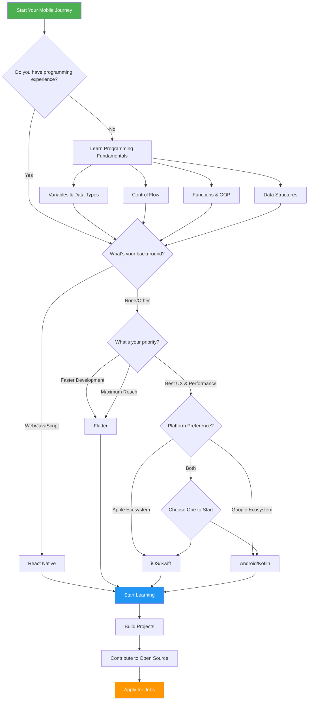

---

## 📚 How to Use This Roadmap

### For Beginners

1. **Start with Fundamentals**: Don't skip the basics
2. **Choose One Platform**: Master one before expanding
3. **Build Projects**: Apply what you learn immediately
4. **Join Communities**: Learn from others and get feedback
5. **Be Patient**: Mastery takes time

### For Intermediate Developers

1. **Identify Gaps**: Use the roadmap to find missing skills
2. **Deep Dive**: Focus on advanced topics
3. **Architecture**: Learn patterns for scalable apps
4. **Testing**: Write comprehensive tests
5. **Contribute**: Share your knowledge

### For Experienced Developers

1. **Cross-Platform**: Expand to other platforms
2. **Leadership**: Mentor junior developers
3. **Architecture**: Design system-level solutions
4. **Performance**: Optimize at scale
5. **Innovation**: Stay ahead of trends

---

## 📱 Mobile Development Overview

### The Mobile Landscape in 2025

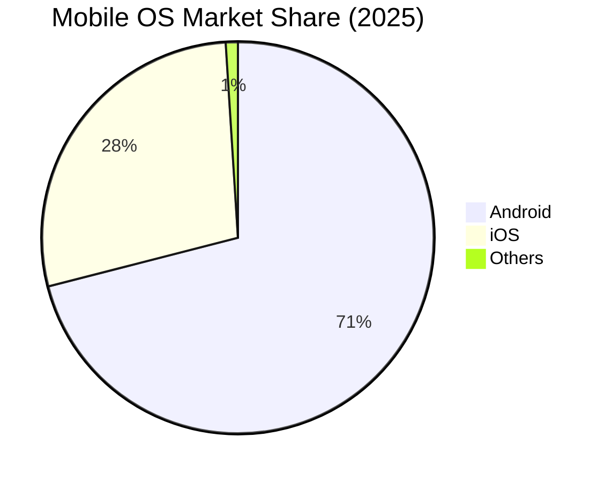

### Development Approaches

| Approach | Examples | Pros | Cons |
|----------|----------|------|------|
| **Native** | Swift/Kotlin | Best performance, Full API access | Platform-specific code |
| **Cross-Platform** | Flutter, RN | Single codebase, Faster development | Slight performance overhead |
| **Hybrid** | Ionic, Cordova | Web technologies | Limited native features |
| **PWA** | Web Apps | No installation | Limited device access |

### Key Statistics

- **6.8 billion** smartphone users worldwide (2025)
- **255 billion** app downloads annually
- **$935 billion** projected app revenue by 2026
- **48%** of small businesses have a mobile app
- **88%** of mobile time spent in apps

---

## ⚖️ Platform Comparison

### iOS vs Android vs Cross-Platform

| Factor | iOS | Android | Flutter | React Native |
|--------|-----|---------|---------|--------------|
| **Language** | Swift/Obj-C | Kotlin/Java | Dart | JavaScript |
| **IDE** | Xcode | Android Studio | VS Code/AS | VS Code |
| **Learning Curve** | Moderate | Moderate | Easy | Easy (if JS) |
| **Performance** | Excellent | Excellent | Near-Native | Good |
| **Job Market** | Strong | Strong | Growing | Strong |
| **Market Share** | 28% | 71% | Both | Both |
| **App Store** | Apple App Store | Google Play | Both | Both |
| **Revenue/User** | Higher | Lower | Depends | Depends |
| **Fragmentation** | Low | High | Low | Moderate |
| **Hot Reload** | Limited | Limited | Yes | Yes |

### When to Choose What

#### Choose iOS When:
- Targeting premium market segment
- Revenue per user is priority
- Apple ecosystem integration needed
- Consistent hardware experience required
- Enterprise apps for Apple devices

#### Choose Android When:
- Maximum market reach needed
- Customization is important
- Google services integration
- Multiple form factors (phones, tablets, TV, wear)
- Developing markets focus

#### Choose Flutter When:
- Starting a new project
- Single codebase priority
- Beautiful custom UI needed
- Strong typing preferred
- Fast development cycles

#### Choose React Native When:
- Team knows JavaScript/React
- Existing React web app
- Native modules needed
- Large ecosystem preference
- Quick prototyping

---

## 🗺️ Roadmaps

### 📱 iOS Development Roadmap

[📖 Full iOS Roadmap →](docs/ios-roadmap.md)

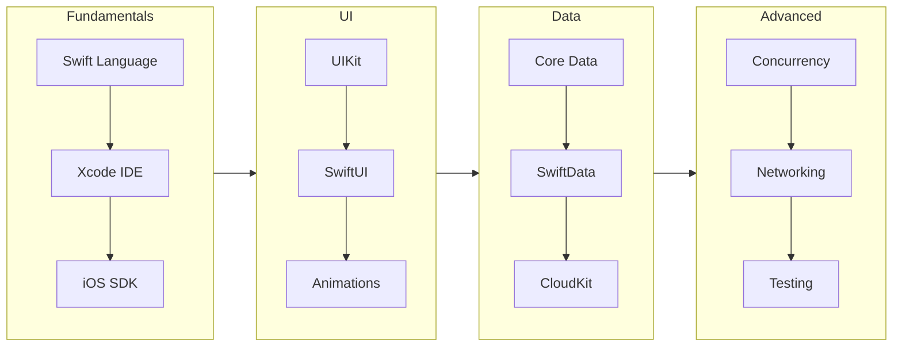

#### iOS Learning Path Overview

| Phase | Topics | Duration | Projects |
|-------|--------|----------|----------|
| **1. Basics** | Swift, Xcode, UIKit basics | 2-3 months | Calculator, Todo App |
| **2. Intermediate** | SwiftUI, Networking, CoreData | 2-3 months | Weather App, Notes App |
| **3. Advanced** | Concurrency, Testing, CI/CD | 2-3 months | Social Media Client |
| **4. Expert** | Architecture, Performance | 2-3 months | Full-Featured App |

#### Key iOS Technologies

**Languages:**
- Swift 5.9+ (Primary)
- Objective-C (Legacy)

**UI Frameworks:**
- UIKit (Traditional)
- SwiftUI (Modern, Declarative)

**Data Persistence:**
- UserDefaults (Small data)
- Core Data (Complex data)
- SwiftData (Modern, Swift-first)
- Realm (Third-party)
- SQLite (Direct database)

**Networking:**
- URLSession (Native)
- Alamofire (Popular library)
- Combine (Reactive)

**Architecture:**
- MVC (Default)
- MVVM (Recommended)
- TCA (Modern, Composable)
- VIPER (Enterprise)

---

### 🤖 Android Development Roadmap

[📖 Full Android Roadmap →](docs/android-roadmap.md)

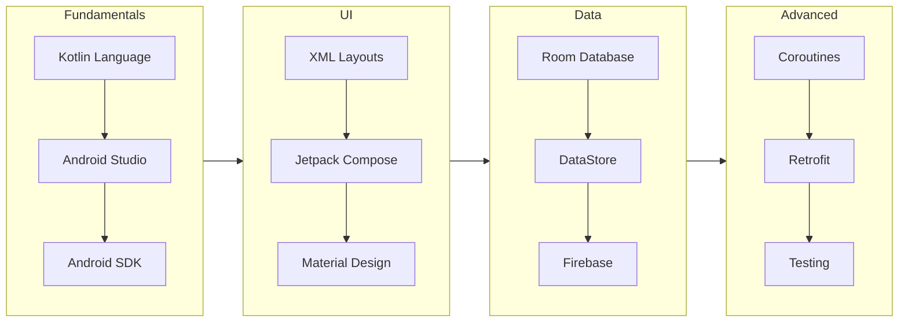

#### Android Learning Path Overview

| Phase | Topics | Duration | Projects |
|-------|--------|----------|----------|
| **1. Basics** | Kotlin, Android Studio, Views | 2-3 months | Calculator, Todo App |
| **2. Intermediate** | Compose, Navigation, Room | 2-3 months | News App, Chat App |
| **3. Advanced** | Coroutines, Testing, Hilt | 2-3 months | E-commerce App |
| **4. Expert** | Architecture, Performance | 2-3 months | Full-Featured App |

#### Key Android Technologies

**Languages:**
- Kotlin (Primary, Official)
- Java (Legacy)

**UI Frameworks:**
- Jetpack Compose (Modern, Recommended)
- XML Views (Traditional)
- Material Design 3

**Data Persistence:**
- Room Database (SQLite wrapper)
- DataStore (Key-value)
- Firebase Realtime Database
- SQLDelight (Multiplatform)

**Networking:**
- Retrofit (REST)
- Ktor (Kotlin-first)
- OkHttp (HTTP client)

**Architecture:**
- MVVM (Recommended)
- MVI (Unidirectional)
- Clean Architecture

**Dependency Injection:**
- Hilt (Recommended)
- Koin (Lightweight)
- Dagger 2 (Powerful)

---

### 🦋 Flutter Development Roadmap

[📖 Full Flutter Roadmap →](docs/flutter-roadmap.md)

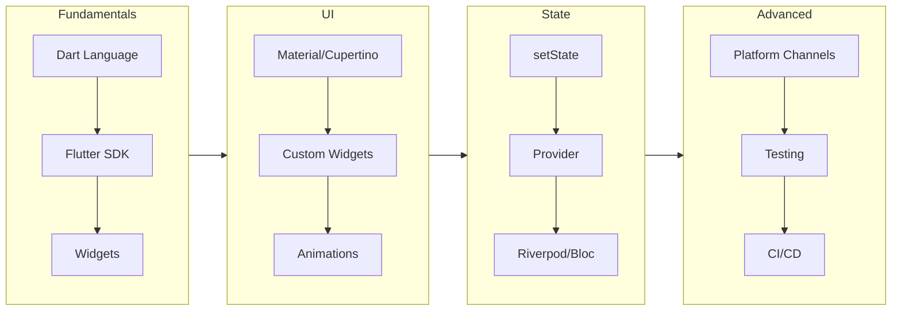

#### Flutter Learning Path Overview

| Phase | Topics | Duration | Projects |
|-------|--------|----------|----------|
| **1. Basics** | Dart, Widgets, Layout | 1-2 months | Counter, Calculator |
| **2. Intermediate** | State, Navigation, HTTP | 2-3 months | Shop App, Weather |
| **3. Advanced** | Bloc, Testing, Platform | 2-3 months | Chat App |
| **4. Expert** | Performance, Plugins | 1-2 months | Production App |

#### Key Flutter Technologies

**Language:**
- Dart 3.x

**State Management:**
- Riverpod (Recommended)
- Bloc/Cubit (Enterprise)
- Provider (Simple)
- GetX (All-in-one)

**Navigation:**
- GoRouter (Recommended)
- AutoRoute
- Navigator 2.0

**Networking:**
- Dio (Feature-rich)
- http (Simple)
- Chopper (Generator)

**Local Storage:**
- Hive (NoSQL)
- Isar (Modern)
- SharedPreferences (Simple)
- Drift (SQLite)

---

### ⚛️ React Native Development Roadmap

[📖 Full React Native Roadmap →](docs/react-native-roadmap.md)

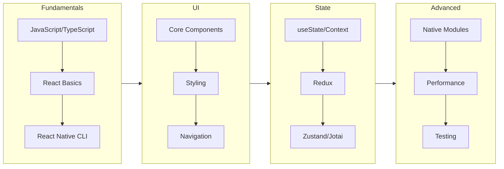

#### React Native Learning Path Overview

| Phase | Topics | Duration | Projects |
|-------|--------|----------|----------|
| **1. Basics** | JS/TS, React, Core Comps | 1-2 months | Todo, Counter |
| **2. Intermediate** | Navigation, State, APIs | 2-3 months | Weather, News |
| **3. Advanced** | Native, Performance | 2-3 months | Chat, E-commerce |
| **4. Expert** | Architecture, Scale | 1-2 months | Production App |

#### Key React Native Technologies

**Languages:**
- TypeScript (Recommended)
- JavaScript

**Navigation:**
- React Navigation (Standard)
- Expo Router (File-based)

**State Management:**
- Zustand (Simple)
- Redux Toolkit (Powerful)
- Jotai (Atomic)
- TanStack Query (Server state)

**UI Libraries:**
- NativeWind (Tailwind)
- Tamagui
- React Native Paper
- Gluestack UI

**Build Tools:**
- Expo (Recommended for new projects)
- React Native CLI (Full control)

---

## 🧱 Core Fundamentals

### Programming Fundamentals

Every mobile developer should master these concepts regardless of platform:

#### 1. Programming Concepts

```
├── Variables & Data Types
│   ├── Primitive Types (int, float, bool, string)
│   ├── Reference Types (objects, arrays)
│   ├── Type Inference
│   └── Type Safety
│
├── Control Flow
│   ├── Conditionals (if/else, switch)
│   ├── Loops (for, while, forEach)
│   ├── Error Handling (try/catch)
│   └── Guard Clauses
│
├── Functions
│   ├── Parameters & Return Types
│   ├── Higher-Order Functions
│   ├── Closures/Lambdas
│   └── Extension Functions
│
├── Object-Oriented Programming
│   ├── Classes & Objects
│   ├── Inheritance
│   ├── Polymorphism
│   ├── Encapsulation
│   └── Abstraction
│
├── Data Structures
│   ├── Arrays/Lists
│   ├── Dictionaries/Maps
│   ├── Sets
│   ├── Stacks & Queues
│   └── Trees & Graphs
│
└── Algorithms
    ├── Sorting (Quick, Merge, Heap)
    ├── Searching (Binary, Linear)
    ├── Recursion
    └── Big O Notation
```

#### 2. Mobile-Specific Fundamentals

```
├── App Lifecycle
│   ├── Launch States
│   ├── Background/Foreground
│   ├── Memory Warnings
│   └── State Preservation
│
├── UI Fundamentals
│   ├── View Hierarchy
│   ├── Layout Systems
│   ├── Event Handling
│   └── Gesture Recognition
│
├── Data Management
│   ├── Local Storage
│   ├── Caching Strategies
│   ├── Data Synchronization
│   └── Offline Support
│
├── Networking
│   ├── HTTP/HTTPS
│   ├── REST APIs
│   ├── WebSockets
│   └── GraphQL
│
└── Security Basics
    ├── Secure Storage
    ├── Authentication
    ├── Data Encryption
    └── Certificate Pinning
```

### Version Control (Git)

Essential Git commands every developer must know:

```bash
# Basic Commands
git init                    # Initialize repository
git clone <url>             # Clone repository
git status                  # Check status
git add .                   # Stage all changes
git commit -m "message"     # Commit changes
git push origin main        # Push to remote
git pull                    # Pull latest changes

# Branching
git branch                  # List branches
git branch <name>           # Create branch
git checkout <name>         # Switch branch
git checkout -b <name>      # Create and switch
git merge <branch>          # Merge branch
git rebase <branch>         # Rebase branch

# Advanced
git stash                   # Stash changes
git stash pop               # Apply stashed changes
git cherry-pick <hash>      # Apply specific commit
git reset --hard HEAD~1     # Undo last commit
git reflog                  # View history

# Collaboration
git fetch                   # Fetch remote changes
git pull --rebase           # Pull with rebase
git push -f                 # Force push (careful!)
```

### Git Flow

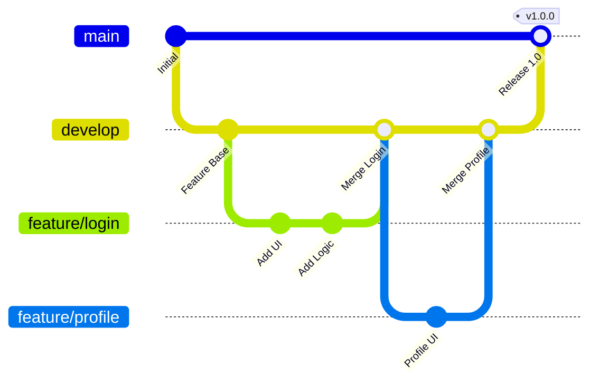

---

## 🎓 Advanced Topics

### Reactive Programming

Understanding reactive paradigms is crucial for modern mobile development:

#### Reactive Concepts

```
├── Observables/Publishers
│   ├── Create observables
│   ├── Subscribe to events
│   ├── Handle completion
│   └── Error handling
│
├── Operators
│   ├── Transforming (map, flatMap)
│   ├── Filtering (filter, debounce)
│   ├── Combining (merge, combineLatest)
│   └── Error Handling (retry, catchError)
│
├── Subjects
│   ├── PublishSubject
│   ├── BehaviorSubject
│   ├── ReplaySubject
│   └── AsyncSubject
│
└── Schedulers
    ├── Main/UI Thread
    ├── Background Thread
    ├── IO Scheduler
    └── Computation Scheduler
```

#### Platform-Specific Implementations

| Concept | iOS | Android | Flutter | React Native |
|---------|-----|---------|---------|--------------|
| Framework | Combine | Flow/RxJava | Streams | RxJS |
| Observable | Publisher | Flow | Stream | Observable |
| Subscribe | sink | collect | listen | subscribe |
| Operators | Built-in | Built-in | Built-in | Operators |

### Concurrency & Multithreading

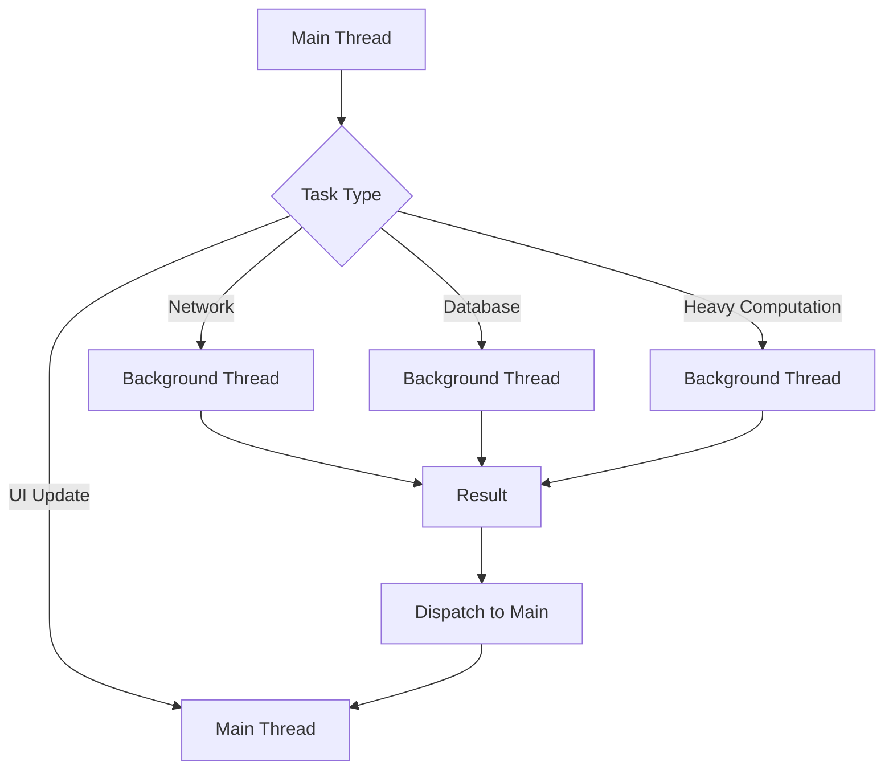

#### Concurrency by Platform

**iOS (Swift Concurrency):**
```swift
// Async/Await
func fetchData() async throws -> Data {
    let (data, _) = try await URLSession.shared.data(from: url)
    return data
}

// Task
Task {
    let data = try await fetchData()
    await MainActor.run {
        updateUI(data)
    }
}

// Actor
actor DataManager {
    private var cache: [String: Data] = [:]
    
    func getData(for key: String) -> Data? {
        cache[key]
    }
}
```

**Android (Coroutines):**
```kotlin
// Suspend function
suspend fun fetchData(): Data {
    return withContext(Dispatchers.IO) {
        api.getData()
    }
}

// Launch coroutine
viewModelScope.launch {
    val data = fetchData()
    withContext(Dispatchers.Main) {
        updateUI(data)
    }
}

// Flow
val dataFlow: Flow<Data> = flow {
    while(true) {
        emit(fetchData())
        delay(5000)
    }
}
```

**Flutter (Isolates):**
```dart
// Async/Await
Future<Data> fetchData() async {
  final response = await http.get(url);
  return Data.fromJson(response.body);
}

// Isolate for heavy computation
final result = await compute(heavyFunction, data);

// Stream
Stream<int> countStream() async* {
  for (int i = 0; i < 10; i++) {
    yield i;
    await Future.delayed(Duration(seconds: 1));
  }
}
```

### Dependency Injection

```
├── Why DI?
│   ├── Testability
│   ├── Flexibility
│   ├── Maintainability
│   └── Separation of Concerns
│
├── DI Patterns
│   ├── Constructor Injection
│   ├── Property Injection
│   ├── Method Injection
│   └── Service Locator
│
└── Platform Solutions
    ├── iOS: Swinject, Factory
    ├── Android: Hilt, Koin
    ├── Flutter: get_it, injectable
    └── RN: InversifyJS
```

---

## 🏗️ Architecture Patterns

### MVC (Model-View-Controller)

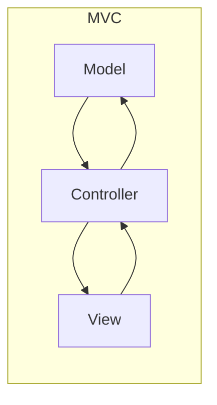

**Pros:**
- Simple to understand
- Built into iOS

**Cons:**
- Massive View Controller problem
- Hard to test
- Tight coupling

### MVVM (Model-View-ViewModel)

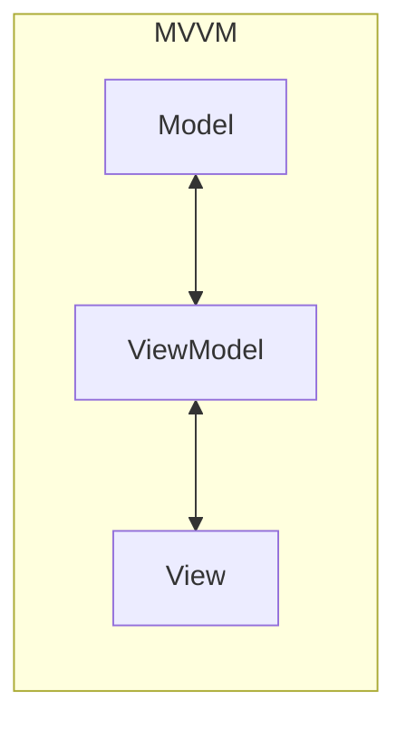

**Structure:**
```
├── Model
│   ├── Data structures
│   ├── Business logic
│   └── Data access
│
├── View
│   ├── UI components
│   ├── User input
│   └── Display logic
│
└── ViewModel
    ├── Presentation logic
    ├── State management
    └── View-Model binding
```

**Pros:**
- Testable
- Separation of concerns
- Data binding

**Cons:**
- Boilerplate
- Learning curve

### Clean Architecture

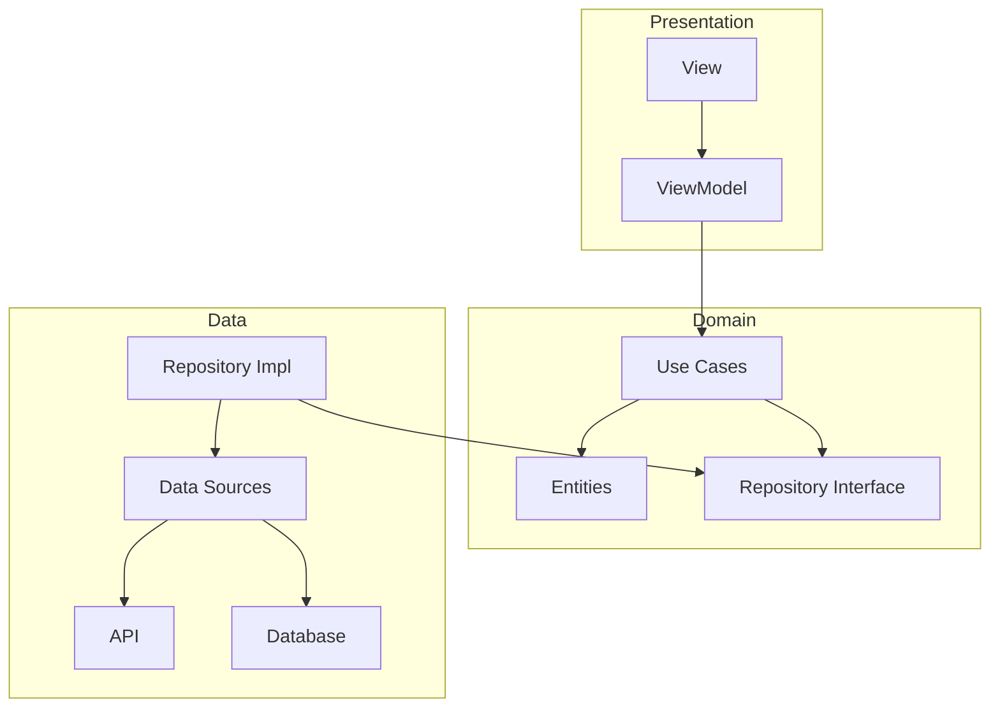

**Layers:**

1. **Presentation Layer**
   - Views/UI
   - ViewModels/Presenters
   - UI Models

2. **Domain Layer**
   - Use Cases
   - Entities
   - Repository Interfaces

3. **Data Layer**
   - Repository Implementations
   - Data Sources
   - DTOs

### Comparison Table

| Pattern | Complexity | Testability | Scalability | Best For |
|---------|------------|-------------|-------------|----------|
| MVC | Low | Poor | Poor | Simple apps |
| MVP | Medium | Good | Medium | Medium apps |
| MVVM | Medium | Good | Good | Most apps |
| MVI | High | Excellent | Excellent | Complex state |
| Clean | High | Excellent | Excellent | Large apps |
| TCA | High | Excellent | Excellent | SwiftUI apps |

---

## 🧪 Testing Strategies

### Testing Pyramid

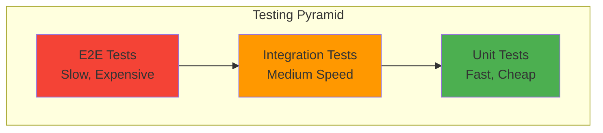

### Test Types

#### 1. Unit Tests

Test individual components in isolation.

**Coverage Goals:**
- Business logic: 80%+
- ViewModels: 70%+
- Utilities: 90%+

**Example (Swift):**
```swift
func testCalculator_Addition() {
    let calculator = Calculator()
    let result = calculator.add(2, 3)
    XCTAssertEqual(result, 5)
}
```

#### 2. Integration Tests

Test component interactions.

**Focus Areas:**
- Database operations
- API calls
- Navigation flows

#### 3. UI/E2E Tests

Test complete user flows.

**Tools by Platform:**
- iOS: XCUITest
- Android: Espresso, Compose Testing
- Flutter: integration_test
- RN: Detox

### Testing Best Practices

```
├── Write Tests First (TDD)
│   ├── Red: Write failing test
│   ├── Green: Make it pass
│   └── Refactor: Clean up
│
├── Test Naming
│   ├── test_[method]_[scenario]_[expected]
│   └── Given_When_Then format
│
├── Test Organization
│   ├── Arrange: Set up
│   ├── Act: Execute
│   └── Assert: Verify
│
├── Mocking
│   ├── Mock external dependencies
│   ├── Use protocols/interfaces
│   └── Avoid over-mocking
│
└── Coverage
    ├── Aim for meaningful coverage
    ├── 100% isn't always necessary
    └── Focus on critical paths
```

---

## 🔄 CI/CD & DevOps

### CI/CD Pipeline

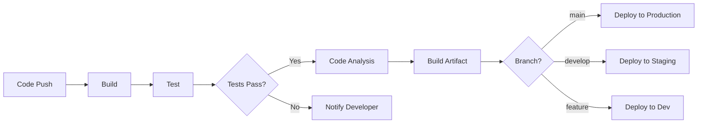

### CI/CD Tools

| Tool | Best For | Platforms |
|------|----------|-----------|
| **GitHub Actions** | GitHub projects | All |
| **Fastlane** | Mobile automation | iOS, Android |
| **Bitrise** | Mobile CI/CD | iOS, Android |
| **Codemagic** | Flutter | All |
| **App Center** | Microsoft ecosystem | All |
| **CircleCI** | General CI/CD | All |

### GitHub Actions Example

```yaml
name: Mobile CI

on:
  push:
    branches: [ main, develop ]
  pull_request:
    branches: [ main ]

jobs:
  build-ios:
    runs-on: macos-latest
    steps:
      - uses: actions/checkout@v4
      - name: Build iOS
        run: |
          xcodebuild -workspace App.xcworkspace \
            -scheme App \
            -sdk iphonesimulator \
            -destination 'platform=iOS Simulator,name=iPhone 15' \
            build test

  build-android:
    runs-on: ubuntu-latest
    steps:
      - uses: actions/checkout@v4
      - name: Set up JDK
        uses: actions/setup-java@v4
        with:
          distribution: 'temurin'
          java-version: '17'
      - name: Build Android
        run: ./gradlew build test
```

### Fastlane Configuration

```ruby
# Fastfile
default_platform(:ios)

platform :ios do
  desc "Run tests"
  lane :test do
    run_tests(scheme: "App")
  end
  
  desc "Deploy to TestFlight"
  lane :beta do
    increment_build_number
    build_app(scheme: "App")
    upload_to_testflight
  end
  
  desc "Deploy to App Store"
  lane :release do
    build_app(scheme: "App")
    upload_to_app_store
  end
end
```

---

## ⚡ Performance Optimization

### Performance Metrics

| Metric | Target | How to Measure |
|--------|--------|----------------|
| **App Launch** | < 2s cold, < 1s warm | Instruments, Profiler |
| **Frame Rate** | 60 FPS | GPU Profiler |
| **Memory** | < 100MB typical | Memory Profiler |
| **Battery** | Minimal impact | Energy Profiler |
| **Network** | Minimize requests | Network Profiler |
| **App Size** | < 50MB recommended | Build analysis |

### Optimization Strategies

```
├── UI Performance
│   ├── Lazy loading
│   ├── View recycling
│   ├── Avoid overdraw
│   └── Optimize images
│
├── Memory Management
│   ├── Avoid memory leaks
│   ├── Use weak references
│   ├── Cache wisely
│   └── Profile regularly
│
├── Network Optimization
│   ├── Compress data
│   ├── Use caching
│   ├── Batch requests
│   └── Implement pagination
│
├── Battery Optimization
│   ├── Minimize background work
│   ├── Use efficient APIs
│   ├── Batch location updates
│   └── Optimize network calls
│
└── App Size Reduction
    ├── Remove unused resources
    ├── Compress images
    ├── Use app bundles
    └── Enable bitcode/minification
```

### Image Optimization

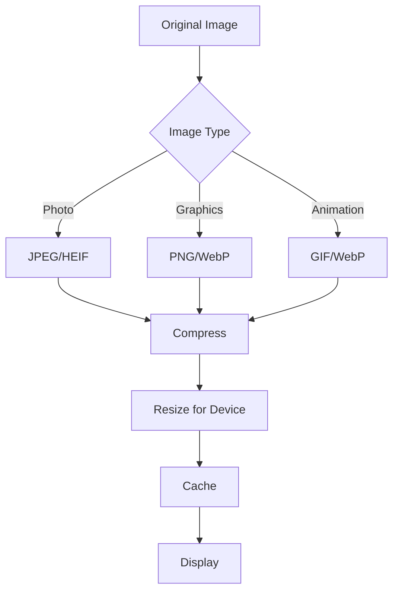

---

## 🔐 Security Best Practices

### Security Checklist

```
├── Data Storage
│   ├── ✅ Use Keychain/Keystore
│   ├── ✅ Encrypt sensitive data
│   ├── ✅ Clear data on logout
│   └── ❌ Don't store in UserDefaults
│
├── Network Security
│   ├── ✅ Use HTTPS only
│   ├── ✅ Certificate pinning
│   ├── ✅ Validate server responses
│   └── ❌ Don't trust all certificates
│
├── Authentication
│   ├── ✅ Use OAuth 2.0/OIDC
│   ├── ✅ Implement biometrics
│   ├── ✅ Secure token storage
│   └── ❌ Don't hardcode credentials
│
├── Code Security
│   ├── ✅ Obfuscate code
│   ├── ✅ Remove debug logs
│   ├── ✅ Validate inputs
│   └── ❌ Don't expose API keys
│
└── App Security
    ├── ✅ Jailbreak/root detection
    ├── ✅ Tamper detection
    ├── ✅ Secure WebViews
    └── ❌ Don't allow screenshots of sensitive data
```

### Secure Data Storage

| Platform | Secure Storage | When to Use |
|----------|----------------|-------------|
| iOS | Keychain | Credentials, tokens |
| Android | Keystore | Credentials, tokens |
| Flutter | flutter_secure_storage | Cross-platform secure |
| RN | react-native-keychain | Cross-platform secure |

### OWASP Mobile Top 10

1. **M1**: Improper Platform Usage
2. **M2**: Insecure Data Storage
3. **M3**: Insecure Communication
4. **M4**: Insecure Authentication
5. **M5**: Insufficient Cryptography
6. **M6**: Insecure Authorization
7. **M7**: Client Code Quality
8. **M8**: Code Tampering
9. **M9**: Reverse Engineering
10. **M10**: Extraneous Functionality

---

## 📚 Resources

### Books

[📖 Complete Book List →](resources/books.md)

**Top Recommendations:**

| Book | Author | Platform | Level |
|------|--------|----------|-------|
| iOS Programming | Big Nerd Ranch | iOS | Beginner |
| Kotlin in Action | Dmitry Jemerov | Android | Intermediate |
| Flutter in Action | Eric Windmill | Flutter | Intermediate |
| Clean Architecture | Robert C. Martin | All | Advanced |

### Courses

[📖 Complete Course List →](resources/courses.md)

**Recommended Platforms:**
- [Apple Developer Documentation](https://developer.apple.com/documentation/)
- [Android Developers](https://developer.android.com/)
- [Flutter.dev](https://flutter.dev/learn)
- [Ray Wenderlich](https://www.kodeco.com/)
- [Udemy](https://www.udemy.com/)
- [Coursera](https://www.coursera.org/)

### Tools

[📖 Complete Tools List →](resources/tools.md)

**Essential Tools:**
- **IDE**: Xcode, Android Studio, VS Code
- **Design**: Figma, Sketch
- **Debugging**: Charles Proxy, Flipper
- **Analytics**: Firebase, Mixpanel
- **Crash Reporting**: Crashlytics, Sentry

### Communities

[📖 Complete Community List →](resources/communities.md)

**Active Communities:**
- Stack Overflow
- Reddit (r/iOSProgramming, r/androiddev, r/FlutterDev)
- Discord servers
- Twitter/X tech community
- Dev.to

---

## 💼 Interview Prep

[📖 Complete Interview Guide →](interview/questions.md)

### Interview Process

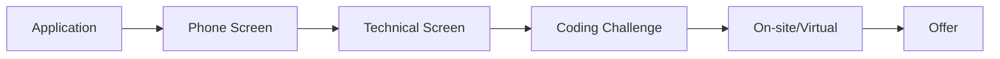

### Common Topics

#### Technical Questions
- Language fundamentals (Swift/Kotlin/Dart/JS)
- Platform-specific knowledge
- Architecture patterns
- Data structures & algorithms
- System design

#### Behavioral Questions
- Why mobile development?
- Describe a challenging project
- How do you handle disagreements?
- What's your learning process?

### Sample Questions

**iOS:**
1. Explain the difference between `let` and `var`
2. What is ARC and how does it work?
3. Explain the iOS app lifecycle
4. What is the difference between `frame` and `bounds`?
5. How does SwiftUI differ from UIKit?

**Android:**
1. Explain Activity lifecycle
2. What is the difference between `val` and `var`?
3. How do Coroutines work?
4. Explain Jetpack Compose
5. What is Hilt and why use it?

**Flutter:**
1. Explain the widget tree
2. What is the difference between StatelessWidget and StatefulWidget?
3. How does Flutter achieve 60fps?
4. Explain state management options
5. How do platform channels work?

---

## 💡 Project Ideas

### Beginner Projects

| Project | Skills Practiced | Difficulty |
|---------|------------------|------------|
| Calculator | UI, Logic | ⭐ |
| Todo List | CRUD, Storage | ⭐ |
| Weather App | API, JSON | ⭐⭐ |
| Notes App | Database | ⭐⭐ |
| Quiz App | Navigation, State | ⭐⭐ |

### Intermediate Projects

| Project | Skills Practiced | Difficulty |
|---------|------------------|------------|
| Chat App | Real-time, Firebase | ⭐⭐⭐ |
| E-commerce | Complex UI, Cart | ⭐⭐⭐ |
| Social Media | Auth, Media | ⭐⭐⭐ |
| Fitness Tracker | HealthKit/Fit | ⭐⭐⭐ |
| Music Player | Media, Background | ⭐⭐⭐ |

### Advanced Projects

| Project | Skills Practiced | Difficulty |
|---------|------------------|------------|
| Video Editor | Media processing | ⭐⭐⭐⭐ |
| AR App | ARKit/ARCore | ⭐⭐⭐⭐ |
| Banking App | Security, Biometrics | ⭐⭐⭐⭐ |
| Navigation App | Maps, Location | ⭐⭐⭐⭐ |
| Full-featured Social | Everything | ⭐⭐⭐⭐⭐ |

---

## 📈 Career Path

### Mobile Developer Career Ladder

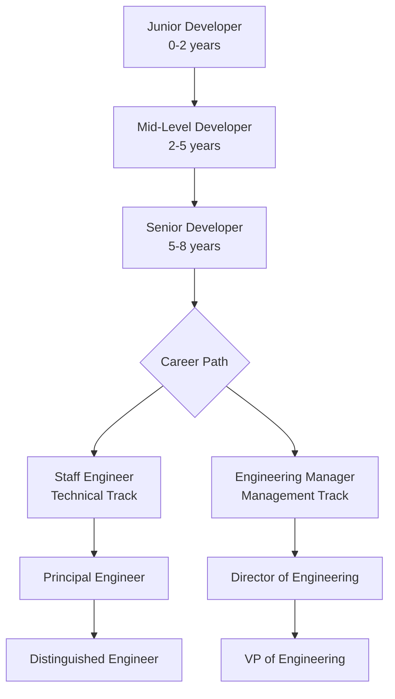

### Salary Expectations (US Market 2025)

| Level | iOS | Android | Cross-Platform |
|-------|-----|---------|----------------|
| Junior | $70-90K | $65-85K | $65-85K |
| Mid | $90-130K | $85-125K | $85-120K |
| Senior | $130-180K | $125-175K | $120-165K |
| Staff | $180-250K | $175-240K | $165-230K |
| Principal | $250K+ | $240K+ | $230K+ |

### Skills by Level

**Junior Developer:**
- Basic language proficiency
- Simple UI implementation
- Basic debugging
- Following coding standards
- Team collaboration

**Mid-Level Developer:**
- Deep language knowledge
- Architecture implementation
- Performance optimization
- Code review participation
- Mentoring juniors

**Senior Developer:**
- Expert-level knowledge
- Architecture design
- Technical leadership
- Cross-team collaboration
- Interview others

**Staff/Principal:**
- System design
- Technical strategy
- Organization influence
- Innovation leadership
- Industry recognition

---

## 🤝 Contributing

We welcome contributions! Please see our [Contributing Guide](CONTRIBUTING.md) for details.

### How to Contribute

1. **Fork** the repository
2. **Create** a feature branch (`git checkout -b feature/amazing-feature`)
3. **Commit** your changes (`git commit -m 'Add amazing feature'`)
4. **Push** to the branch (`git push origin feature/amazing-feature`)
5. **Open** a Pull Request

### Contribution Ideas

- Add new resources (books, courses, tools)
- Improve existing documentation
- Fix typos and errors
- Add translations
- Share project ideas
- Update outdated information

---

## 📄 License

This project is licensed under the MIT License - see the [LICENSE](LICENSE) file for details.

---

## 🌟 Star History

If you find this roadmap helpful, please consider giving it a star! It helps others discover this resource.

[](https://star-history.com/#muhittincamdali/mobile-developer-roadmap&Date)

---

## 📞 Contact & Support

- **Issues**: [GitHub Issues](https://github.com/muhittincamdali/mobile-developer-roadmap/issues)
- **Discussions**: [GitHub Discussions](https://github.com/muhittincamdali/mobile-developer-roadmap/discussions)
- **Twitter**: [@muhittincamdali](https://twitter.com/muhittincamdali)

---

<p align="center">
  Made with ❤️ for the mobile development community
</p>

<p align="center">
  <a href="#-mobile-developer-roadmap">Back to Top ↑</a>
</p>
