<p align="center">
  
</p>

<h1 align="center">🗺️ Mobile Developer Roadmap 2026</h1>

<p align="center">
  <strong>The most comprehensive mobile development learning path on GitHub</strong><br>
  <em>From zero to world-class mobile developer</em>
</p>

<p align="center">
  <a href="#-quick-start"></a>
  <a href="#-learning-tracks"></a>
  <a href="#-progress-tracker"></a>
</p>

<p align="center">
  
  
  
  
  
</p>

---

## 🌟 Why This Roadmap?

| Feature | This Roadmap | Others |
|---------|--------------|--------|
| **10 Specialized Tracks** | ✅ | ❌ Limited |
| **Time Estimates** | ✅ Per topic | ❌ |
| **Practice Projects** | ✅ 50+ projects | ❌ Few |
| **Assessment Criteria** | ✅ Skill checks | ❌ |
| **Job Market Insights** | ✅ Real data | ❌ |
| **Progress Tracker** | ✅ Built-in | ❌ |
| **Community Links** | ✅ 100+ | ❌ |
| **Interview Prep** | ✅ Included | ❌ |

---

## 📋 Table of Contents

- [Quick Start](#-quick-start)
- [Roadmap Overview](#-roadmap-overview)
- [Learning Tracks](#-learning-tracks)
  - [🟢 Beginner Track](#-beginner-track-0-6-months)
  - [🟡 Intermediate Track](#-intermediate-track-6-12-months)
  - [🔴 Advanced Track](#-advanced-track-12-24-months)
  - [🍎 iOS Specialist](#-ios-specialist-track)
  - [🤖 Android Specialist](#-android-specialist-track)
  - [🦋 Cross-Platform Track](#-cross-platform-track)
  - [🏗️ Architecture Track](#️-architecture-track)
  - [⚡ Performance Track](#-performance-track)
  - [🔒 Security Track](#-security-track)
  - [👑 Leadership Track](#-leadership-track)
- [Progress Tracker](#-progress-tracker)
- [Practice Projects](#-practice-projects)
- [Job Market Insights](#-job-market-insights)
- [Assessment Tools](#-skill-assessment)
- [Community & Mentorship](#-community--mentorship)
- [Contributing](#-contributing)

---

## 🚀 Quick Start

### Choose Your Path

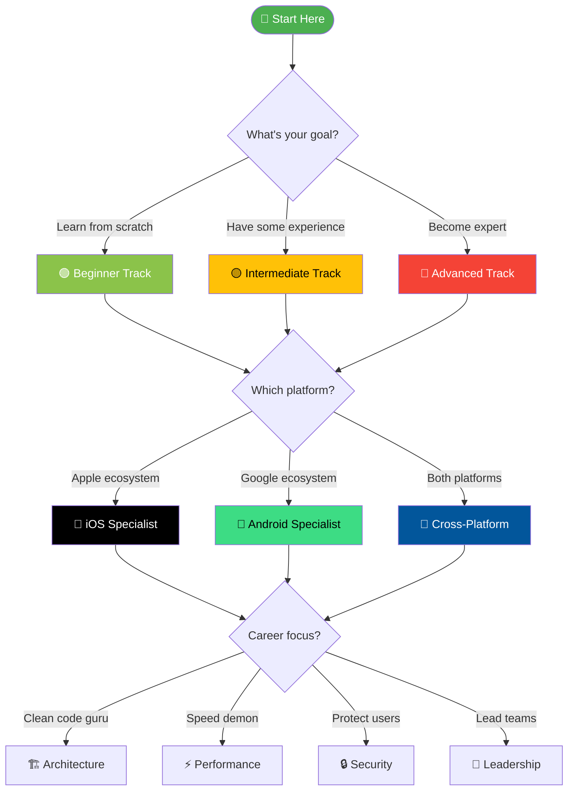

### 1-Minute Assessment

Answer these questions to find your track:

| Question | Answer → Track |
|----------|----------------|
| "I've never coded before" | 🟢 Beginner |
| "I know basics, built simple apps" | 🟡 Intermediate |
| "I work professionally, want to level up" | 🔴 Advanced |
| "I want to build iOS apps only" | 🍎 iOS Specialist |
| "I want to build Android apps only" | 🤖 Android Specialist |
| "I want one codebase for both" | 🦋 Cross-Platform |
| "I want to design systems" | 🏗️ Architecture |
| "I want blazing fast apps" | ⚡ Performance |
| "I want secure apps" | 🔒 Security |
| "I want to lead teams" | 👑 Leadership |

---

## 🗺️ Roadmap Overview

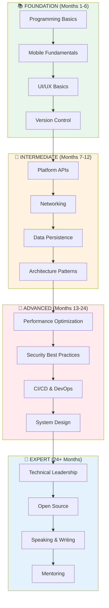

---

## 📚 Learning Tracks

## 🟢 Beginner Track (0-6 Months)

> **Goal:** Build your first mobile app and understand fundamentals

### Month 1: Programming Fundamentals

#### Week 1-2: Choose Your Language

| Platform | Language | Time | Resources |
|----------|----------|------|-----------|
| iOS | Swift | 40 hrs | [Swift.org](https://swift.org), [100 Days of Swift](https://www.hackingwithswift.com/100) |
| Android | Kotlin | 40 hrs | [Kotlin Docs](https://kotlinlang.org/docs/home.html), [Android Basics](https://developer.android.com/courses) |
| Cross-Platform | Dart/JS | 40 hrs | [Dart.dev](https://dart.dev/guides), [TypeScript](https://www.typescriptlang.org/docs/) |

<details>
<summary><strong>📝 Swift Fundamentals Checklist</strong></summary>

```swift
// Topics to master:
□ Variables & Constants (let, var)
□ Data Types (String, Int, Double, Bool)
□ Operators (+, -, *, /, %, ==, !=, <, >)
□ String Interpolation ("\(variable)")
□ Collections (Array, Set, Dictionary)
□ Control Flow (if, else, switch)
□ Loops (for-in, while, repeat-while)
□ Functions & Parameters
□ Optionals (?, !, if let, guard let)
□ Closures & Higher-order functions
□ Structs & Classes
□ Properties & Methods
□ Protocols
□ Extensions
□ Error Handling (try, catch, throw)
□ Generics basics
```

**Assessment:** Build a command-line calculator that handles errors gracefully
</details>

<details>
<summary><strong>📝 Kotlin Fundamentals Checklist</strong></summary>

```kotlin
// Topics to master:
□ Variables (val, var)
□ Data Types & Type Inference
□ Null Safety (?., !!, let)
□ Collections (List, Set, Map)
□ Control Flow (if, when, for, while)
□ Functions & Default Parameters
□ Lambdas & Higher-order Functions
□ Classes & Objects
□ Data Classes
□ Sealed Classes
□ Coroutines Basics
□ Extension Functions
□ Scope Functions (let, run, with, apply, also)
```

**Assessment:** Build a contact manager CLI app with file persistence
</details>

#### Week 3-4: Development Environment

| Task | iOS | Android | Time |
|------|-----|---------|------|
| IDE Setup | Xcode | Android Studio | 2 hrs |
| Simulator/Emulator | iOS Simulator | Android Emulator | 2 hrs |
| First Project | Hello World | Hello World | 4 hrs |
| Git Basics | Terminal + GitHub | Terminal + GitHub | 8 hrs |

**🎯 Month 1 Project:** Build a "Tip Calculator" app
- Input: Bill amount, tip percentage
- Output: Tip amount, total per person
- **Success Criteria:** App runs without crashes, handles edge cases

---

### Month 2: UI Fundamentals

#### Week 1-2: Layout Systems

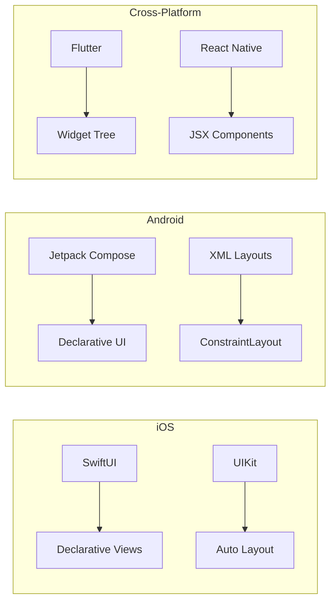

<details>
<summary><strong>📝 SwiftUI Essentials</strong></summary>

```swift
// Topics to master:
□ View Protocol & body property
□ Text, Image, Button, TextField
□ VStack, HStack, ZStack
□ Spacer, Divider, Padding
□ @State property wrapper
□ @Binding for child views
□ NavigationStack & NavigationLink
□ List & ForEach
□ Sheet & Alert presentations
□ Custom ViewModifiers
□ SF Symbols usage
□ Color & Gradient
□ Animation basics (.animation, withAnimation)
□ Gesture recognition (tap, long press, drag)
```

**Resources:**
- 📚 [Apple SwiftUI Tutorials](https://developer.apple.com/tutorials/swiftui)
- 📺 [Stanford CS193p](https://cs193p.sites.stanford.edu/)
- 🎮 [Hacking with Swift](https://www.hackingwithswift.com/100/swiftui)
</details>

<details>
<summary><strong>📝 Jetpack Compose Essentials</strong></summary>

```kotlin
// Topics to master:
□ Composable functions
□ Text, Image, Button, TextField
□ Column, Row, Box
□ Modifier chain
□ remember & mutableStateOf
□ State hoisting
□ Navigation Compose
□ LazyColumn & LazyRow
□ Scaffold & TopAppBar
□ Material Design 3 components
□ Theming (colors, typography, shapes)
□ Animation APIs
□ Side effects (LaunchedEffect, SideEffect)
```

**Resources:**
- 📚 [Android Compose Pathway](https://developer.android.com/courses/pathways/compose)
- 📺 [Compose Camp](https://developer.android.com/courses/android-basics-compose/course)
</details>

#### Week 3-4: Common UI Patterns

| Pattern | Usage | Complexity |
|---------|-------|------------|
| Tab Bar | Main navigation | ⭐ |
| Navigation Stack | Hierarchical flow | ⭐⭐ |
| Modal/Sheet | Temporary views | ⭐ |
| Pull to Refresh | List updates | ⭐⭐ |
| Search | Content filtering | ⭐⭐ |
| Infinite Scroll | Large datasets | ⭐⭐⭐ |

**🎯 Month 2 Project:** Build a "Recipe Book" app
- Home screen with recipe list
- Detail screen with ingredients
- Add new recipe form
- **Success Criteria:** Smooth navigation, clean UI, data persists in memory

---

### Month 3: Data & Networking

#### Week 1-2: Local Data Storage

| Method | Use Case | iOS | Android |
|--------|----------|-----|---------|
| UserDefaults/SharedPrefs | Settings, small data | UserDefaults | SharedPreferences |
| File System | Documents, media | FileManager | File API |
| Database | Structured data | SwiftData/CoreData | Room |
| Keychain/Keystore | Secrets | Keychain | EncryptedSharedPrefs |

<details>
<summary><strong>📝 Data Persistence Checklist</strong></summary>

**iOS (SwiftData):**
```swift
□ @Model macro for entities
□ ModelContainer setup
□ @Query for fetching
□ Relationships (@Relationship)
□ Sorting & filtering
□ Migration strategies
```

**Android (Room):**
```kotlin
□ @Entity for tables
□ @Dao for queries
□ @Database setup
□ TypeConverters
□ Relationships
□ Migrations
```
</details>

#### Week 3-4: Networking Basics

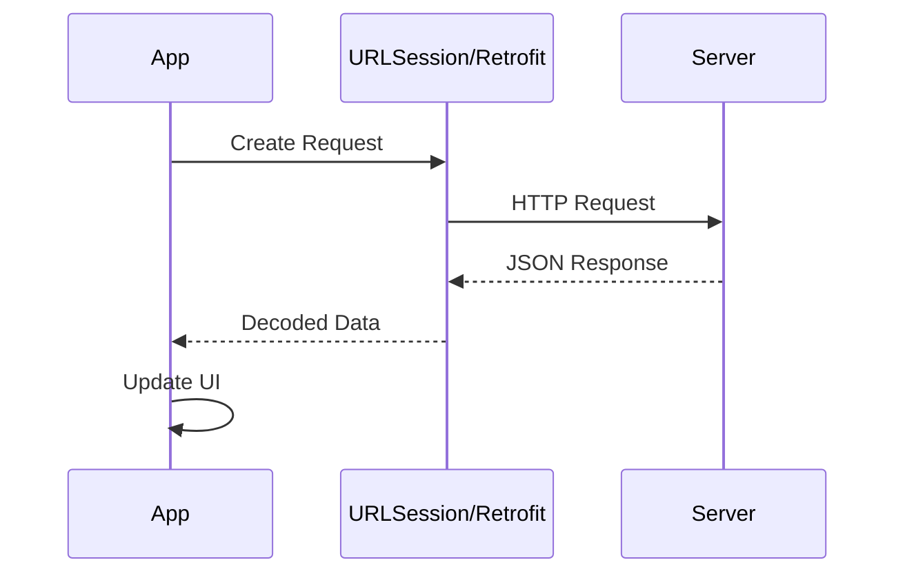

| Topic | Time | Resources |
|-------|------|-----------|
| HTTP Methods (GET, POST, PUT, DELETE) | 4 hrs | [MDN HTTP](https://developer.mozilla.org/en-US/docs/Web/HTTP) |
| JSON Parsing | 8 hrs | Platform docs |
| Async/Await | 8 hrs | Platform docs |
| Error Handling | 4 hrs | Platform docs |
| Image Loading | 4 hrs | SDWebImage, Coil |

**🎯 Month 3 Project:** Build a "Weather App"
- Fetch data from OpenWeatherMap API
- Display current weather + forecast
- Save favorite cities locally
- **Success Criteria:** Handles offline state, loading states, errors

---

### Month 4-5: Architecture & Best Practices

#### MVVM Architecture

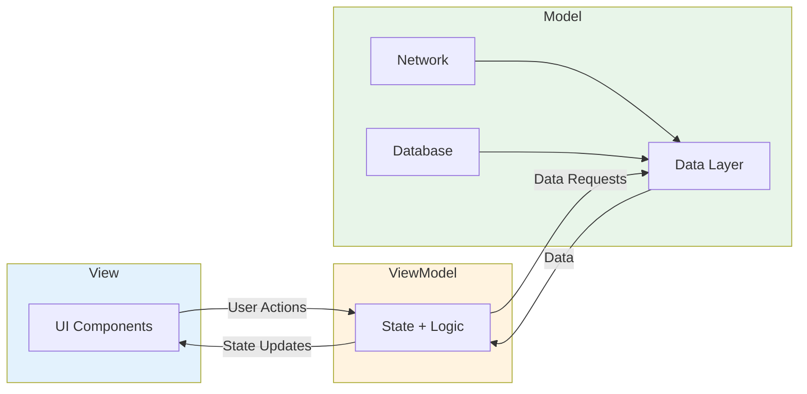

<details>
<summary><strong>📝 Architecture Checklist</strong></summary>

```
□ Separate UI from business logic
□ ViewModel holds UI state
□ Repository pattern for data
□ Dependency injection basics
□ Single responsibility principle
□ Unit testable components
□ Reactive state updates
```
</details>

#### Code Quality

| Practice | Tool | Time to Learn |
|----------|------|---------------|
| Linting | SwiftLint / Detekt | 2 hrs |
| Formatting | Swift Format / ktfmt | 1 hr |
| Git Workflow | Git Flow | 4 hrs |
| Code Review | GitHub PRs | 4 hrs |
| Documentation | DocC / KDoc | 4 hrs |

**🎯 Month 4-5 Project:** Build a "Task Manager" app
- Full MVVM architecture
- Local database with sync capability
- Unit tests for ViewModel
- **Success Criteria:** Clean architecture, 80% test coverage for ViewModels

---

### Month 6: Publishing & Polish

#### App Store Preparation

| Task | iOS | Android | Time |
|------|-----|---------|------|
| App Icons | Asset Catalog | Adaptive Icons | 4 hrs |
| Screenshots | Simulator | Emulator | 4 hrs |
| Privacy Policy | Required | Required | 2 hrs |
| App Description | App Store Connect | Play Console | 2 hrs |
| Beta Testing | TestFlight | Internal Testing | 8 hrs |

**🎯 Month 6 Project:** Polish and publish your best app
- Add app icon and launch screen
- Write compelling store listing
- Beta test with 5+ users
- Submit to App Store / Play Store
- **Success Criteria:** App approved and live on store!

---

### 🏆 Beginner Track Completion Criteria

| Skill | Assessment |
|-------|------------|
| Language Fundamentals | ✅ Build CLI app without tutorials |
| UI Development | ✅ Create custom components |
| Data Persistence | ✅ Implement offline support |
| Networking | ✅ Consume REST API |
| Architecture | ✅ Explain MVVM to someone |
| Publishing | ✅ App live on store |

**🎓 Certificate Project:** Build and publish a complete app of your choice using all learned skills.

---

## 🟡 Intermediate Track (6-12 Months)

> **Goal:** Build production-quality apps with advanced features

### Core Skills

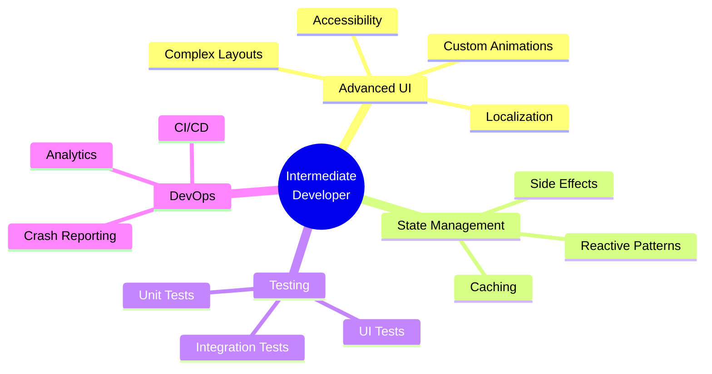

### Month 7-8: Advanced UI & UX

#### Custom Animations

| Animation Type | Difficulty | Use Case |
|---------------|------------|----------|
| Basic Transitions | ⭐ | Screen changes |
| Spring Animations | ⭐⭐ | Bouncy effects |
| Keyframe | ⭐⭐⭐ | Complex sequences |
| Physics-based | ⭐⭐⭐⭐ | Natural movement |
| Gesture-driven | ⭐⭐⭐⭐ | Interactive |

<details>
<summary><strong>📝 Animation Mastery Checklist</strong></summary>

**iOS:**
```swift
□ withAnimation & Animation modifiers
□ Transitions (.slide, .opacity, .scale)
□ matchedGeometryEffect
□ AnimatableData protocol
□ TimelineView for continuous
□ Canvas for custom drawing
□ Core Animation (CALayer)
□ UIViewPropertyAnimator
```

**Android:**
```kotlin
□ Compose animate* APIs
□ AnimatedVisibility
□ Crossfade
□ AnimatedContent
□ updateTransition
□ rememberInfiniteTransition
□ Animatable
□ MotionLayout
```
</details>

#### Accessibility

| Feature | Priority | Implementation |
|---------|----------|----------------|
| VoiceOver/TalkBack | 🔴 Critical | Labels, hints |
| Dynamic Type | 🔴 Critical | Scalable fonts |
| Color Contrast | 🔴 Critical | WCAG compliant |
| Reduce Motion | 🟡 Important | Simplified animations |
| Switch Control | 🟡 Important | Full keyboard nav |

**🎯 Project:** Build an accessible social media feed with smooth animations

---

### Month 9-10: Advanced Architecture

#### Clean Architecture

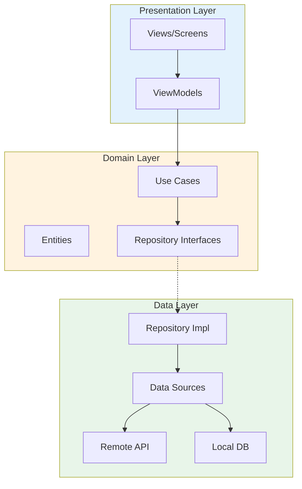

#### Dependency Injection

| Framework | Platform | Learning Curve |
|-----------|----------|----------------|
| Swift Dependencies | iOS | ⭐⭐ |
| Factory | iOS | ⭐ |
| Hilt | Android | ⭐⭐ |
| Koin | Android | ⭐ |
| GetIt | Flutter | ⭐ |

<details>
<summary><strong>📝 Architecture Patterns Deep Dive</strong></summary>

| Pattern | When to Use | Complexity |
|---------|-------------|------------|
| MVC | Simple apps, rapid prototyping | ⭐ |
| MVP | Legacy apps, UIKit | ⭐⭐ |
| MVVM | Most modern apps | ⭐⭐ |
| MVI | Complex state, debugging | ⭐⭐⭐ |
| VIPER | Large teams, modules | ⭐⭐⭐⭐ |
| TCA | SwiftUI, testability | ⭐⭐⭐⭐ |
| Clean | Enterprise apps | ⭐⭐⭐⭐ |
</details>

**🎯 Project:** Refactor a simple app to Clean Architecture with full test coverage

---

### Month 11-12: Testing & CI/CD

#### Testing Pyramid

```
                    /\
                   /  \
                  / E2E \        ← 10% (Slow, expensive)
                 /______\
                /        \
               /   UI     \      ← 20% (Visual, flows)
              /____________\
             /              \
            /  Integration   \   ← 30% (Components)
           /__________________\
          /                    \
         /      Unit Tests      \ ← 40% (Fast, focused)
        /________________________\
```

#### CI/CD Pipeline

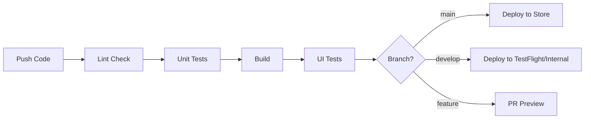

<details>
<summary><strong>📝 Testing Checklist</strong></summary>

```
Unit Testing:
□ Test ViewModel logic
□ Test Use Cases
□ Test Data transformations
□ Mock dependencies
□ Test error handling
□ Achieve 80%+ coverage

UI Testing:
□ Critical user flows
□ Form validation
□ Navigation
□ Error states
□ Loading states

Integration Testing:
□ API integration
□ Database operations
□ End-to-end flows
```
</details>

**🎯 Project:** Set up complete CI/CD with automated testing and deployment

---

### 🏆 Intermediate Track Completion Criteria

| Skill | Assessment |
|-------|------------|
| Advanced UI | ✅ Build complex animations |
| Accessibility | ✅ App passes accessibility audit |
| Clean Architecture | ✅ Implement in production app |
| Testing | ✅ 80%+ code coverage |
| CI/CD | ✅ Automated deployment pipeline |

---

## 🔴 Advanced Track (12-24 Months)

> **Goal:** Become a senior engineer who can architect and lead

### Month 13-15: Performance Mastery

See [⚡ Performance Track](#-performance-track) for details.

### Month 16-18: Security Deep Dive

See [🔒 Security Track](#-security-track) for details.

### Month 19-21: System Design

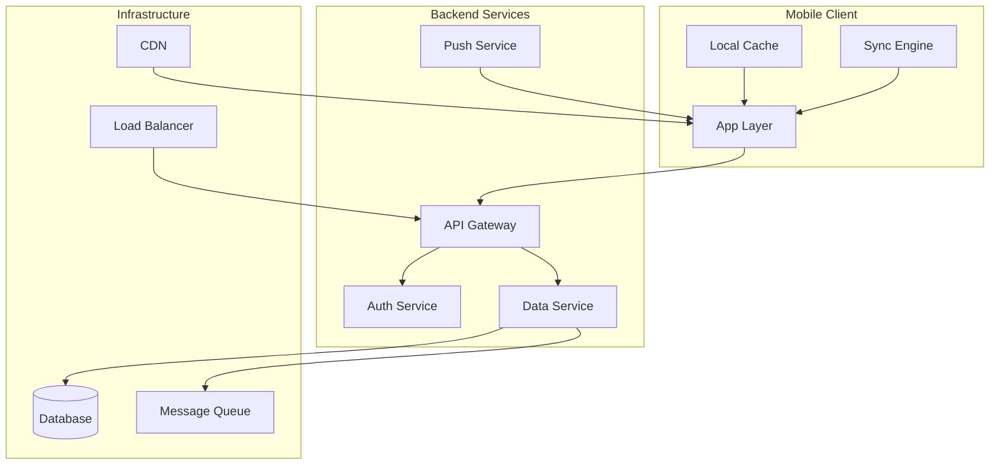

<details>
<summary><strong>📝 System Design Topics</strong></summary>

| Topic | Complexity | Resources |
|-------|------------|-----------|
| Offline-first architecture | ⭐⭐⭐ | [Offline First](https://offlinefirst.org/) |
| Real-time sync (CRDT) | ⭐⭐⭐⭐ | [CRDT.tech](https://crdt.tech/) |
| API design (REST, GraphQL, gRPC) | ⭐⭐⭐ | [API Patterns](https://microservices.io/patterns/) |
| Pagination strategies | ⭐⭐ | Cursor vs Offset |
| Caching strategies | ⭐⭐⭐ | Cache invalidation |
| Push notification architecture | ⭐⭐ | APNs, FCM |
| Analytics pipeline | ⭐⭐ | Events, funnels |
| A/B testing infrastructure | ⭐⭐⭐ | Feature flags |
| Modular architecture | ⭐⭐⭐⭐ | Module boundaries |
</details>

### Month 22-24: Leadership Preparation

See [👑 Leadership Track](#-leadership-track) for details.

---

## 🍎 iOS Specialist Track

> **For developers who want to master the Apple ecosystem**

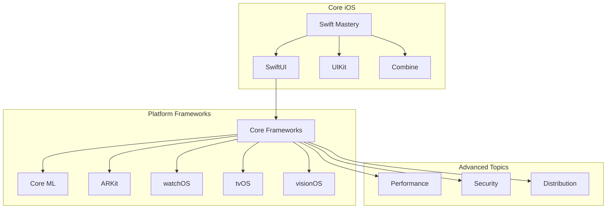

### iOS Mastery Checklist

<details>
<summary><strong>🔵 Swift Language (40 hours)</strong></summary>

```swift
// Advanced Swift Topics:
□ Protocol-Oriented Programming
□ Generics & Associated Types
□ Result Builders (@resultBuilder)
□ Property Wrappers
□ Macros (Swift 5.9+)
□ Opaque Types (some, any)
□ Existential Types
□ Memory Management (ARC deep dive)
□ Copy-on-Write optimization
□ Unsafe Swift (pointers, buffers)
```
</details>

<details>
<summary><strong>🟢 SwiftUI Advanced (60 hours)</strong></summary>

```swift
// Advanced SwiftUI:
□ @Observable macro (iOS 17+)
□ @Environment & custom keys
□ PreferenceKey
□ GeometryReader mastery
□ Custom Layout protocol
□ ViewThatFits
□ ContainerRelativeFrame
□ Animation timing curves
□ Matched geometry effects
□ Canvas & TimelineView
□ Metal shader integration
□ Accessibility modifiers
□ Custom ButtonStyle, ToggleStyle
□ DocumentGroup & FileDocument
□ Widget development
□ App Intents & Shortcuts
```
</details>

<details>
<summary><strong>🟡 UIKit (When Needed) (40 hours)</strong></summary>

```swift
// UIKit essentials:
□ UIViewController lifecycle
□ UICollectionView Compositional Layout
□ UICollectionView Diffable Data Source
□ Auto Layout programmatically
□ Custom UIView animations
□ UIViewRepresentable (bridge to SwiftUI)
□ Deep linking & URL schemes
□ Handoff & Universal Links
```
</details>

<details>
<summary><strong>🟣 Concurrency (30 hours)</strong></summary>

```swift
// Swift Concurrency:
□ async/await fundamentals
□ Task & TaskGroup
□ Actors & @MainActor
□ Sendable protocol
□ AsyncSequence & AsyncStream
□ Continuations (withCheckedContinuation)
□ Task cancellation & priorities
□ GlobalActor custom implementation
□ Data race debugging
```
</details>

<details>
<summary><strong>🔴 Platform Frameworks (80+ hours)</strong></summary>

| Framework | Use Case | Time |
|-----------|----------|------|
| Core Data / SwiftData | Local persistence | 20 hrs |
| CloudKit | Apple cloud sync | 15 hrs |
| Core Location | GPS, geofencing | 10 hrs |
| MapKit | Maps integration | 10 hrs |
| Core Animation | Advanced animations | 15 hrs |
| Core Graphics | Custom drawing | 10 hrs |
| AVFoundation | Audio/Video | 20 hrs |
| Core ML | Machine learning | 15 hrs |
| Vision | Image analysis | 10 hrs |
| ARKit | Augmented reality | 20 hrs |
| HealthKit | Health data | 10 hrs |
| StoreKit 2 | In-app purchases | 15 hrs |
| Push Notifications | APNs | 10 hrs |
| WidgetKit | Home screen widgets | 10 hrs |
| App Intents | Siri & Shortcuts | 10 hrs |
| visionOS | Spatial computing | 30 hrs |
</details>

### iOS Career Path

| Level | Skills | Salary (US) |
|-------|--------|-------------|
| Junior | Swift, SwiftUI basics, 1 app | $70-100K |
| Mid | Architecture, Testing, 3+ apps | $100-140K |
| Senior | System design, Mentoring, 5+ years | $140-180K |
| Staff | Technical vision, Cross-team impact | $180-250K |
| Principal | Industry influence, Patents/Publications | $250K+ |

---

## 🤖 Android Specialist Track

> **For developers who want to master the Android ecosystem**

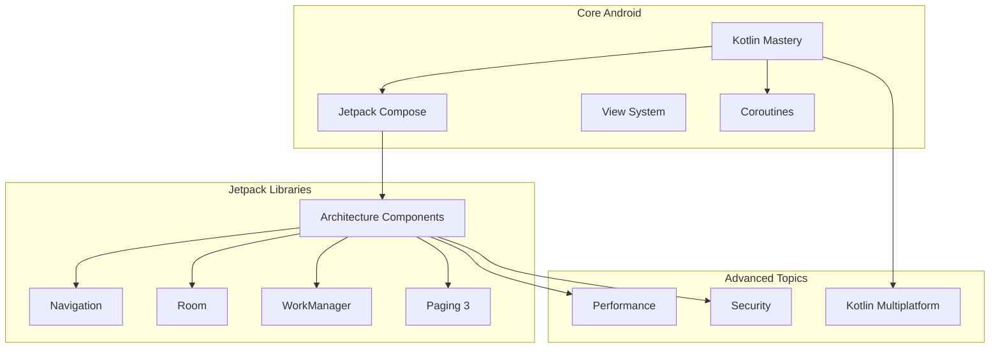

### Android Mastery Checklist

<details>
<summary><strong>🔵 Kotlin Advanced (40 hours)</strong></summary>

```kotlin
// Advanced Kotlin:
□ Coroutines deep dive
□ Flow, StateFlow, SharedFlow
□ Channels
□ Sealed classes & interfaces
□ Inline functions & reified types
□ Delegation patterns
□ DSL building
□ Multiplatform basics
□ Contracts
□ Context receivers (experimental)
```
</details>

<details>
<summary><strong>🟢 Jetpack Compose Advanced (60 hours)</strong></summary>

```kotlin
// Advanced Compose:
□ Composition & Recomposition
□ State management patterns
□ Side effects (LaunchedEffect, DisposableEffect)
□ Custom layouts
□ Intrinsic measurements
□ SubcomposeLayout
□ Custom Modifier
□ Draw modifiers & Canvas
□ Gesture handling
□ Compose Navigation deep dive
□ Testing Compose UI
□ Performance optimization
□ Interop with View system
```
</details>

<details>
<summary><strong>🟣 Architecture Components (50 hours)</strong></summary>

```kotlin
// Jetpack Architecture:
□ ViewModel & SavedStateHandle
□ Lifecycle-aware components
□ Room with Flow
□ Room migrations
□ WorkManager constraints & chaining
□ DataStore (Preferences, Proto)
□ Paging 3 with RemoteMediator
□ Navigation Safe Args
□ Hilt dependency injection
□ App Startup
```
</details>

<details>
<summary><strong>🔴 Platform Features (60+ hours)</strong></summary>

| Feature | Use Case | Time |
|---------|----------|------|
| Material Design 3 | Modern UI | 15 hrs |
| Notifications | User engagement | 10 hrs |
| Background Work | Sync, upload | 15 hrs |
| Location Services | Maps, geofencing | 10 hrs |
| CameraX | Camera apps | 15 hrs |
| Media3 | Audio/Video | 20 hrs |
| ML Kit | On-device ML | 15 hrs |
| Biometric | Secure auth | 5 hrs |
| App Widgets | Home screen | 10 hrs |
| Wear OS | Watch apps | 20 hrs |
| Android TV | TV apps | 15 hrs |
| Auto | Car apps | 10 hrs |
</details>

---

## 🦋 Cross-Platform Track

> **Build once, deploy everywhere**

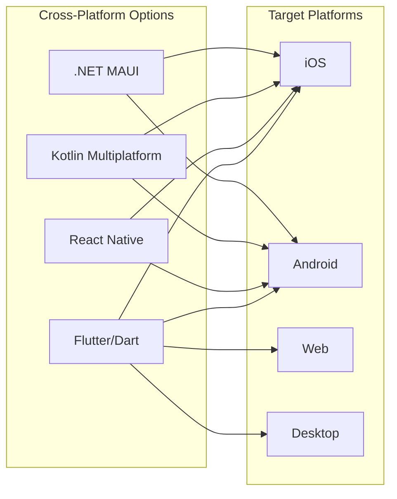

### Framework Comparison

| Criteria | Flutter | React Native | KMP |
|----------|---------|--------------|-----|
| Performance | ⭐⭐⭐⭐⭐ | ⭐⭐⭐⭐ | ⭐⭐⭐⭐⭐ |
| Native Feel | ⭐⭐⭐⭐ | ⭐⭐⭐⭐⭐ | ⭐⭐⭐⭐⭐ |
| Learning Curve | ⭐⭐⭐⭐ | ⭐⭐⭐ | ⭐⭐⭐ |
| Ecosystem | ⭐⭐⭐⭐ | ⭐⭐⭐⭐⭐ | ⭐⭐⭐ |
| Hot Reload | ⭐⭐⭐⭐⭐ | ⭐⭐⭐⭐ | N/A |
| Code Sharing | 95%+ | 85%+ | 70%+ |
| Job Market | Growing | Strong | Growing |

### Flutter Path (12 months)

<details>
<summary><strong>📝 Flutter Roadmap</strong></summary>

**Months 1-3: Foundations**
```dart
□ Dart syntax & async
□ Widget lifecycle
□ StatelessWidget vs StatefulWidget
□ Layout widgets
□ Navigation & routing
□ Forms & validation
```

**Months 4-6: Intermediate**
```dart
□ State management (Provider, Riverpod, BLoC)
□ HTTP & REST APIs
□ Local storage (Hive, SQLite)
□ Animations & transitions
□ Platform channels
□ Testing (unit, widget, integration)
```

**Months 7-9: Advanced**
```dart
□ Custom painting
□ Isolates for heavy computation
□ Native integrations
□ Firebase suite
□ Push notifications
□ Background processing
```

**Months 10-12: Production**
```dart
□ CI/CD with Codemagic/GitHub Actions
□ App signing & distribution
□ Performance optimization
□ Crash reporting & analytics
□ A/B testing
□ Release management
```
</details>

### React Native Path (12 months)

<details>
<summary><strong>📝 React Native Roadmap</strong></summary>

**Months 1-3: Foundations**
```javascript
□ JavaScript ES6+ / TypeScript
□ React fundamentals
□ Core components
□ Styling (StyleSheet, Tailwind)
□ Navigation (React Navigation)
□ Basic hooks
```

**Months 4-6: Intermediate**
```javascript
□ State management (Redux, Zustand)
□ API integration
□ AsyncStorage & MMKV
□ Animations (Reanimated)
□ Gestures (Gesture Handler)
□ Testing (Jest, Detox)
```

**Months 7-9: Advanced**
```javascript
□ Native modules
□ TurboModules & Fabric
□ New Architecture
□ Hermes engine
□ CodePush
□ Push notifications
```

**Months 10-12: Production**
```javascript
□ CI/CD with EAS Build
□ App Center
□ Performance profiling
□ Crash reporting
□ Analytics
□ Release strategies
```
</details>

---

## 🏗️ Architecture Track

> **Design systems that scale**

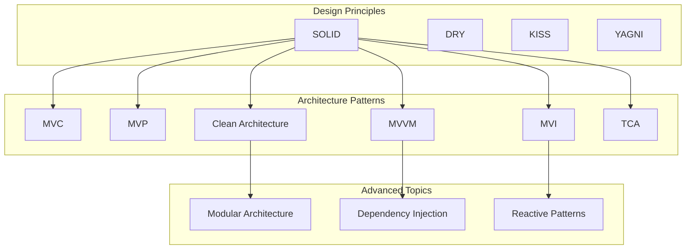

### Architecture Decision Matrix

| Scenario | Recommended | Why |
|----------|-------------|-----|
| Small app, solo dev | MVVM | Simple, effective |
| Large app, big team | Clean + MVVM | Scalable, testable |
| Complex state | MVI | Predictable state |
| SwiftUI app | TCA or MVVM | Works with SwiftUI |
| Multi-module app | Modular Clean | Clear boundaries |
| Legacy refactor | MVP → MVVM | Gradual migration |

### Deep Dive Topics

<details>
<summary><strong>📝 SOLID Principles Applied</strong></summary>

| Principle | Mobile Example |
|-----------|----------------|
| **S**ingle Responsibility | ViewModel only handles UI logic |
| **O**pen/Closed | Use protocols for extensibility |
| **L**iskov Substitution | Repository implementations interchangeable |
| **I**nterface Segregation | Small, focused protocols |
| **D**ependency Inversion | Depend on abstractions, not concretions |
</details>

<details>
<summary><strong>📝 Modular Architecture</strong></summary>

```
app/
├── App/                 # Main app target
├── Features/
│   ├── Home/           # Feature module
│   ├── Profile/        # Feature module
│   └── Settings/       # Feature module
├── Core/
│   ├── Network/        # Shared networking
│   ├── Storage/        # Shared persistence
│   └── UI/             # Shared components
└── Domain/
    ├── Entities/       # Business objects
    └── UseCases/       # Business logic
```

**Benefits:**
- Faster build times
- Clear ownership
- Parallel development
- Easier testing
</details>

---

## ⚡ Performance Track

> **Build apps that fly**

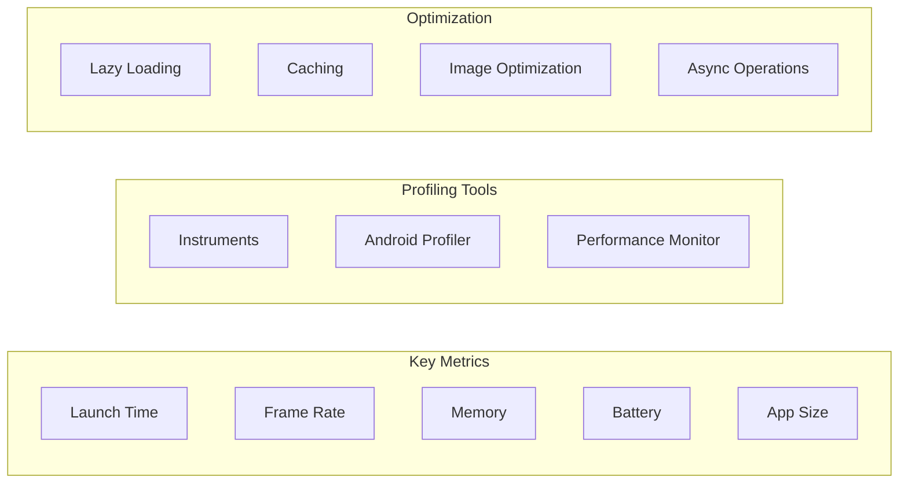

### Performance Benchmarks

| Metric | Good | Acceptable | Needs Work |
|--------|------|------------|------------|
| Cold Launch | < 1s | 1-2s | > 2s |
| Warm Launch | < 0.5s | 0.5-1s | > 1s |
| Frame Rate | 60 fps | 55-60 fps | < 55 fps |
| Memory | < 100MB | 100-200MB | > 200MB |
| App Size | < 30MB | 30-100MB | > 100MB |
| Battery/hr | < 5% | 5-10% | > 10% |

### Performance Checklist

<details>
<summary><strong>📝 Launch Time Optimization</strong></summary>

```
□ Minimize work in app delegate/Application
□ Lazy load non-critical features
□ Defer analytics initialization
□ Use static linking wisely
□ Optimize asset loading
□ Profile with Instruments/Profiler
```
</details>

<details>
<summary><strong>📝 UI Performance</strong></summary>

```
□ Avoid expensive operations on main thread
□ Use proper list recycling
□ Optimize images (size, format, caching)
□ Reduce overdraw
□ Profile with GPU tools
□ Minimize view hierarchy depth
□ Use lazy loading for off-screen content
```
</details>

<details>
<summary><strong>📝 Memory Optimization</strong></summary>

```
□ Fix retain cycles
□ Use weak references appropriately
□ Clear caches on memory warning
□ Profile with Memory Graph/Profiler
□ Optimize image memory usage
□ Release unused resources
□ Use value types where appropriate
```
</details>

---

## 🔒 Security Track

> **Protect users and their data**

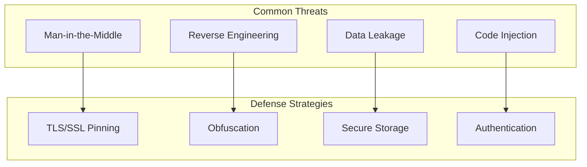

### Security Checklist

<details>
<summary><strong>📝 Data Security</strong></summary>

```
□ Store secrets in Keychain/Keystore
□ Never hardcode API keys
□ Encrypt sensitive data at rest
□ Use HTTPS everywhere
□ Implement certificate pinning
□ Clear sensitive data from memory
□ Secure user defaults/shared prefs
□ Implement proper session management
```
</details>

<details>
<summary><strong>📝 Authentication</strong></summary>

```
□ Use biometric authentication
□ Implement secure token storage
□ Support OAuth 2.0 / OIDC
□ Add rate limiting
□ Implement proper logout
□ Handle session expiry
□ Multi-factor authentication support
```
</details>

<details>
<summary><strong>📝 App Security</strong></summary>

```
□ Enable code obfuscation
□ Detect jailbreak/root
□ Implement anti-tampering
□ Secure WebView configuration
□ Validate input data
□ Use secure random numbers
□ Implement proper deep link handling
```
</details>

### OWASP Mobile Top 10

| Risk | Mitigation |
|------|------------|
| Improper Platform Usage | Follow platform guidelines |
| Insecure Data Storage | Use Keychain/Keystore |
| Insecure Communication | TLS + cert pinning |
| Insecure Authentication | Biometric + secure tokens |
| Insufficient Cryptography | Use platform crypto APIs |
| Insecure Authorization | Server-side validation |
| Client Code Quality | Code review + static analysis |
| Code Tampering | Obfuscation + integrity checks |
| Reverse Engineering | Obfuscation + native code |
| Extraneous Functionality | Remove debug code |

---

## 👑 Leadership Track

> **Lead teams and drive technical excellence**

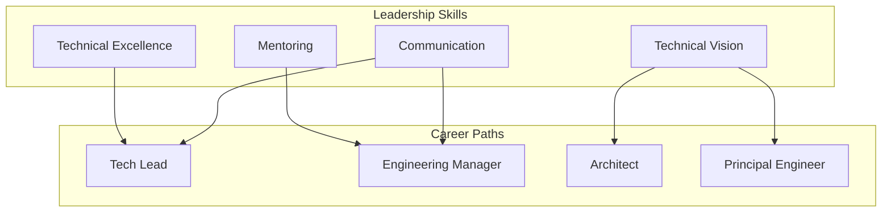

### Leadership Progression

| Level | Scope | Key Skills |
|-------|-------|------------|
| Senior Engineer | Team impact | Technical depth, mentoring |
| Staff Engineer | Multi-team | Architecture, influence |
| Tech Lead | Team leadership | Delivery, people |
| Principal | Org-wide | Vision, strategy |
| Architect | Technical direction | System design |
| Engineering Manager | People management | Hiring, growth |

### Leadership Checklist

<details>
<summary><strong>📝 Technical Leadership</strong></summary>

```
□ Define and evolve architecture
□ Create technical standards
□ Lead architecture reviews
□ Drive technical decisions
□ Reduce technical debt
□ Champion best practices
□ Research new technologies
□ Create reusable components
```
</details>

<details>
<summary><strong>📝 People Leadership</strong></summary>

```
□ Mentor junior developers
□ Conduct effective 1:1s
□ Give constructive feedback
□ Support career growth
□ Build inclusive culture
□ Manage conflicts
□ Conduct interviews
□ Onboard new team members
```
</details>

<details>
<summary><strong>📝 Communication</strong></summary>

```
□ Present to stakeholders
□ Write technical proposals
□ Document decisions (ADRs)
□ Lead team meetings
□ Cross-team collaboration
□ Technical writing
□ Conference speaking
□ Open source contribution
```
</details>

---

## 📊 Progress Tracker

### Track Your Learning

Copy this to track your progress:

```markdown
## My Mobile Development Journey

### Current Track: [Your Track]
### Started: [Date]
### Target: [Goal]

### Progress

#### Beginner Track
- [ ] Month 1: Programming Fundamentals
- [ ] Month 2: UI Fundamentals
- [ ] Month 3: Data & Networking
- [ ] Month 4-5: Architecture
- [ ] Month 6: Publishing

#### Projects Completed
- [ ] Tip Calculator
- [ ] Recipe Book
- [ ] Weather App
- [ ] Task Manager
- [ ] Published App

#### Skills Assessment
| Skill | Level (1-5) | Last Assessed |
|-------|-------------|---------------|
| Swift/Kotlin | | |
| SwiftUI/Compose | | |
| Networking | | |
| Architecture | | |
| Testing | | |
```

### Skill Self-Assessment

Rate yourself 1-5 for each skill:

| Rating | Description |
|--------|-------------|
| 1 | No experience |
| 2 | Basic understanding |
| 3 | Can work independently |
| 4 | Can mentor others |
| 5 | Expert / thought leader |

---

## 🎯 Practice Projects

### Project Ideas by Level

#### 🟢 Beginner (1-2 weeks each)

| Project | Skills Practiced | Difficulty |
|---------|------------------|------------|
| Tip Calculator | UI, math, state | ⭐ |
| Unit Converter | UI, logic | ⭐ |
| Rock Paper Scissors | Logic, animations | ⭐ |
| Flashcard App | Lists, navigation | ⭐⭐ |
| Notes App | CRUD, persistence | ⭐⭐ |
| Weather App | API, async | ⭐⭐ |
| Quiz App | State, scoring | ⭐⭐ |

#### 🟡 Intermediate (2-4 weeks each)

| Project | Skills Practiced | Difficulty |
|---------|------------------|------------|
| Todo with Sync | Cloud sync, auth | ⭐⭐⭐ |
| Recipe Finder | API, search, favorites | ⭐⭐⭐ |
| Podcast Player | Audio, background | ⭐⭐⭐ |
| Expense Tracker | Charts, categories | ⭐⭐⭐ |
| Chat App | Real-time, messages | ⭐⭐⭐⭐ |
| Fitness Tracker | HealthKit/Fit, charts | ⭐⭐⭐⭐ |
| E-commerce | Cart, payments | ⭐⭐⭐⭐ |

#### 🔴 Advanced (1-3 months each)

| Project | Skills Practiced | Difficulty |
|---------|------------------|------------|
| Social Media Clone | Full-stack, feeds | ⭐⭐⭐⭐⭐ |
| Video Streaming | Media, CDN | ⭐⭐⭐⭐⭐ |
| AR Experience | ARKit/ARCore | ⭐⭐⭐⭐⭐ |
| Offline-first App | Sync, conflict | ⭐⭐⭐⭐⭐ |
| Open Source Library | API design, docs | ⭐⭐⭐⭐⭐ |

---

## 💼 Job Market Insights

### 2026 Salary Data (US)

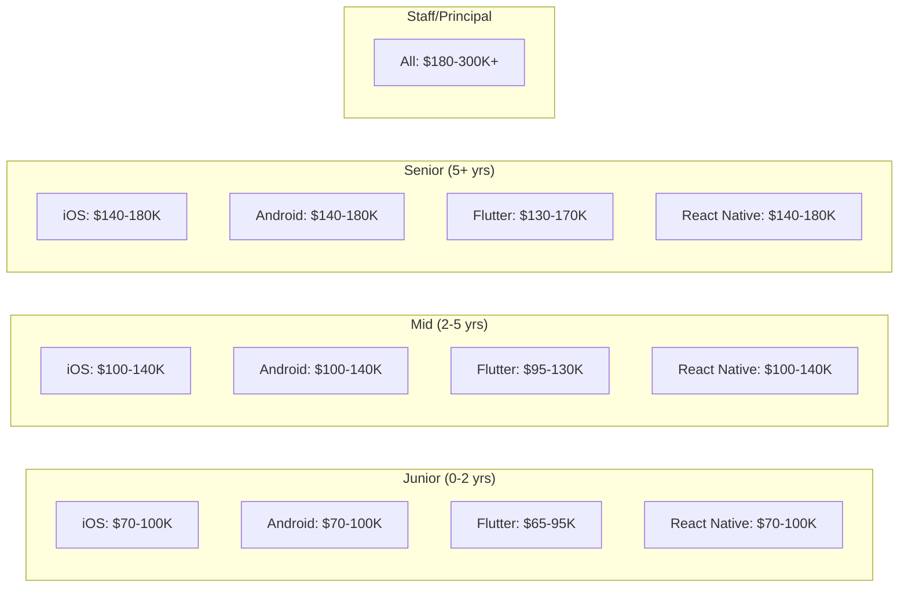

### In-Demand Skills 2026

| Skill | Demand | Trend |
|-------|--------|-------|
| Swift/SwiftUI | 🔥🔥🔥🔥🔥 | ↗️ Rising |
| Kotlin/Compose | 🔥🔥🔥🔥🔥 | ↗️ Rising |
| Flutter | 🔥🔥🔥🔥 | ↗️ Rising |
| React Native | 🔥🔥🔥🔥 | → Stable |
| Kotlin Multiplatform | 🔥🔥🔥 | ↗️ Rising fast |
| visionOS | 🔥🔥 | ↗️ Rising |

### Interview Preparation

| Topic | Questions to Expect |
|-------|---------------------|
| Data Structures | Arrays, linked lists, trees, graphs |
| Algorithms | Sorting, searching, dynamic programming |
| System Design | Design Instagram, Uber, WhatsApp |
| Mobile Specific | Lifecycle, memory, threading |
| Architecture | MVVM, Clean, patterns |
| Behavioral | Leadership, conflict, failure |

---

## 🎓 Skill Assessment

### Self-Assessment Quiz

Answer honestly to find your level:

**Language & Syntax**
- [ ] Can write basic functions and classes
- [ ] Understand optionals/null safety deeply
- [ ] Can write complex generics
- [ ] Know memory management internals

**UI Development**
- [ ] Can create basic layouts
- [ ] Can implement custom components
- [ ] Can create complex animations
- [ ] Can build accessible UIs

**Architecture**
- [ ] Understand MVC
- [ ] Can implement MVVM
- [ ] Can design Clean Architecture
- [ ] Can architect large applications

**Testing**
- [ ] Write basic unit tests
- [ ] Achieve 80%+ coverage
- [ ] Write UI tests
- [ ] Practice TDD

**Scoring:**
- 0-4 checks: 🟢 Beginner
- 5-8 checks: 🟡 Intermediate
- 9-12 checks: 🔴 Advanced
- 13-16 checks: 💎 Expert

---

## 🤝 Community & Mentorship

### Online Communities

| Community | Platform | Focus |
|-----------|----------|-------|
| [iOS Developers](https://www.reddit.com/r/iOSProgramming/) | Reddit | iOS |
| [Android Dev](https://www.reddit.com/r/androiddev/) | Reddit | Android |
| [Flutter Dev](https://www.reddit.com/r/FlutterDev/) | Reddit | Flutter |
| [Hacking with Swift](https://www.hackingwithswift.com/forums) | Forum | Swift |
| [Kotlinlang Slack](https://kotlinlang.slack.com/) | Slack | Kotlin |
| [Flutter Discord](https://discord.gg/N7Yshp4) | Discord | Flutter |

### Conferences

| Conference | Focus | When |
|------------|-------|------|
| WWDC | Apple | June |
| Google I/O | Android | May |
| KotlinConf | Kotlin | May |
| Droidcon | Android | Various |
| try! Swift | Swift | Various |
| Flutter Forward | Flutter | Various |

### Finding a Mentor

1. **Online Platforms**
   - [ADPList](https://adplist.org/) - Free mentorship
   - [MentorCruise](https://mentorcruise.com/) - Paid mentorship
   - [Codementor](https://www.codementor.io/) - On-demand help

2. **Local Meetups**
   - Search [Meetup.com](https://www.meetup.com/)
   - Join local iOS/Android groups
   - Attend hackathons

3. **Open Source**
   - Contribute to projects
   - Engage with maintainers
   - Build relationships

---

## 🤝 Contributing

We welcome contributions! See [CONTRIBUTING.md](CONTRIBUTING.md) for guidelines.

### How to Contribute

1. **Add Resources** - Found a great tutorial? Add it!
2. **Fix Errors** - Spot a mistake? Please correct it
3. **Improve Content** - Make explanations clearer
4. **Add Translations** - Help make this accessible globally
5. **Share Projects** - Add your practice project ideas

---

## 📜 License

This project is licensed under the MIT License - see [LICENSE](LICENSE) for details.

---

## ⭐ Star History

<a href="https://star-history.com/#muhittincamdali/mobile-developer-roadmap&Date">
 <picture>
   <source media="(prefers-color-scheme: dark)" srcset="https://api.star-history.com/svg?repos=muhittincamdali/mobile-developer-roadmap&type=Date&theme=dark" />
   <source media="(prefers-color-scheme: light)" srcset="https://api.star-history.com/svg?repos=muhittincamdali/mobile-developer-roadmap&type=Date" />
   
 </picture>
</a>

---

<p align="center">
  <strong>🚀 Start your journey today!</strong><br>
  <sub>Made with ❤️ by mobile developers, for mobile developers</sub>
</p>

<p align="center">
  <a href="#-quick-start">Back to Top ↑</a>
</p>
