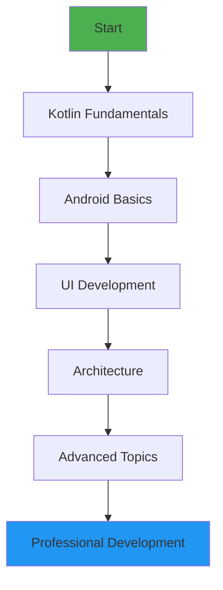
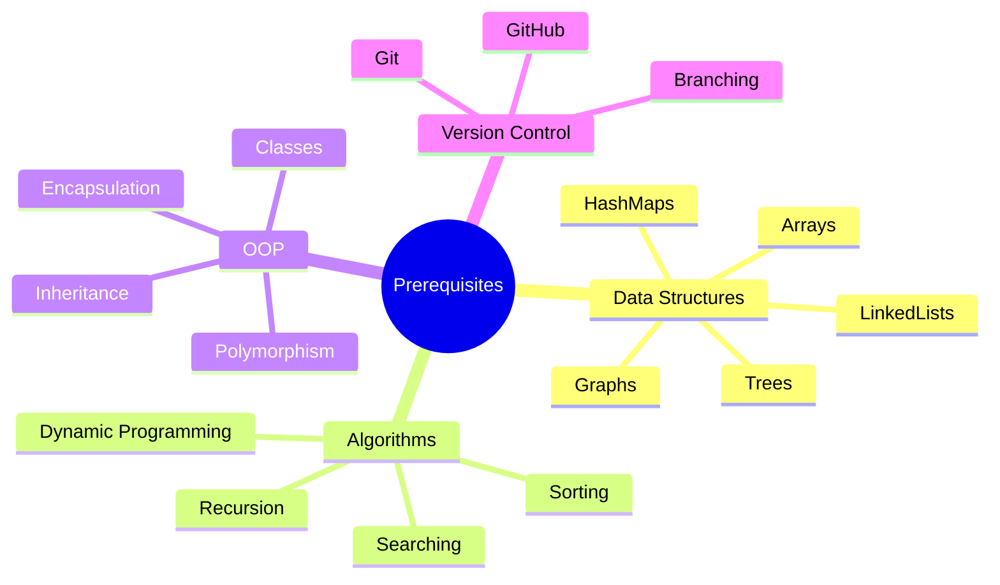
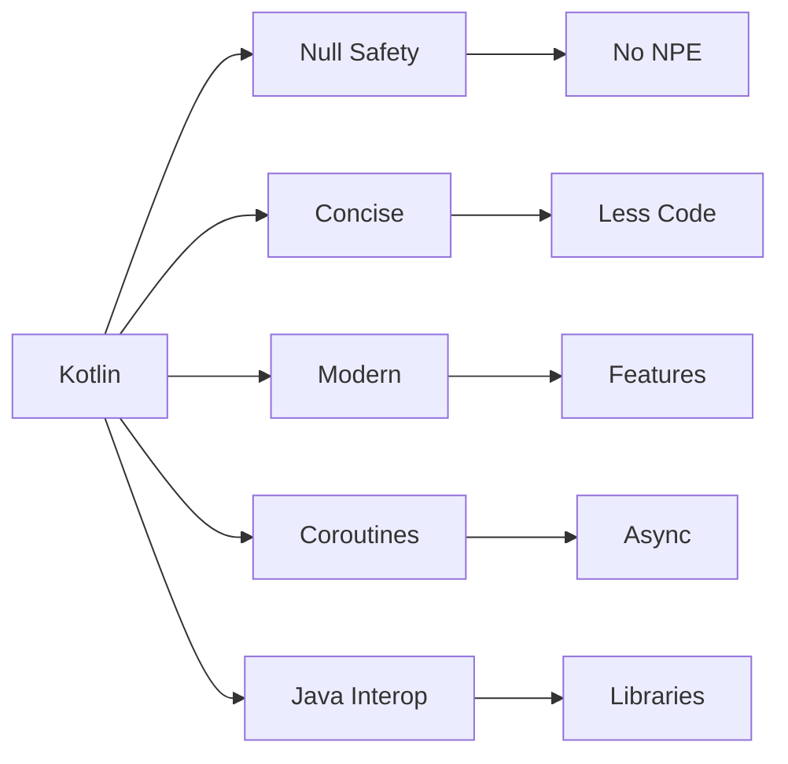
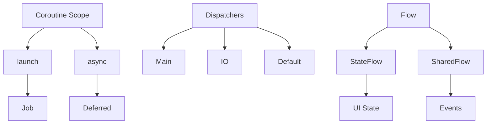
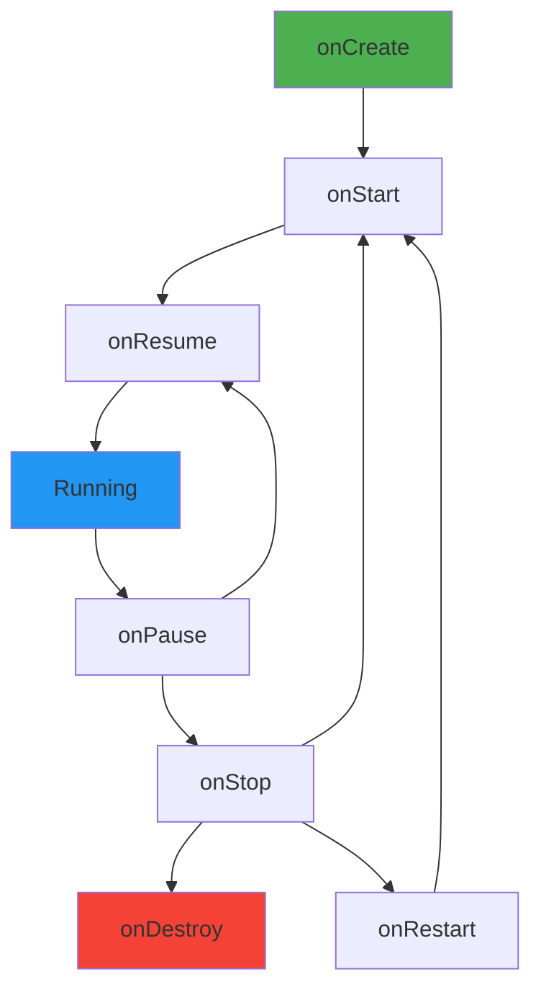
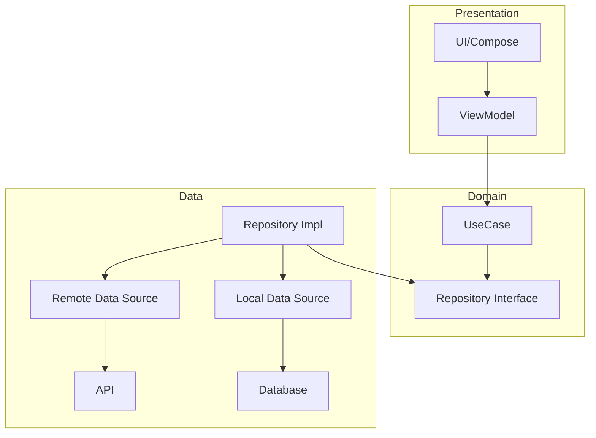
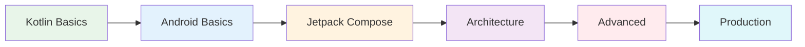

# Android Developer Roadmap

> A comprehensive guide to becoming a professional Android developer in 2024-2025



---

## Table of Contents

1. [Prerequisites](#prerequisites)
2. [Kotlin Programming Language](#kotlin-programming-language)
3. [Android Studio Setup](#android-studio-setup)
4. [Android Fundamentals](#android-fundamentals)
5. [User Interface Development](#user-interface-development)
6. [Jetpack Compose](#jetpack-compose)
7. [Architecture Patterns](#architecture-patterns)
8. [Jetpack Components](#jetpack-components)
9. [Networking](#networking)
10. [Local Data Persistence](#local-data-persistence)
11. [Dependency Injection](#dependency-injection)
12. [Testing](#testing)
13. [Performance Optimization](#performance-optimization)
14. [Security](#security)
15. [Publishing](#publishing)
16. [Advanced Topics](#advanced-topics)

---

## Prerequisites

### Computer Science Fundamentals

Before diving into Android development, ensure you have a solid understanding of:

#### Data Structures
- Arrays and Lists
- HashMaps and Sets
- Trees and Graphs
- Stacks and Queues
- LinkedLists

#### Algorithms
- Sorting algorithms (Quick, Merge, Bubble)
- Searching algorithms (Binary, Linear)
- Graph traversal (BFS, DFS)
- Dynamic Programming basics
- Time and Space complexity (Big O)

#### Object-Oriented Programming
- Classes and Objects
- Inheritance and Polymorphism
- Encapsulation and Abstraction
- SOLID Principles
- Design Patterns



### Development Environment

| Tool | Purpose | Link |
|------|---------|------|
| Android Studio | Official IDE | developer.android.com |
| JDK 17+ | Java Development Kit | adoptium.net |
| Git | Version Control | git-scm.com |
| ADB | Debug Bridge | Android SDK |

---

## Kotlin Programming Language

### Why Kotlin?

Kotlin is the official language for Android development since 2019. It offers:

- **Null Safety** - Eliminates NullPointerException
- **Concise Syntax** - Less boilerplate code
- **Interoperability** - Works with Java seamlessly
- **Coroutines** - Simplified async programming
- **Modern Features** - Extension functions, data classes, sealed classes



### Kotlin Basics

#### Variables and Types

```kotlin
// Immutable (preferred)
val name: String = "Android"
val count = 42 // Type inference

// Mutable
var score: Int = 0
score = 100

// Nullable types
var nullable: String? = null
val length = nullable?.length ?: 0 // Elvis operator
```

#### Functions

```kotlin
// Basic function
fun greet(name: String): String {
    return "Hello, $name!"
}

// Single expression function
fun double(x: Int) = x * 2

// Default parameters
fun connect(host: String, port: Int = 8080) { }

// Named arguments
connect(port = 443, host = "api.example.com")

// Higher-order functions
fun operate(x: Int, y: Int, operation: (Int, Int) -> Int): Int {
    return operation(x, y)
}

val sum = operate(5, 3) { a, b -> a + b }
```

#### Classes and Objects

```kotlin
// Data class
data class User(
    val id: Long,
    val name: String,
    val email: String
)

// Sealed class
sealed class Result<out T> {
    data class Success<T>(val data: T) : Result<T>()
    data class Error(val message: String) : Result<Nothing>()
    object Loading : Result<Nothing>()
}

// Object declaration (Singleton)
object Analytics {
    fun track(event: String) { }
}

// Companion object
class Factory {
    companion object {
        fun create(): Factory = Factory()
    }
}
```

#### Collections

```kotlin
// Lists
val immutableList = listOf(1, 2, 3)
val mutableList = mutableListOf(1, 2, 3)

// Maps
val map = mapOf("a" to 1, "b" to 2)
val mutableMap = mutableMapOf<String, Int>()

// Collection operations
val numbers = listOf(1, 2, 3, 4, 5)

val doubled = numbers.map { it * 2 }
val evens = numbers.filter { it % 2 == 0 }
val sum = numbers.reduce { acc, n -> acc + n }
val first = numbers.firstOrNull { it > 3 }

// Sequence (lazy evaluation)
val result = numbers.asSequence()
    .filter { it > 2 }
    .map { it * 2 }
    .toList()
```

### Kotlin Coroutines

#### Basics

```kotlin
// Launching a coroutine
viewModelScope.launch {
    val result = fetchData()
    updateUI(result)
}

// Suspend function
suspend fun fetchData(): Data {
    return withContext(Dispatchers.IO) {
        api.getData()
    }
}

// Async/await
viewModelScope.launch {
    val deferred1 = async { fetchUser() }
    val deferred2 = async { fetchPosts() }
    
    val user = deferred1.await()
    val posts = deferred2.await()
}
```

#### Dispatchers

| Dispatcher | Use Case |
|------------|----------|
| `Dispatchers.Main` | UI operations |
| `Dispatchers.IO` | Network, Database |
| `Dispatchers.Default` | CPU-intensive work |
| `Dispatchers.Unconfined` | Not confined to any thread |

#### Flow

```kotlin
// Creating a flow
fun fetchUsers(): Flow<User> = flow {
    val users = api.getUsers()
    users.forEach { emit(it) }
}

// Collecting a flow
viewModelScope.launch {
    fetchUsers()
        .filter { it.isActive }
        .map { it.name }
        .collect { name ->
            println(name)
        }
}

// StateFlow
private val _uiState = MutableStateFlow(UiState())
val uiState: StateFlow<UiState> = _uiState.asStateFlow()

// SharedFlow
private val _events = MutableSharedFlow<Event>()
val events: SharedFlow<Event> = _events.asSharedFlow()
```



### Advanced Kotlin

#### Extension Functions

```kotlin
// String extension
fun String.capitalizeWords(): String {
    return split(" ").joinToString(" ") { it.capitalize() }
}

val title = "hello world".capitalizeWords() // "Hello World"

// Context extension
fun Context.showToast(message: String) {
    Toast.makeText(this, message, Toast.LENGTH_SHORT).show()
}

// Nullable extension
fun String?.orEmpty(): String = this ?: ""
```

#### Generics

```kotlin
// Generic class
class Box<T>(val value: T)

// Generic function
fun <T> List<T>.secondOrNull(): T? = getOrNull(1)

// Variance
interface Producer<out T> { // Covariant
    fun produce(): T
}

interface Consumer<in T> { // Contravariant
    fun consume(item: T)
}

// Reified type parameters
inline fun <reified T> List<*>.filterIsInstance(): List<T> {
    return filter { it is T }.map { it as T }
}
```

#### Delegation

```kotlin
// Property delegation
class User {
    var name: String by Delegates.observable("") { _, old, new ->
        println("Changed from $old to $new")
    }
    
    val lazyValue: String by lazy {
        println("Computed!")
        "Hello"
    }
}

// Interface delegation
interface Printer {
    fun print()
}

class ConsolePrinter : Printer {
    override fun print() = println("Console")
}

class Document(printer: Printer) : Printer by printer
```

---

## Android Studio Setup

### Installation

1. Download Android Studio from developer.android.com
2. Install JDK 17 or higher
3. Configure SDK Manager
4. Set up an emulator or connect a physical device

### Essential Plugins

| Plugin | Purpose |
|--------|---------|
| Kotlin | Language support |
| Android ButterKnife | View binding (legacy) |
| ADB Idea | ADB commands |
| JSON To Kotlin Class | JSON parsing |
| Detekt | Code analysis |

### Project Structure

```
MyApp/
├── app/
│   ├── build.gradle.kts
│   ├── src/
│   │   ├── main/
│   │   │   ├── java/com/example/
│   │   │   │   ├── data/
│   │   │   │   ├── domain/
│   │   │   │   ├── presentation/
│   │   │   │   └── di/
│   │   │   ├── res/
│   │   │   │   ├── layout/
│   │   │   │   ├── values/
│   │   │   │   ├── drawable/
│   │   │   │   └── mipmap/
│   │   │   └── AndroidManifest.xml
│   │   ├── test/
│   │   └── androidTest/
├── gradle/
├── build.gradle.kts
└── settings.gradle.kts
```

### Gradle Configuration

```kotlin
// app/build.gradle.kts
plugins {
    id("com.android.application")
    id("org.jetbrains.kotlin.android")
    id("com.google.devtools.ksp")
    id("com.google.dagger.hilt.android")
}

android {
    namespace = "com.example.myapp"
    compileSdk = 34

    defaultConfig {
        applicationId = "com.example.myapp"
        minSdk = 24
        targetSdk = 34
        versionCode = 1
        versionName = "1.0.0"

        testInstrumentationRunner = "androidx.test.runner.AndroidJUnitRunner"
    }

    buildTypes {
        release {
            isMinifyEnabled = true
            proguardFiles(
                getDefaultProguardFile("proguard-android-optimize.txt"),
                "proguard-rules.pro"
            )
        }
    }

    compileOptions {
        sourceCompatibility = JavaVersion.VERSION_17
        targetCompatibility = JavaVersion.VERSION_17
    }

    kotlinOptions {
        jvmTarget = "17"
    }

    buildFeatures {
        compose = true
        viewBinding = true
    }

    composeOptions {
        kotlinCompilerExtensionVersion = "1.5.8"
    }
}

dependencies {
    // AndroidX Core
    implementation("androidx.core:core-ktx:1.12.0")
    implementation("androidx.lifecycle:lifecycle-runtime-ktx:2.7.0")
    implementation("androidx.activity:activity-compose:1.8.2")
    
    // Compose
    implementation(platform("androidx.compose:compose-bom:2024.01.00"))
    implementation("androidx.compose.ui:ui")
    implementation("androidx.compose.ui:ui-graphics")
    implementation("androidx.compose.ui:ui-tooling-preview")
    implementation("androidx.compose.material3:material3")
    
    // Navigation
    implementation("androidx.navigation:navigation-compose:2.7.6")
    
    // Hilt
    implementation("com.google.dagger:hilt-android:2.50")
    ksp("com.google.dagger:hilt-compiler:2.50")
    
    // Room
    implementation("androidx.room:room-runtime:2.6.1")
    implementation("androidx.room:room-ktx:2.6.1")
    ksp("androidx.room:room-compiler:2.6.1")
    
    // Retrofit
    implementation("com.squareup.retrofit2:retrofit:2.9.0")
    implementation("com.squareup.retrofit2:converter-gson:2.9.0")
    implementation("com.squareup.okhttp3:logging-interceptor:4.12.0")
    
    // Testing
    testImplementation("junit:junit:4.13.2")
    testImplementation("io.mockk:mockk:1.13.9")
    testImplementation("org.jetbrains.kotlinx:kotlinx-coroutines-test:1.7.3")
    androidTestImplementation("androidx.test.ext:junit:1.1.5")
    androidTestImplementation("androidx.test.espresso:espresso-core:3.5.1")
}
```

---

## Android Fundamentals

### Application Class

```kotlin
class MyApplication : Application() {
    
    override fun onCreate() {
        super.onCreate()
        // Initialize libraries
        initTimber()
        initCoil()
    }
    
    private fun initTimber() {
        if (BuildConfig.DEBUG) {
            Timber.plant(Timber.DebugTree())
        }
    }
    
    private fun initCoil() {
        // Coil initialization
    }
}
```

### Activity Lifecycle



```kotlin
class MainActivity : AppCompatActivity() {
    
    override fun onCreate(savedInstanceState: Bundle?) {
        super.onCreate(savedInstanceState)
        setContentView(R.layout.activity_main)
        // Initialize UI
    }
    
    override fun onStart() {
        super.onStart()
        // Activity becoming visible
    }
    
    override fun onResume() {
        super.onResume()
        // Activity in foreground
    }
    
    override fun onPause() {
        super.onPause()
        // Another activity taking focus
    }
    
    override fun onStop() {
        super.onStop()
        // Activity no longer visible
    }
    
    override fun onDestroy() {
        super.onDestroy()
        // Cleanup resources
    }
    
    override fun onSaveInstanceState(outState: Bundle) {
        super.onSaveInstanceState(outState)
        // Save UI state
    }
    
    override fun onRestoreInstanceState(savedInstanceState: Bundle) {
        super.onRestoreInstanceState(savedInstanceState)
        // Restore UI state
    }
}
```

### Fragment Lifecycle

```kotlin
class HomeFragment : Fragment() {
    
    private var _binding: FragmentHomeBinding? = null
    private val binding get() = _binding!!
    
    override fun onCreateView(
        inflater: LayoutInflater,
        container: ViewGroup?,
        savedInstanceState: Bundle?
    ): View {
        _binding = FragmentHomeBinding.inflate(inflater, container, false)
        return binding.root
    }
    
    override fun onViewCreated(view: View, savedInstanceState: Bundle?) {
        super.onViewCreated(view, savedInstanceState)
        setupUI()
        observeViewModel()
    }
    
    override fun onDestroyView() {
        super.onDestroyView()
        _binding = null
    }
}
```

### Intents

```kotlin
// Explicit Intent
val intent = Intent(this, DetailActivity::class.java).apply {
    putExtra("USER_ID", userId)
    putExtra("USER_NAME", userName)
}
startActivity(intent)

// Implicit Intent
val shareIntent = Intent(Intent.ACTION_SEND).apply {
    type = "text/plain"
    putExtra(Intent.EXTRA_TEXT, "Check this out!")
}
startActivity(Intent.createChooser(shareIntent, "Share via"))

// Activity Result
private val launcher = registerForActivityResult(
    ActivityResultContracts.StartActivityForResult()
) { result ->
    if (result.resultCode == RESULT_OK) {
        val data = result.data
        // Handle result
    }
}

launcher.launch(intent)
```

### Services

```kotlin
// Foreground Service
class DownloadService : Service() {
    
    override fun onBind(intent: Intent?): IBinder? = null
    
    override fun onStartCommand(intent: Intent?, flags: Int, startId: Int): Int {
        val notification = createNotification()
        startForeground(NOTIFICATION_ID, notification)
        
        // Do work
        downloadFile()
        
        return START_NOT_STICKY
    }
    
    private fun createNotification(): Notification {
        return NotificationCompat.Builder(this, CHANNEL_ID)
            .setContentTitle("Downloading...")
            .setSmallIcon(R.drawable.ic_download)
            .build()
    }
}

// WorkManager (preferred for background work)
class SyncWorker(
    context: Context,
    params: WorkerParameters
) : CoroutineWorker(context, params) {
    
    override suspend fun doWork(): Result {
        return try {
            syncData()
            Result.success()
        } catch (e: Exception) {
            Result.retry()
        }
    }
}

// Schedule work
val syncRequest = PeriodicWorkRequestBuilder<SyncWorker>(
    15, TimeUnit.MINUTES
).setConstraints(
    Constraints.Builder()
        .setRequiredNetworkType(NetworkType.CONNECTED)
        .build()
).build()

WorkManager.getInstance(context).enqueue(syncRequest)
```

### Broadcast Receivers

```kotlin
class NetworkReceiver : BroadcastReceiver() {
    
    override fun onReceive(context: Context, intent: Intent) {
        if (intent.action == ConnectivityManager.CONNECTIVITY_ACTION) {
            val isConnected = isNetworkAvailable(context)
            // Handle connectivity change
        }
    }
}

// Register in Manifest
<receiver android:name=".NetworkReceiver">
    <intent-filter>
        <action android:name="android.net.conn.CONNECTIVITY_CHANGE"/>
    </intent-filter>
</receiver>

// Dynamic registration
val receiver = NetworkReceiver()
val filter = IntentFilter(ConnectivityManager.CONNECTIVITY_ACTION)
registerReceiver(receiver, filter)

// Unregister
unregisterReceiver(receiver)
```

### Content Providers

```kotlin
class NotesProvider : ContentProvider() {
    
    override fun onCreate(): Boolean = true
    
    override fun query(
        uri: Uri,
        projection: Array<String>?,
        selection: String?,
        selectionArgs: Array<String>?,
        sortOrder: String?
    ): Cursor? {
        return when (uriMatcher.match(uri)) {
            NOTES -> database.query(TABLE_NOTES, projection, selection, selectionArgs, null, null, sortOrder)
            NOTE_ID -> database.query(TABLE_NOTES, projection, "_id = ?", arrayOf(uri.lastPathSegment), null, null, null)
            else -> null
        }
    }
    
    override fun insert(uri: Uri, values: ContentValues?): Uri? {
        val id = database.insert(TABLE_NOTES, null, values)
        return ContentUris.withAppendedId(uri, id)
    }
    
    override fun update(uri: Uri, values: ContentValues?, selection: String?, selectionArgs: Array<String>?): Int {
        return database.update(TABLE_NOTES, values, selection, selectionArgs)
    }
    
    override fun delete(uri: Uri, selection: String?, selectionArgs: Array<String>?): Int {
        return database.delete(TABLE_NOTES, selection, selectionArgs)
    }
    
    override fun getType(uri: Uri): String? = null
}
```

---

## User Interface Development

### XML Layouts

#### ConstraintLayout

```xml
<?xml version="1.0" encoding="utf-8"?>
<androidx.constraintlayout.widget.ConstraintLayout
    xmlns:android="http://schemas.android.com/apk/res/android"
    xmlns:app="http://schemas.android.com/apk/res-auto"
    android:layout_width="match_parent"
    android:layout_height="match_parent"
    android:padding="16dp">

    <ImageView
        android:id="@+id/ivProfile"
        android:layout_width="80dp"
        android:layout_height="80dp"
        android:src="@drawable/ic_profile"
        app:layout_constraintStart_toStartOf="parent"
        app:layout_constraintTop_toTopOf="parent"/>

    <TextView
        android:id="@+id/tvName"
        android:layout_width="0dp"
        android:layout_height="wrap_content"
        android:layout_marginStart="16dp"
        android:textSize="18sp"
        android:textStyle="bold"
        app:layout_constraintEnd_toEndOf="parent"
        app:layout_constraintStart_toEndOf="@id/ivProfile"
        app:layout_constraintTop_toTopOf="@id/ivProfile"/>

    <TextView
        android:id="@+id/tvEmail"
        android:layout_width="0dp"
        android:layout_height="wrap_content"
        android:layout_marginTop="4dp"
        android:textColor="@color/text_secondary"
        app:layout_constraintEnd_toEndOf="parent"
        app:layout_constraintStart_toStartOf="@id/tvName"
        app:layout_constraintTop_toBottomOf="@id/tvName"/>

    <Button
        android:id="@+id/btnEdit"
        android:layout_width="0dp"
        android:layout_height="wrap_content"
        android:layout_marginTop="24dp"
        android:text="Edit Profile"
        app:layout_constraintEnd_toEndOf="parent"
        app:layout_constraintStart_toStartOf="parent"
        app:layout_constraintTop_toBottomOf="@id/ivProfile"/>

</androidx.constraintlayout.widget.ConstraintLayout>
```

#### RecyclerView

```kotlin
// Adapter
class UserAdapter(
    private val onItemClick: (User) -> Unit
) : ListAdapter<User, UserAdapter.ViewHolder>(UserDiffCallback()) {
    
    override fun onCreateViewHolder(parent: ViewGroup, viewType: Int): ViewHolder {
        val binding = ItemUserBinding.inflate(
            LayoutInflater.from(parent.context),
            parent,
            false
        )
        return ViewHolder(binding)
    }
    
    override fun onBindViewHolder(holder: ViewHolder, position: Int) {
        holder.bind(getItem(position))
    }
    
    inner class ViewHolder(
        private val binding: ItemUserBinding
    ) : RecyclerView.ViewHolder(binding.root) {
        
        init {
            binding.root.setOnClickListener {
                onItemClick(getItem(adapterPosition))
            }
        }
        
        fun bind(user: User) {
            binding.tvName.text = user.name
            binding.tvEmail.text = user.email
            Glide.with(binding.ivAvatar)
                .load(user.avatarUrl)
                .circleCrop()
                .into(binding.ivAvatar)
        }
    }
}

class UserDiffCallback : DiffUtil.ItemCallback<User>() {
    override fun areItemsTheSame(oldItem: User, newItem: User) = oldItem.id == newItem.id
    override fun areContentsTheSame(oldItem: User, newItem: User) = oldItem == newItem
}

// Usage
val adapter = UserAdapter { user ->
    navigateToDetail(user.id)
}

binding.recyclerView.apply {
    layoutManager = LinearLayoutManager(context)
    adapter = this@Fragment.adapter
    addItemDecoration(DividerItemDecoration(context, DividerItemDecoration.VERTICAL))
}

viewModel.users.observe(viewLifecycleOwner) { users ->
    adapter.submitList(users)
}
```

### View Binding

```kotlin
// Activity
class MainActivity : AppCompatActivity() {
    
    private lateinit var binding: ActivityMainBinding
    
    override fun onCreate(savedInstanceState: Bundle?) {
        super.onCreate(savedInstanceState)
        binding = ActivityMainBinding.inflate(layoutInflater)
        setContentView(binding.root)
        
        binding.btnSubmit.setOnClickListener {
            val text = binding.etInput.text.toString()
            submit(text)
        }
    }
}

// Fragment
class HomeFragment : Fragment() {
    
    private var _binding: FragmentHomeBinding? = null
    private val binding get() = _binding!!
    
    override fun onCreateView(
        inflater: LayoutInflater,
        container: ViewGroup?,
        savedInstanceState: Bundle?
    ): View {
        _binding = FragmentHomeBinding.inflate(inflater, container, false)
        return binding.root
    }
    
    override fun onDestroyView() {
        super.onDestroyView()
        _binding = null
    }
}
```

### Material Design Components

```kotlin
// Material Button
<com.google.android.material.button.MaterialButton
    android:layout_width="wrap_content"
    android:layout_height="wrap_content"
    android:text="Primary"
    style="@style/Widget.Material3.Button"/>

// Text Field
<com.google.android.material.textfield.TextInputLayout
    android:layout_width="match_parent"
    android:layout_height="wrap_content"
    android:hint="Email"
    style="@style/Widget.Material3.TextInputLayout.OutlinedBox">

    <com.google.android.material.textfield.TextInputEditText
        android:layout_width="match_parent"
        android:layout_height="wrap_content"
        android:inputType="textEmailAddress"/>

</com.google.android.material.textfield.TextInputLayout>

// Bottom Navigation
<com.google.android.material.bottomnavigation.BottomNavigationView
    android:id="@+id/bottomNav"
    android:layout_width="match_parent"
    android:layout_height="wrap_content"
    app:menu="@menu/bottom_nav_menu"/>

// Snackbar
Snackbar.make(binding.root, "Item deleted", Snackbar.LENGTH_LONG)
    .setAction("Undo") { undoDelete() }
    .show()

// Bottom Sheet
class OptionsBottomSheet : BottomSheetDialogFragment() {
    
    override fun onCreateView(
        inflater: LayoutInflater,
        container: ViewGroup?,
        savedInstanceState: Bundle?
    ): View {
        return inflater.inflate(R.layout.bottom_sheet_options, container, false)
    }
}
```

---

## Jetpack Compose

### Basics

```kotlin
@Composable
fun Greeting(name: String, modifier: Modifier = Modifier) {
    Text(
        text = "Hello, $name!",
        modifier = modifier.padding(16.dp),
        style = MaterialTheme.typography.headlineMedium
    )
}

@Preview(showBackground = true)
@Composable
fun GreetingPreview() {
    MyAppTheme {
        Greeting("Android")
    }
}
```

### State Management

```kotlin
@Composable
fun Counter() {
    var count by remember { mutableStateOf(0) }
    
    Column(
        horizontalAlignment = Alignment.CenterHorizontally,
        modifier = Modifier.padding(16.dp)
    ) {
        Text(
            text = "Count: $count",
            style = MaterialTheme.typography.headlineLarge
        )
        Spacer(modifier = Modifier.height(16.dp))
        Row {
            Button(onClick = { count-- }) {
                Text("-")
            }
            Spacer(modifier = Modifier.width(16.dp))
            Button(onClick = { count++ }) {
                Text("+")
            }
        }
    }
}

// State hoisting
@Composable
fun StatefulCounter() {
    var count by rememberSaveable { mutableStateOf(0) }
    
    StatelessCounter(
        count = count,
        onIncrement = { count++ },
        onDecrement = { count-- }
    )
}

@Composable
fun StatelessCounter(
    count: Int,
    onIncrement: () -> Unit,
    onDecrement: () -> Unit
) {
    Column {
        Text("Count: $count")
        Row {
            Button(onClick = onDecrement) { Text("-") }
            Button(onClick = onIncrement) { Text("+") }
        }
    }
}
```

### Layouts

```kotlin
@Composable
fun ProfileCard(user: User) {
    Card(
        modifier = Modifier
            .fillMaxWidth()
            .padding(16.dp),
        elevation = CardDefaults.cardElevation(defaultElevation = 4.dp)
    ) {
        Row(
            modifier = Modifier.padding(16.dp),
            verticalAlignment = Alignment.CenterVertically
        ) {
            AsyncImage(
                model = user.avatarUrl,
                contentDescription = "Avatar",
                modifier = Modifier
                    .size(64.dp)
                    .clip(CircleShape),
                contentScale = ContentScale.Crop
            )
            
            Spacer(modifier = Modifier.width(16.dp))
            
            Column {
                Text(
                    text = user.name,
                    style = MaterialTheme.typography.titleMedium
                )
                Text(
                    text = user.email,
                    style = MaterialTheme.typography.bodyMedium,
                    color = MaterialTheme.colorScheme.onSurfaceVariant
                )
            }
        }
    }
}

@Composable
fun UserList(users: List<User>, onUserClick: (User) -> Unit) {
    LazyColumn(
        contentPadding = PaddingValues(16.dp),
        verticalArrangement = Arrangement.spacedBy(8.dp)
    ) {
        items(
            items = users,
            key = { it.id }
        ) { user ->
            ProfileCard(
                user = user,
                modifier = Modifier.clickable { onUserClick(user) }
            )
        }
    }
}

// Grid layout
@Composable
fun PhotoGrid(photos: List<Photo>) {
    LazyVerticalGrid(
        columns = GridCells.Fixed(3),
        contentPadding = PaddingValues(4.dp)
    ) {
        items(photos) { photo ->
            AsyncImage(
                model = photo.url,
                contentDescription = null,
                modifier = Modifier
                    .aspectRatio(1f)
                    .padding(2.dp)
                    .clip(RoundedCornerShape(4.dp))
            )
        }
    }
}
```

### Navigation

```kotlin
// NavHost setup
@Composable
fun AppNavigation() {
    val navController = rememberNavController()
    
    NavHost(
        navController = navController,
        startDestination = "home"
    ) {
        composable("home") {
            HomeScreen(
                onNavigateToDetail = { id ->
                    navController.navigate("detail/$id")
                }
            )
        }
        
        composable(
            route = "detail/{itemId}",
            arguments = listOf(
                navArgument("itemId") { type = NavType.LongType }
            )
        ) { backStackEntry ->
            val itemId = backStackEntry.arguments?.getLong("itemId") ?: 0
            DetailScreen(
                itemId = itemId,
                onBack = { navController.popBackStack() }
            )
        }
        
        composable("settings") {
            SettingsScreen()
        }
    }
}

// Type-safe navigation with sealed class
sealed class Screen(val route: String) {
    object Home : Screen("home")
    object Detail : Screen("detail/{id}") {
        fun createRoute(id: Long) = "detail/$id"
    }
    object Settings : Screen("settings")
}
```

### ViewModel Integration

```kotlin
@HiltViewModel
class HomeViewModel @Inject constructor(
    private val repository: UserRepository
) : ViewModel() {
    
    private val _uiState = MutableStateFlow(HomeUiState())
    val uiState: StateFlow<HomeUiState> = _uiState.asStateFlow()
    
    init {
        loadUsers()
    }
    
    private fun loadUsers() {
        viewModelScope.launch {
            _uiState.update { it.copy(isLoading = true) }
            
            repository.getUsers()
                .onSuccess { users ->
                    _uiState.update { it.copy(users = users, isLoading = false) }
                }
                .onFailure { error ->
                    _uiState.update { it.copy(error = error.message, isLoading = false) }
                }
        }
    }
    
    fun refresh() {
        loadUsers()
    }
}

data class HomeUiState(
    val users: List<User> = emptyList(),
    val isLoading: Boolean = false,
    val error: String? = null
)

@Composable
fun HomeScreen(
    viewModel: HomeViewModel = hiltViewModel(),
    onNavigateToDetail: (Long) -> Unit
) {
    val uiState by viewModel.uiState.collectAsStateWithLifecycle()
    
    when {
        uiState.isLoading -> {
            Box(
                modifier = Modifier.fillMaxSize(),
                contentAlignment = Alignment.Center
            ) {
                CircularProgressIndicator()
            }
        }
        uiState.error != null -> {
            ErrorScreen(
                message = uiState.error!!,
                onRetry = { viewModel.refresh() }
            )
        }
        else -> {
            UserList(
                users = uiState.users,
                onUserClick = { onNavigateToDetail(it.id) }
            )
        }
    }
}
```

### Theming

```kotlin
// Color scheme
private val DarkColorScheme = darkColorScheme(
    primary = Purple80,
    secondary = PurpleGrey80,
    tertiary = Pink80,
    background = Color(0xFF121212),
    surface = Color(0xFF1E1E1E)
)

private val LightColorScheme = lightColorScheme(
    primary = Purple40,
    secondary = PurpleGrey40,
    tertiary = Pink40,
    background = Color(0xFFFFFBFE),
    surface = Color(0xFFFFFFFF)
)

// Typography
val Typography = Typography(
    headlineLarge = TextStyle(
        fontFamily = FontFamily.Default,
        fontWeight = FontWeight.Bold,
        fontSize = 32.sp,
        lineHeight = 40.sp
    ),
    titleMedium = TextStyle(
        fontFamily = FontFamily.Default,
        fontWeight = FontWeight.Medium,
        fontSize = 16.sp,
        lineHeight = 24.sp
    ),
    bodyMedium = TextStyle(
        fontFamily = FontFamily.Default,
        fontWeight = FontWeight.Normal,
        fontSize = 14.sp,
        lineHeight = 20.sp
    )
)

// Theme
@Composable
fun MyAppTheme(
    darkTheme: Boolean = isSystemInDarkTheme(),
    dynamicColor: Boolean = true,
    content: @Composable () -> Unit
) {
    val colorScheme = when {
        dynamicColor && Build.VERSION.SDK_INT >= Build.VERSION_CODES.S -> {
            val context = LocalContext.current
            if (darkTheme) dynamicDarkColorScheme(context)
            else dynamicLightColorScheme(context)
        }
        darkTheme -> DarkColorScheme
        else -> LightColorScheme
    }

    MaterialTheme(
        colorScheme = colorScheme,
        typography = Typography,
        content = content
    )
}
```

---

## Architecture Patterns

### MVVM with Clean Architecture



#### Domain Layer

```kotlin
// Entity
data class User(
    val id: Long,
    val name: String,
    val email: String,
    val avatarUrl: String
)

// Repository interface
interface UserRepository {
    suspend fun getUsers(): Result<List<User>>
    suspend fun getUserById(id: Long): Result<User>
    suspend fun updateUser(user: User): Result<Unit>
    suspend fun deleteUser(id: Long): Result<Unit>
}

// Use case
class GetUsersUseCase @Inject constructor(
    private val repository: UserRepository
) {
    suspend operator fun invoke(): Result<List<User>> {
        return repository.getUsers()
    }
}

class GetUserByIdUseCase @Inject constructor(
    private val repository: UserRepository
) {
    suspend operator fun invoke(id: Long): Result<User> {
        return repository.getUserById(id)
    }
}
```

#### Data Layer

```kotlin
// DTO
@Serializable
data class UserDto(
    val id: Long,
    val name: String,
    val email: String,
    @SerialName("avatar_url")
    val avatarUrl: String
)

// Mapper
fun UserDto.toDomain(): User = User(
    id = id,
    name = name,
    email = email,
    avatarUrl = avatarUrl
)

fun User.toDto(): UserDto = UserDto(
    id = id,
    name = name,
    email = email,
    avatarUrl = avatarUrl
)

// Repository implementation
class UserRepositoryImpl @Inject constructor(
    private val api: UserApi,
    private val dao: UserDao
) : UserRepository {
    
    override suspend fun getUsers(): Result<List<User>> {
        return try {
            val response = api.getUsers()
            val users = response.map { it.toDomain() }
            dao.insertAll(users.map { it.toEntity() })
            Result.success(users)
        } catch (e: Exception) {
            val cached = dao.getAll().map { it.toDomain() }
            if (cached.isNotEmpty()) {
                Result.success(cached)
            } else {
                Result.failure(e)
            }
        }
    }
    
    override suspend fun getUserById(id: Long): Result<User> {
        return try {
            val response = api.getUser(id)
            Result.success(response.toDomain())
        } catch (e: Exception) {
            val cached = dao.getById(id)
            cached?.let {
                Result.success(it.toDomain())
            } ?: Result.failure(e)
        }
    }
    
    override suspend fun updateUser(user: User): Result<Unit> {
        return try {
            api.updateUser(user.id, user.toDto())
            dao.update(user.toEntity())
            Result.success(Unit)
        } catch (e: Exception) {
            Result.failure(e)
        }
    }
    
    override suspend fun deleteUser(id: Long): Result<Unit> {
        return try {
            api.deleteUser(id)
            dao.deleteById(id)
            Result.success(Unit)
        } catch (e: Exception) {
            Result.failure(e)
        }
    }
}
```

#### Presentation Layer

```kotlin
@HiltViewModel
class UserListViewModel @Inject constructor(
    private val getUsersUseCase: GetUsersUseCase
) : ViewModel() {
    
    private val _uiState = MutableStateFlow<UserListUiState>(UserListUiState.Loading)
    val uiState: StateFlow<UserListUiState> = _uiState.asStateFlow()
    
    private val _events = MutableSharedFlow<UserListEvent>()
    val events: SharedFlow<UserListEvent> = _events.asSharedFlow()
    
    init {
        loadUsers()
    }
    
    fun loadUsers() {
        viewModelScope.launch {
            _uiState.value = UserListUiState.Loading
            
            getUsersUseCase()
                .onSuccess { users ->
                    _uiState.value = UserListUiState.Success(users)
                }
                .onFailure { error ->
                    _uiState.value = UserListUiState.Error(error.message ?: "Unknown error")
                }
        }
    }
    
    fun onUserClick(user: User) {
        viewModelScope.launch {
            _events.emit(UserListEvent.NavigateToDetail(user.id))
        }
    }
}

sealed interface UserListUiState {
    object Loading : UserListUiState
    data class Success(val users: List<User>) : UserListUiState
    data class Error(val message: String) : UserListUiState
}

sealed interface UserListEvent {
    data class NavigateToDetail(val userId: Long) : UserListEvent
    data class ShowSnackbar(val message: String) : UserListEvent
}
```

### MVI Pattern

```kotlin
// State
data class LoginState(
    val email: String = "",
    val password: String = "",
    val isLoading: Boolean = false,
    val error: String? = null
)

// Intent/Action
sealed interface LoginIntent {
    data class EmailChanged(val email: String) : LoginIntent
    data class PasswordChanged(val password: String) : LoginIntent
    object LoginClicked : LoginIntent
    object ErrorDismissed : LoginIntent
}

// Effect
sealed interface LoginEffect {
    object NavigateToHome : LoginEffect
    data class ShowError(val message: String) : LoginEffect
}

// ViewModel
@HiltViewModel
class LoginViewModel @Inject constructor(
    private val loginUseCase: LoginUseCase
) : ViewModel() {
    
    private val _state = MutableStateFlow(LoginState())
    val state: StateFlow<LoginState> = _state.asStateFlow()
    
    private val _effect = MutableSharedFlow<LoginEffect>()
    val effect: SharedFlow<LoginEffect> = _effect.asSharedFlow()
    
    fun processIntent(intent: LoginIntent) {
        when (intent) {
            is LoginIntent.EmailChanged -> {
                _state.update { it.copy(email = intent.email) }
            }
            is LoginIntent.PasswordChanged -> {
                _state.update { it.copy(password = intent.password) }
            }
            is LoginIntent.LoginClicked -> {
                login()
            }
            is LoginIntent.ErrorDismissed -> {
                _state.update { it.copy(error = null) }
            }
        }
    }
    
    private fun login() {
        viewModelScope.launch {
            _state.update { it.copy(isLoading = true, error = null) }
            
            val currentState = _state.value
            loginUseCase(currentState.email, currentState.password)
                .onSuccess {
                    _state.update { it.copy(isLoading = false) }
                    _effect.emit(LoginEffect.NavigateToHome)
                }
                .onFailure { error ->
                    _state.update { it.copy(isLoading = false, error = error.message) }
                }
        }
    }
}
```

---

## Jetpack Components

### ViewModel

```kotlin
class SharedViewModel : ViewModel() {
    
    private val _data = MutableLiveData<String>()
    val data: LiveData<String> = _data
    
    fun updateData(value: String) {
        _data.value = value
    }
}

// SavedStateHandle
class DetailViewModel(
    private val savedStateHandle: SavedStateHandle
) : ViewModel() {
    
    val itemId: Long = savedStateHandle.get<Long>("itemId") ?: 0
    
    var query: String
        get() = savedStateHandle["query"] ?: ""
        set(value) { savedStateHandle["query"] = value }
}
```

### LiveData

```kotlin
class UserViewModel : ViewModel() {
    
    private val _user = MutableLiveData<User>()
    val user: LiveData<User> = _user
    
    // Transformations
    val userName: LiveData<String> = user.map { it.name }
    
    val userWithPosts: LiveData<UserWithPosts> = user.switchMap { user ->
        repository.getPostsForUser(user.id)
    }
    
    // MediatorLiveData
    private val _searchResults = MediatorLiveData<List<User>>()
    val searchResults: LiveData<List<User>> = _searchResults
    
    init {
        _searchResults.addSource(user) { updateResults() }
        _searchResults.addSource(query) { updateResults() }
    }
}

// Observer
viewModel.user.observe(viewLifecycleOwner) { user ->
    binding.tvName.text = user.name
}
```

### Room Database

```kotlin
// Entity
@Entity(tableName = "users")
data class UserEntity(
    @PrimaryKey
    val id: Long,
    val name: String,
    val email: String,
    @ColumnInfo(name = "avatar_url")
    val avatarUrl: String,
    @ColumnInfo(name = "created_at")
    val createdAt: Long = System.currentTimeMillis()
)

// DAO
@Dao
interface UserDao {
    
    @Query("SELECT * FROM users ORDER BY name ASC")
    fun getAll(): Flow<List<UserEntity>>
    
    @Query("SELECT * FROM users WHERE id = :id")
    suspend fun getById(id: Long): UserEntity?
    
    @Query("SELECT * FROM users WHERE name LIKE '%' || :query || '%'")
    fun search(query: String): Flow<List<UserEntity>>
    
    @Insert(onConflict = OnConflictStrategy.REPLACE)
    suspend fun insert(user: UserEntity)
    
    @Insert(onConflict = OnConflictStrategy.REPLACE)
    suspend fun insertAll(users: List<UserEntity>)
    
    @Update
    suspend fun update(user: UserEntity)
    
    @Delete
    suspend fun delete(user: UserEntity)
    
    @Query("DELETE FROM users WHERE id = :id")
    suspend fun deleteById(id: Long)
    
    @Query("DELETE FROM users")
    suspend fun deleteAll()
}

// Database
@Database(
    entities = [UserEntity::class, PostEntity::class],
    version = 1,
    exportSchema = true
)
@TypeConverters(Converters::class)
abstract class AppDatabase : RoomDatabase() {
    abstract fun userDao(): UserDao
    abstract fun postDao(): PostDao
}

// Type converters
class Converters {
    @TypeConverter
    fun fromTimestamp(value: Long?): Date? = value?.let { Date(it) }
    
    @TypeConverter
    fun dateToTimestamp(date: Date?): Long? = date?.time
}

// Database module
@Module
@InstallIn(SingletonComponent::class)
object DatabaseModule {
    
    @Provides
    @Singleton
    fun provideDatabase(@ApplicationContext context: Context): AppDatabase {
        return Room.databaseBuilder(
            context,
            AppDatabase::class.java,
            "app_database"
        )
            .addMigrations(MIGRATION_1_2)
            .build()
    }
    
    @Provides
    fun provideUserDao(database: AppDatabase): UserDao = database.userDao()
}

// Migration
val MIGRATION_1_2 = object : Migration(1, 2) {
    override fun migrate(database: SupportSQLiteDatabase) {
        database.execSQL("ALTER TABLE users ADD COLUMN phone TEXT")
    }
}
```

### Navigation Component

```kotlin
// nav_graph.xml
<?xml version="1.0" encoding="utf-8"?>
<navigation xmlns:android="http://schemas.android.com/apk/res/android"
    xmlns:app="http://schemas.android.com/apk/res-auto"
    android:id="@+id/nav_graph"
    app:startDestination="@id/homeFragment">

    <fragment
        android:id="@+id/homeFragment"
        android:name="com.example.HomeFragment"
        android:label="Home">
        <action
            android:id="@+id/action_home_to_detail"
            app:destination="@id/detailFragment">
            <argument
                android:name="itemId"
                app:argType="long"/>
        </action>
    </fragment>

    <fragment
        android:id="@+id/detailFragment"
        android:name="com.example.DetailFragment"
        android:label="Detail">
        <argument
            android:name="itemId"
            app:argType="long"/>
    </fragment>

</navigation>

// Usage with Safe Args
findNavController().navigate(
    HomeFragmentDirections.actionHomeToDetail(itemId = 123L)
)

// Deep link
<fragment
    android:id="@+id/detailFragment"
    android:name="com.example.DetailFragment">
    <deepLink
        app:uri="myapp://detail/{itemId}"/>
</fragment>
```

### DataStore

```kotlin
// Preferences DataStore
val Context.dataStore by preferencesDataStore(name = "settings")

class SettingsRepository @Inject constructor(
    @ApplicationContext private val context: Context
) {
    private val dataStore = context.dataStore
    
    companion object {
        val DARK_MODE = booleanPreferencesKey("dark_mode")
        val LANGUAGE = stringPreferencesKey("language")
        val NOTIFICATIONS = booleanPreferencesKey("notifications")
    }
    
    val darkMode: Flow<Boolean> = dataStore.data.map { prefs ->
        prefs[DARK_MODE] ?: false
    }
    
    val language: Flow<String> = dataStore.data.map { prefs ->
        prefs[LANGUAGE] ?: "en"
    }
    
    suspend fun setDarkMode(enabled: Boolean) {
        dataStore.edit { prefs ->
            prefs[DARK_MODE] = enabled
        }
    }
    
    suspend fun setLanguage(lang: String) {
        dataStore.edit { prefs ->
            prefs[LANGUAGE] = lang
        }
    }
}

// Proto DataStore
@Serializable
data class UserPreferences(
    val darkMode: Boolean = false,
    val language: String = "en",
    val notificationsEnabled: Boolean = true
)

val Context.userPrefsDataStore by dataStore(
    fileName = "user_prefs.json",
    serializer = UserPreferencesSerializer
)
```

### Paging 3

```kotlin
// PagingSource
class UserPagingSource(
    private val api: UserApi
) : PagingSource<Int, User>() {
    
    override suspend fun load(params: LoadParams<Int>): LoadResult<Int, User> {
        val page = params.key ?: 1
        
        return try {
            val response = api.getUsers(page, params.loadSize)
            val users = response.data.map { it.toDomain() }
            
            LoadResult.Page(
                data = users,
                prevKey = if (page == 1) null else page - 1,
                nextKey = if (users.isEmpty()) null else page + 1
            )
        } catch (e: Exception) {
            LoadResult.Error(e)
        }
    }
    
    override fun getRefreshKey(state: PagingState<Int, User>): Int? {
        return state.anchorPosition?.let { anchor ->
            state.closestPageToPosition(anchor)?.prevKey?.plus(1)
                ?: state.closestPageToPosition(anchor)?.nextKey?.minus(1)
        }
    }
}

// Repository
class UserRepository @Inject constructor(
    private val api: UserApi
) {
    fun getUsers(): Flow<PagingData<User>> {
        return Pager(
            config = PagingConfig(
                pageSize = 20,
                enablePlaceholders = false
            ),
            pagingSourceFactory = { UserPagingSource(api) }
        ).flow
    }
}

// ViewModel
@HiltViewModel
class UserListViewModel @Inject constructor(
    repository: UserRepository
) : ViewModel() {
    
    val users: Flow<PagingData<User>> = repository.getUsers()
        .cachedIn(viewModelScope)
}

// Compose UI
@Composable
fun UserList(viewModel: UserListViewModel = hiltViewModel()) {
    val users = viewModel.users.collectAsLazyPagingItems()
    
    LazyColumn {
        items(
            count = users.itemCount,
            key = users.itemKey { it.id }
        ) { index ->
            users[index]?.let { user ->
                UserItem(user)
            }
        }
        
        when (users.loadState.append) {
            is LoadState.Loading -> {
                item { LoadingItem() }
            }
            is LoadState.Error -> {
                item { ErrorItem { users.retry() } }
            }
            else -> {}
        }
    }
}
```

---

## Networking

### Retrofit

```kotlin
// API interface
interface ApiService {
    
    @GET("users")
    suspend fun getUsers(
        @Query("page") page: Int,
        @Query("limit") limit: Int
    ): ApiResponse<List<UserDto>>
    
    @GET("users/{id}")
    suspend fun getUser(@Path("id") id: Long): UserDto
    
    @POST("users")
    suspend fun createUser(@Body user: UserDto): UserDto
    
    @PUT("users/{id}")
    suspend fun updateUser(
        @Path("id") id: Long,
        @Body user: UserDto
    ): UserDto
    
    @DELETE("users/{id}")
    suspend fun deleteUser(@Path("id") id: Long)
    
    @Multipart
    @POST("users/{id}/avatar")
    suspend fun uploadAvatar(
        @Path("id") id: Long,
        @Part image: MultipartBody.Part
    ): UserDto
}

// Response wrapper
@Serializable
data class ApiResponse<T>(
    val data: T,
    val message: String? = null,
    val status: Int
)

// Network module
@Module
@InstallIn(SingletonComponent::class)
object NetworkModule {
    
    @Provides
    @Singleton
    fun provideOkHttpClient(): OkHttpClient {
        return OkHttpClient.Builder()
            .addInterceptor(AuthInterceptor())
            .addInterceptor(HttpLoggingInterceptor().apply {
                level = HttpLoggingInterceptor.Level.BODY
            })
            .connectTimeout(30, TimeUnit.SECONDS)
            .readTimeout(30, TimeUnit.SECONDS)
            .build()
    }
    
    @Provides
    @Singleton
    fun provideRetrofit(okHttpClient: OkHttpClient): Retrofit {
        return Retrofit.Builder()
            .baseUrl(BuildConfig.BASE_URL)
            .client(okHttpClient)
            .addConverterFactory(GsonConverterFactory.create())
            .build()
    }
    
    @Provides
    @Singleton
    fun provideApiService(retrofit: Retrofit): ApiService {
        return retrofit.create(ApiService::class.java)
    }
}

// Auth interceptor
class AuthInterceptor @Inject constructor(
    private val tokenManager: TokenManager
) : Interceptor {
    
    override fun intercept(chain: Interceptor.Chain): Response {
        val request = chain.request().newBuilder()
        
        tokenManager.accessToken?.let { token ->
            request.addHeader("Authorization", "Bearer $token")
        }
        
        return chain.proceed(request.build())
    }
}
```

### Ktor Client

```kotlin
// Ktor setup
val httpClient = HttpClient(Android) {
    install(ContentNegotiation) {
        json(Json {
            prettyPrint = true
            isLenient = true
            ignoreUnknownKeys = true
        })
    }
    
    install(Logging) {
        level = LogLevel.ALL
    }
    
    install(DefaultRequest) {
        header(HttpHeaders.ContentType, ContentType.Application.Json)
    }
    
    install(HttpTimeout) {
        requestTimeoutMillis = 30_000
        connectTimeoutMillis = 30_000
    }
}

// API service
class KtorApiService(private val client: HttpClient) {
    
    suspend fun getUsers(): List<UserDto> {
        return client.get("$BASE_URL/users").body()
    }
    
    suspend fun createUser(user: UserDto): UserDto {
        return client.post("$BASE_URL/users") {
            setBody(user)
        }.body()
    }
}
```

### Error Handling

```kotlin
// Sealed class for network results
sealed class NetworkResult<out T> {
    data class Success<T>(val data: T) : NetworkResult<T>()
    data class Error(val code: Int, val message: String) : NetworkResult<Nothing>()
    data class Exception(val e: Throwable) : NetworkResult<Nothing>()
}

// Safe API call
suspend fun <T> safeApiCall(apiCall: suspend () -> T): NetworkResult<T> {
    return try {
        NetworkResult.Success(apiCall())
    } catch (e: HttpException) {
        NetworkResult.Error(e.code(), e.message())
    } catch (e: IOException) {
        NetworkResult.Exception(e)
    } catch (e: Exception) {
        NetworkResult.Exception(e)
    }
}

// Usage
class UserRepository @Inject constructor(
    private val api: ApiService
) {
    suspend fun getUsers(): NetworkResult<List<User>> {
        return safeApiCall {
            api.getUsers(1, 20).data.map { it.toDomain() }
        }
    }
}
```

---

## Dependency Injection

### Hilt

```kotlin
// Application
@HiltAndroidApp
class MyApplication : Application()

// Activity
@AndroidEntryPoint
class MainActivity : AppCompatActivity()

// Fragment
@AndroidEntryPoint
class HomeFragment : Fragment()

// ViewModel
@HiltViewModel
class HomeViewModel @Inject constructor(
    private val repository: UserRepository
) : ViewModel()

// Module
@Module
@InstallIn(SingletonComponent::class)
object AppModule {
    
    @Provides
    @Singleton
    fun provideGson(): Gson = GsonBuilder().create()
}

@Module
@InstallIn(SingletonComponent::class)
abstract class RepositoryModule {
    
    @Binds
    @Singleton
    abstract fun bindUserRepository(
        impl: UserRepositoryImpl
    ): UserRepository
}

// Qualifier
@Qualifier
@Retention(AnnotationRetention.BINARY)
annotation class IoDispatcher

@Module
@InstallIn(SingletonComponent::class)
object DispatcherModule {
    
    @Provides
    @IoDispatcher
    fun provideIoDispatcher(): CoroutineDispatcher = Dispatchers.IO
}

// Usage
class UserRepository @Inject constructor(
    private val api: ApiService,
    @IoDispatcher private val dispatcher: CoroutineDispatcher
) {
    suspend fun getUsers() = withContext(dispatcher) {
        api.getUsers()
    }
}
```

### Koin

```kotlin
// Modules
val appModule = module {
    single { Gson() }
    single { provideOkHttpClient() }
    single { provideRetrofit(get()) }
    single { get<Retrofit>().create(ApiService::class.java) }
}

val repositoryModule = module {
    single<UserRepository> { UserRepositoryImpl(get(), get()) }
}

val viewModelModule = module {
    viewModel { HomeViewModel(get()) }
    viewModel { (id: Long) -> DetailViewModel(id, get()) }
}

// Application
class MyApplication : Application() {
    override fun onCreate() {
        super.onCreate()
        
        startKoin {
            androidContext(this@MyApplication)
            modules(appModule, repositoryModule, viewModelModule)
        }
    }
}

// Usage
class HomeFragment : Fragment() {
    private val viewModel: HomeViewModel by viewModel()
}

class DetailFragment : Fragment() {
    private val viewModel: DetailViewModel by viewModel { parametersOf(args.itemId) }
}
```

---

## Testing

### Unit Testing

```kotlin
// ViewModel test
@ExperimentalCoroutinesApi
class HomeViewModelTest {
    
    @get:Rule
    val mainDispatcherRule = MainDispatcherRule()
    
    private lateinit var viewModel: HomeViewModel
    private val repository: UserRepository = mockk()
    
    @Before
    fun setup() {
        viewModel = HomeViewModel(repository)
    }
    
    @Test
    fun `loadUsers success updates state`() = runTest {
        // Given
        val users = listOf(User(1, "John", "john@email.com", ""))
        coEvery { repository.getUsers() } returns Result.success(users)
        
        // When
        viewModel.loadUsers()
        
        // Then
        val state = viewModel.uiState.value
        assertTrue(state is UserListUiState.Success)
        assertEquals(users, (state as UserListUiState.Success).users)
    }
    
    @Test
    fun `loadUsers error updates state`() = runTest {
        // Given
        val error = Exception("Network error")
        coEvery { repository.getUsers() } returns Result.failure(error)
        
        // When
        viewModel.loadUsers()
        
        // Then
        val state = viewModel.uiState.value
        assertTrue(state is UserListUiState.Error)
        assertEquals("Network error", (state as UserListUiState.Error).message)
    }
}

// Repository test
class UserRepositoryTest {
    
    private lateinit var repository: UserRepository
    private val api: ApiService = mockk()
    private val dao: UserDao = mockk()
    
    @Before
    fun setup() {
        repository = UserRepositoryImpl(api, dao)
    }
    
    @Test
    fun `getUsers returns cached data on network error`() = runTest {
        // Given
        val cachedUsers = listOf(UserEntity(1, "John", "john@email.com", ""))
        coEvery { api.getUsers(any(), any()) } throws IOException()
        coEvery { dao.getAll() } returns cachedUsers
        
        // When
        val result = repository.getUsers()
        
        // Then
        assertTrue(result.isSuccess)
        assertEquals(1, result.getOrNull()?.size)
    }
}

// MainDispatcherRule
@ExperimentalCoroutinesApi
class MainDispatcherRule(
    private val dispatcher: TestDispatcher = UnconfinedTestDispatcher()
) : TestWatcher() {
    
    override fun starting(description: Description) {
        Dispatchers.setMain(dispatcher)
    }
    
    override fun finished(description: Description) {
        Dispatchers.resetMain()
    }
}
```

### UI Testing

```kotlin
// Compose UI test
class HomeScreenTest {
    
    @get:Rule
    val composeTestRule = createComposeRule()
    
    @Test
    fun displayUserList() {
        // Given
        val users = listOf(
            User(1, "John Doe", "john@email.com", ""),
            User(2, "Jane Doe", "jane@email.com", "")
        )
        
        // When
        composeTestRule.setContent {
            MyAppTheme {
                UserList(users = users, onUserClick = {})
            }
        }
        
        // Then
        composeTestRule.onNodeWithText("John Doe").assertIsDisplayed()
        composeTestRule.onNodeWithText("Jane Doe").assertIsDisplayed()
    }
    
    @Test
    fun clickUserNavigatesToDetail() {
        // Given
        var clickedUserId: Long? = null
        val users = listOf(User(1, "John Doe", "john@email.com", ""))
        
        composeTestRule.setContent {
            MyAppTheme {
                UserList(
                    users = users,
                    onUserClick = { clickedUserId = it.id }
                )
            }
        }
        
        // When
        composeTestRule.onNodeWithText("John Doe").performClick()
        
        // Then
        assertEquals(1L, clickedUserId)
    }
}

// Espresso test
@RunWith(AndroidJUnit4::class)
class MainActivityTest {
    
    @get:Rule
    val activityRule = ActivityScenarioRule(MainActivity::class.java)
    
    @Test
    fun clickButton_showsSnackbar() {
        onView(withId(R.id.btnSubmit))
            .perform(click())
        
        onView(withText("Submitted successfully"))
            .check(matches(isDisplayed()))
    }
    
    @Test
    fun typeText_displaysInTextView() {
        onView(withId(R.id.etInput))
            .perform(typeText("Hello"), closeSoftKeyboard())
        
        onView(withId(R.id.tvOutput))
            .check(matches(withText("Hello")))
    }
}
```

### Integration Testing

```kotlin
@HiltAndroidTest
@RunWith(AndroidJUnit4::class)
class UserFlowTest {
    
    @get:Rule(order = 0)
    val hiltRule = HiltAndroidRule(this)
    
    @get:Rule(order = 1)
    val composeTestRule = createAndroidComposeRule<MainActivity>()
    
    @Inject
    lateinit var database: AppDatabase
    
    @Before
    fun setup() {
        hiltRule.inject()
        // Clear database
        runBlocking {
            database.userDao().deleteAll()
        }
    }
    
    @Test
    fun userFlow_addAndDisplayUser() {
        // Navigate to add user screen
        composeTestRule.onNodeWithContentDescription("Add user")
            .performClick()
        
        // Fill form
        composeTestRule.onNodeWithTag("name_input")
            .performTextInput("John Doe")
        composeTestRule.onNodeWithTag("email_input")
            .performTextInput("john@email.com")
        
        // Submit
        composeTestRule.onNodeWithText("Save")
            .performClick()
        
        // Verify user appears in list
        composeTestRule.onNodeWithText("John Doe")
            .assertIsDisplayed()
    }
}
```

---

## Performance Optimization

### Memory Management

```kotlin
// Avoid memory leaks
class MyFragment : Fragment() {
    
    // Use weak reference for callbacks
    private var callback: WeakReference<Callback>? = null
    
    // Cancel coroutines in onDestroyView
    override fun onDestroyView() {
        super.onDestroyView()
        callback = null
    }
}

// Use lifecycle-aware components
class LocationManager(private val lifecycle: Lifecycle) : LifecycleObserver {
    
    @OnLifecycleEvent(Lifecycle.Event.ON_START)
    fun startListening() {
        // Start location updates
    }
    
    @OnLifecycleEvent(Lifecycle.Event.ON_STOP)
    fun stopListening() {
        // Stop location updates
    }
}
```

### Image Loading

```kotlin
// Coil
AsyncImage(
    model = ImageRequest.Builder(LocalContext.current)
        .data(imageUrl)
        .crossfade(true)
        .memoryCachePolicy(CachePolicy.ENABLED)
        .diskCachePolicy(CachePolicy.ENABLED)
        .build(),
    contentDescription = null,
    modifier = Modifier.fillMaxWidth()
)

// Glide
Glide.with(context)
    .load(imageUrl)
    .placeholder(R.drawable.placeholder)
    .error(R.drawable.error)
    .diskCacheStrategy(DiskCacheStrategy.ALL)
    .into(imageView)
```

### Baseline Profiles

```kotlin
// BaselineProfileGenerator
@RunWith(AndroidJUnit4::class)
class BaselineProfileGenerator {
    
    @get:Rule
    val baselineProfileRule = BaselineProfileRule()
    
    @Test
    fun startup() = baselineProfileRule.collect(
        packageName = "com.example.myapp"
    ) {
        pressHome()
        startActivityAndWait()
        
        // Navigate through app
        device.findObject(By.text("Home")).click()
        device.waitForIdle()
        
        device.findObject(By.text("Profile")).click()
        device.waitForIdle()
    }
}
```

---

## Security

### Data Encryption

```kotlin
// EncryptedSharedPreferences
val masterKey = MasterKey.Builder(context)
    .setKeyScheme(MasterKey.KeyScheme.AES256_GCM)
    .build()

val encryptedPrefs = EncryptedSharedPreferences.create(
    context,
    "secure_prefs",
    masterKey,
    EncryptedSharedPreferences.PrefKeyEncryptionScheme.AES256_SIV,
    EncryptedSharedPreferences.PrefValueEncryptionScheme.AES256_GCM
)

// Store sensitive data
encryptedPrefs.edit()
    .putString("auth_token", token)
    .apply()

// SQLCipher for Room
val passphrase = SQLiteDatabase.getBytes("my_passphrase".toCharArray())
val factory = SupportFactory(passphrase)

Room.databaseBuilder(context, AppDatabase::class.java, "encrypted.db")
    .openHelperFactory(factory)
    .build()
```

### Network Security

```kotlin
// Network security config
// res/xml/network_security_config.xml
<?xml version="1.0" encoding="utf-8"?>
<network-security-config>
    <domain-config cleartextTrafficPermitted="false">
        <domain includeSubdomains="true">api.example.com</domain>
        <pin-set>
            <pin digest="SHA-256">base64_encoded_pin</pin>
        </pin-set>
    </domain-config>
</network-security-config>

// Certificate pinning with OkHttp
val certificatePinner = CertificatePinner.Builder()
    .add("api.example.com", "sha256/AAAAAAAAAAAAAAAAAAAAAAAAAAAAAAAAAAAAAAAAAAA=")
    .build()

val client = OkHttpClient.Builder()
    .certificatePinner(certificatePinner)
    .build()
```

### ProGuard/R8

```proguard
# proguard-rules.pro

# Keep data classes
-keep class com.example.data.model.** { *; }

# Retrofit
-keepattributes Signature
-keepattributes *Annotation*
-keep class retrofit2.** { *; }
-keepclasseswithmembers class * {
    @retrofit2.http.* <methods>;
}

# Gson
-keep class com.google.gson.** { *; }
-keepattributes SerializedName

# Room
-keep class * extends androidx.room.RoomDatabase
-keep @androidx.room.Entity class *
```

---

## Publishing

### App Signing

```kotlin
// build.gradle.kts
android {
    signingConfigs {
        create("release") {
            storeFile = file("keystore.jks")
            storePassword = System.getenv("KEYSTORE_PASSWORD")
            keyAlias = System.getenv("KEY_ALIAS")
            keyPassword = System.getenv("KEY_PASSWORD")
        }
    }
    
    buildTypes {
        release {
            signingConfig = signingConfigs.getByName("release")
            isMinifyEnabled = true
            isShrinkResources = true
            proguardFiles(
                getDefaultProguardFile("proguard-android-optimize.txt"),
                "proguard-rules.pro"
            )
        }
    }
}
```

### CI/CD with GitHub Actions

```yaml
# .github/workflows/android.yml
name: Android CI

on:
  push:
    branches: [ main ]
  pull_request:
    branches: [ main ]

jobs:
  build:
    runs-on: ubuntu-latest
    
    steps:
    - uses: actions/checkout@v4
    
    - name: Set up JDK 17
      uses: actions/setup-java@v4
      with:
        java-version: '17'
        distribution: 'temurin'
    
    - name: Grant execute permission for gradlew
      run: chmod +x gradlew
    
    - name: Build with Gradle
      run: ./gradlew build
    
    - name: Run tests
      run: ./gradlew test
    
    - name: Build Release APK
      run: ./gradlew assembleRelease
      env:
        KEYSTORE_PASSWORD: ${{ secrets.KEYSTORE_PASSWORD }}
        KEY_ALIAS: ${{ secrets.KEY_ALIAS }}
        KEY_PASSWORD: ${{ secrets.KEY_PASSWORD }}
    
    - name: Upload APK
      uses: actions/upload-artifact@v4
      with:
        name: app-release
        path: app/build/outputs/apk/release/*.apk
```

### Play Store Checklist

| Item | Description |
|------|-------------|
| App Bundle | Generate signed AAB |
| Screenshots | At least 2 per device type |
| Feature Graphic | 1024 x 500 px |
| App Icon | 512 x 512 px |
| Privacy Policy | Required URL |
| Content Rating | IARC questionnaire |
| Target Audience | Age group selection |

---

## Advanced Topics

### Bluetooth & BLE

```kotlin
// Bluetooth LE scanning
private val bleScanner = bluetoothAdapter.bluetoothLeScanner

private val scanCallback = object : ScanCallback() {
    override fun onScanResult(callbackType: Int, result: ScanResult) {
        val device = result.device
        val rssi = result.rssi
        // Handle discovered device
    }
}

fun startScan() {
    val filter = ScanFilter.Builder()
        .setServiceUuid(ParcelUuid(SERVICE_UUID))
        .build()
    
    val settings = ScanSettings.Builder()
        .setScanMode(ScanSettings.SCAN_MODE_LOW_LATENCY)
        .build()
    
    bleScanner.startScan(listOf(filter), settings, scanCallback)
}
```

### Camera & CameraX

```kotlin
// CameraX setup
class CameraFragment : Fragment() {
    
    private lateinit var cameraProvider: ProcessCameraProvider
    private lateinit var imageCapture: ImageCapture
    
    private fun startCamera() {
        val cameraProviderFuture = ProcessCameraProvider.getInstance(requireContext())
        
        cameraProviderFuture.addListener({
            cameraProvider = cameraProviderFuture.get()
            
            val preview = Preview.Builder().build().also {
                it.setSurfaceProvider(binding.previewView.surfaceProvider)
            }
            
            imageCapture = ImageCapture.Builder()
                .setCaptureMode(ImageCapture.CAPTURE_MODE_MINIMIZE_LATENCY)
                .build()
            
            val cameraSelector = CameraSelector.DEFAULT_BACK_CAMERA
            
            cameraProvider.unbindAll()
            cameraProvider.bindToLifecycle(
                viewLifecycleOwner,
                cameraSelector,
                preview,
                imageCapture
            )
        }, ContextCompat.getMainExecutor(requireContext()))
    }
    
    private fun takePhoto() {
        val outputOptions = ImageCapture.OutputFileOptions.Builder(
            File(outputDirectory, "${System.currentTimeMillis()}.jpg")
        ).build()
        
        imageCapture.takePicture(
            outputOptions,
            ContextCompat.getMainExecutor(requireContext()),
            object : ImageCapture.OnImageSavedCallback {
                override fun onImageSaved(output: ImageCapture.OutputFileResults) {
                    // Photo saved successfully
                }
                
                override fun onError(exception: ImageCaptureException) {
                    // Handle error
                }
            }
        )
    }
}
```

### ML Kit

```kotlin
// Text recognition
private val recognizer = TextRecognition.getClient(TextRecognizerOptions.DEFAULT_OPTIONS)

fun recognizeText(image: InputImage) {
    recognizer.process(image)
        .addOnSuccessListener { visionText ->
            for (block in visionText.textBlocks) {
                for (line in block.lines) {
                    for (element in line.elements) {
                        val text = element.text
                        val boundingBox = element.boundingBox
                    }
                }
            }
        }
        .addOnFailureListener { e ->
            // Handle error
        }
}

// Object detection
private val objectDetector = ObjectDetection.getClient(
    ObjectDetectorOptions.Builder()
        .setDetectorMode(ObjectDetectorOptions.STREAM_MODE)
        .enableMultipleObjects()
        .enableClassification()
        .build()
)
```

---

## Resources

### Official Documentation
- [Android Developers](https://developer.android.com)
- [Kotlin Documentation](https://kotlinlang.org/docs)
- [Jetpack Compose](https://developer.android.com/jetpack/compose)
- [Android Architecture](https://developer.android.com/topic/architecture)

### Recommended Libraries

| Category | Library |
|----------|---------|
| Networking | Retrofit, Ktor, OkHttp |
| Image Loading | Coil, Glide |
| DI | Hilt, Koin |
| Database | Room, SQLDelight |
| Testing | JUnit, MockK, Turbine |
| Async | Coroutines, Flow |

### Learning Path



---

## Contributing

Feel free to contribute to this roadmap by:

1. Fork the repository
2. Create a feature branch
3. Submit a pull request

---

## License

This roadmap is open source and available under the MIT License.

---

*Last updated: 2024*
