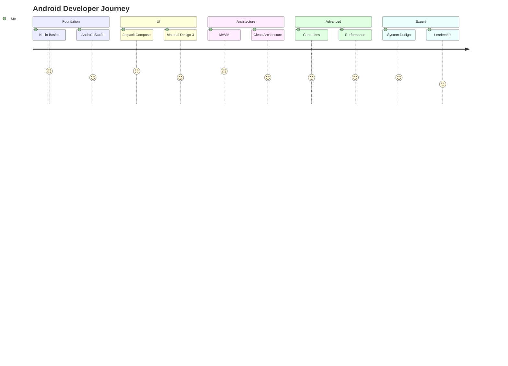

# 🤖 Android Developer Roadmap - Complete Guide

> The definitive guide to becoming a world-class Android developer

## Table of Contents

- [Overview](#overview)
- [Phase 1: Kotlin Foundations](#phase-1-kotlin-foundations-weeks-1-8)
- [Phase 2: Jetpack Compose](#phase-2-jetpack-compose-weeks-9-16)
- [Phase 3: Architecture Components](#phase-3-architecture-components-weeks-17-24)
- [Phase 4: Data & Networking](#phase-4-data--networking-weeks-25-32)
- [Phase 5: Advanced Topics](#phase-5-advanced-topics-weeks-33-48)
- [Phase 6: Expert Level](#phase-6-expert-level-months-13-24)
- [Resources](#resources)

---

## Overview



### Time Investment

| Phase | Duration | Hours/Week | Total Hours |
|-------|----------|------------|-------------|
| Kotlin Foundations | 8 weeks | 15-20 | 120-160 |
| Jetpack Compose | 8 weeks | 15-20 | 120-160 |
| Architecture | 8 weeks | 15-20 | 120-160 |
| Data & Networking | 8 weeks | 15-20 | 120-160 |
| Advanced Topics | 16 weeks | 15-20 | 240-320 |
| **Total** | **48 weeks** | | **720-960 hrs** |

---

## Phase 1: Kotlin Foundations (Weeks 1-8)

### Week 1-2: Language Basics

#### Variables & Types

```kotlin
// Variables
val immutable = "Cannot change" // Like final
var mutable = "Can change"

// Type Inference
val inferredString = "Kotlin infers String"
val inferredInt = 42
val inferredDouble = 3.14

// Explicit Types
val explicitString: String = "Hello"
val explicitInt: Int = 42
val explicitLong: Long = 42L
val explicitDouble: Double = 3.14
val explicitBool: Boolean = true

// Nullable Types
val nullable: String? = null
val nonNull: String = "Cannot be null"

// String Templates
val name = "Kotlin"
val greeting = "Hello, $name!"
val calculation = "2 + 2 = ${2 + 2}"

// Multi-line Strings
val multiline = """
    |This is a
    |multi-line string
    |with margin
""".trimMargin()
```

#### Null Safety

```kotlin
// Safe Call Operator
val length = nullable?.length // Returns null if nullable is null

// Elvis Operator
val len = nullable?.length ?: 0 // Default value if null

// Not-null Assertion
val len2 = nullable!!.length // Throws if null (avoid!)

// Safe Cast
val str: String? = value as? String

// Let
nullable?.let { nonNullValue ->
    println("Value is $nonNullValue")
}

// Smart Casts
fun process(value: Any) {
    if (value is String) {
        // value is automatically cast to String here
        println(value.length)
    }
}
```

#### Collections

```kotlin
// Lists
val immutableList = listOf(1, 2, 3)
val mutableList = mutableListOf(1, 2, 3)
mutableList.add(4)

// Sets
val immutableSet = setOf(1, 2, 3)
val mutableSet = mutableSetOf(1, 2, 3)

// Maps
val immutableMap = mapOf("a" to 1, "b" to 2)
val mutableMap = mutableMapOf("a" to 1, "b" to 2)
mutableMap["c"] = 3

// Collection Operations
val numbers = listOf(1, 2, 3, 4, 5)
val doubled = numbers.map { it * 2 }
val evens = numbers.filter { it % 2 == 0 }
val sum = numbers.reduce { acc, n -> acc + n }
val total = numbers.fold(0) { acc, n -> acc + n }
val sorted = numbers.sortedDescending()
val first = numbers.firstOrNull { it > 3 }
val any = numbers.any { it > 3 }
val all = numbers.all { it > 0 }
val grouped = numbers.groupBy { if (it % 2 == 0) "even" else "odd" }
```

### Week 3-4: Functions & Lambdas

```kotlin
// Basic Function
fun greet(name: String): String {
    return "Hello, $name!"
}

// Single Expression Function
fun greet(name: String) = "Hello, $name!"

// Default Parameters
fun greet(name: String, formal: Boolean = false) =
    if (formal) "Good day, $name." else "Hey, $name!"

// Named Arguments
greet(name = "Alice", formal = true)

// Varargs
fun sum(vararg numbers: Int): Int = numbers.sum()

// Extension Functions
fun String.addExclamation() = "$this!"
"Hello".addExclamation() // "Hello!"

// Infix Functions
infix fun Int.times(str: String) = str.repeat(this)
2 times "Hi " // "Hi Hi "

// Higher-Order Functions
fun operation(a: Int, b: Int, op: (Int, Int) -> Int): Int {
    return op(a, b)
}
operation(2, 3) { x, y -> x + y } // 5

// Lambda Syntax
val sum: (Int, Int) -> Int = { a, b -> a + b }
val square: (Int) -> Int = { it * it }

// Inline Functions
inline fun measureTime(block: () -> Unit): Long {
    val start = System.currentTimeMillis()
    block()
    return System.currentTimeMillis() - start
}
```

### Week 5-6: OOP & Classes

```kotlin
// Class
class Person(
    val name: String,
    var age: Int
) {
    // Secondary Constructor
    constructor(name: String) : this(name, 0)
    
    // Init Block
    init {
        require(age >= 0) { "Age cannot be negative" }
    }
    
    // Properties
    val isAdult: Boolean
        get() = age >= 18
    
    // Methods
    fun greet() = "Hi, I'm $name"
}

// Data Class
data class User(
    val id: Long,
    val name: String,
    val email: String
) {
    // Auto-generated: equals(), hashCode(), toString(), copy()
}

// Sealed Class
sealed class Result<out T> {
    data class Success<T>(val data: T) : Result<T>()
    data class Error(val message: String) : Result<Nothing>()
    data object Loading : Result<Nothing>()
}

// When with Sealed Class
fun handleResult(result: Result<String>) = when (result) {
    is Result.Success -> "Data: ${result.data}"
    is Result.Error -> "Error: ${result.message}"
    Result.Loading -> "Loading..."
}

// Object (Singleton)
object Analytics {
    fun track(event: String) { }
}

// Companion Object
class Factory {
    companion object {
        fun create(): Factory = Factory()
    }
}

// Interfaces
interface Clickable {
    fun click()
    fun showOff() = println("I'm clickable!") // Default implementation
}

// Delegation
class CountingSet<T>(
    private val innerSet: MutableSet<T> = mutableSetOf()
) : MutableSet<T> by innerSet {
    var objectsAdded = 0
    
    override fun add(element: T): Boolean {
        objectsAdded++
        return innerSet.add(element)
    }
}
```

### Week 7-8: Coroutines Basics

```kotlin
import kotlinx.coroutines.*

// Basic Coroutine
fun main() = runBlocking {
    launch {
        delay(1000L)
        println("World!")
    }
    println("Hello,")
}

// Suspend Function
suspend fun fetchUser(id: Int): User {
    delay(1000) // Simulates network call
    return User(id, "John", "john@test.com")
}

// Async/Await
suspend fun fetchUserAndPosts(userId: Int): Pair<User, List<Post>> {
    return coroutineScope {
        val userDeferred = async { fetchUser(userId) }
        val postsDeferred = async { fetchPosts(userId) }
        Pair(userDeferred.await(), postsDeferred.await())
    }
}

// Structured Concurrency
suspend fun processData() = coroutineScope {
    val job1 = launch { processItem(1) }
    val job2 = launch { processItem(2) }
    // Both jobs complete before returning
}

// Exception Handling
suspend fun safeFetch(): Result<User> {
    return try {
        Result.Success(fetchUser(1))
    } catch (e: Exception) {
        Result.Error(e.message ?: "Unknown error")
    }
}

// Dispatchers
suspend fun fetchOnIO(): User = withContext(Dispatchers.IO) {
    // Run on IO thread pool
    fetchUser(1)
}

// Flow
fun numbers(): Flow<Int> = flow {
    for (i in 1..5) {
        delay(100)
        emit(i)
    }
}

// Collecting Flow
suspend fun collectNumbers() {
    numbers()
        .filter { it % 2 == 0 }
        .map { it * it }
        .collect { println(it) }
}
```

**🎯 Phase 1 Project:** Build a command-line note-taking app
- Create, read, update, delete notes
- Save to JSON file
- Use data classes, sealed classes, and coroutines
- Write unit tests

---

## Phase 2: Jetpack Compose (Weeks 9-16)

### Week 9-10: Compose Fundamentals

```kotlin
import androidx.compose.foundation.layout.*
import androidx.compose.material3.*
import androidx.compose.runtime.*
import androidx.compose.ui.Modifier
import androidx.compose.ui.unit.dp

// Basic Composable
@Composable
fun Greeting(name: String) {
    Text(
        text = "Hello, $name!",
        style = MaterialTheme.typography.headlineMedium
    )
}

// Layout Composables
@Composable
fun LayoutExample() {
    Column(
        modifier = Modifier
            .fillMaxSize()
            .padding(16.dp),
        verticalArrangement = Arrangement.spacedBy(8.dp)
    ) {
        Text("First item")
        
        Row(
            horizontalArrangement = Arrangement.SpaceBetween,
            modifier = Modifier.fillMaxWidth()
        ) {
            Text("Left")
            Text("Right")
        }
        
        Box(
            modifier = Modifier
                .size(100.dp)
                .background(MaterialTheme.colorScheme.primary)
        ) {
            Text(
                "Centered",
                modifier = Modifier.align(Alignment.Center),
                color = MaterialTheme.colorScheme.onPrimary
            )
        }
    }
}

// Modifiers
@Composable
fun ModifierExample() {
    Text(
        text = "Styled Text",
        modifier = Modifier
            .fillMaxWidth()
            .padding(16.dp)
            .background(
                color = MaterialTheme.colorScheme.surface,
                shape = RoundedCornerShape(8.dp)
            )
            .clickable { /* handle click */ }
            .padding(16.dp) // Inner padding
    )
}
```

### Week 11-12: State Management

```kotlin
// remember & mutableStateOf
@Composable
fun Counter() {
    var count by remember { mutableStateOf(0) }
    
    Column {
        Text("Count: $count")
        Button(onClick = { count++ }) {
            Text("Increment")
        }
    }
}

// State Hoisting
@Composable
fun StatefulCounter() {
    var count by remember { mutableStateOf(0) }
    StatelessCounter(
        count = count,
        onIncrement = { count++ }
    )
}

@Composable
fun StatelessCounter(
    count: Int,
    onIncrement: () -> Unit
) {
    Column {
        Text("Count: $count")
        Button(onClick = onIncrement) {
            Text("Increment")
        }
    }
}

// rememberSaveable (survives config changes)
@Composable
fun PersistentCounter() {
    var count by rememberSaveable { mutableStateOf(0) }
    // count survives rotation
}

// derivedStateOf
@Composable
fun FilteredList(items: List<String>, query: String) {
    val filteredItems by remember(items, query) {
        derivedStateOf {
            items.filter { it.contains(query, ignoreCase = true) }
        }
    }
    LazyColumn {
        items(filteredItems) { item ->
            Text(item)
        }
    }
}

// produceState (async state)
@Composable
fun UserProfile(userId: String) {
    val user by produceState<User?>(initialValue = null, userId) {
        value = fetchUser(userId)
    }
    
    user?.let { UserCard(it) } ?: LoadingIndicator()
}

// snapshotFlow
@Composable
fun ScrollTracker(listState: LazyListState) {
    LaunchedEffect(listState) {
        snapshotFlow { listState.firstVisibleItemIndex }
            .collect { index ->
                analytics.trackScroll(index)
            }
    }
}
```

### Week 13-14: Lists & Navigation

```kotlin
// LazyColumn
@Composable
fun TaskList(tasks: List<Task>) {
    LazyColumn(
        contentPadding = PaddingValues(16.dp),
        verticalArrangement = Arrangement.spacedBy(8.dp)
    ) {
        items(
            items = tasks,
            key = { it.id }
        ) { task ->
            TaskItem(task)
        }
    }
}

// LazyColumn with Headers
@Composable
fun GroupedList(groupedItems: Map<String, List<Item>>) {
    LazyColumn {
        groupedItems.forEach { (header, items) ->
            stickyHeader {
                Text(
                    text = header,
                    modifier = Modifier
                        .fillMaxWidth()
                        .background(MaterialTheme.colorScheme.surface)
                        .padding(16.dp)
                )
            }
            items(items) { item ->
                ItemRow(item)
            }
        }
    }
}

// Navigation
@Composable
fun AppNavigation() {
    val navController = rememberNavController()
    
    NavHost(
        navController = navController,
        startDestination = "home"
    ) {
        composable("home") {
            HomeScreen(
                onNavigateToDetail = { id ->
                    navController.navigate("detail/$id")
                }
            )
        }
        
        composable(
            route = "detail/{itemId}",
            arguments = listOf(
                navArgument("itemId") { type = NavType.StringType }
            )
        ) { backStackEntry ->
            val itemId = backStackEntry.arguments?.getString("itemId")
            DetailScreen(itemId = itemId)
        }
    }
}

// Type-safe Navigation (recommended)
@Serializable
object Home

@Serializable
data class Detail(val itemId: String)

@Composable
fun TypeSafeNavigation() {
    val navController = rememberNavController()
    
    NavHost(navController, startDestination = Home) {
        composable<Home> {
            HomeScreen(
                onNavigateToDetail = { id ->
                    navController.navigate(Detail(id))
                }
            )
        }
        composable<Detail> { backStackEntry ->
            val detail: Detail = backStackEntry.toRoute()
            DetailScreen(itemId = detail.itemId)
        }
    }
}
```

### Week 15-16: Animations

```kotlin
// animate*AsState
@Composable
fun AnimatedBox(isExpanded: Boolean) {
    val size by animateDpAsState(
        targetValue = if (isExpanded) 200.dp else 100.dp,
        animationSpec = spring(
            dampingRatio = Spring.DampingRatioMediumBouncy,
            stiffness = Spring.StiffnessLow
        )
    )
    
    Box(
        modifier = Modifier
            .size(size)
            .background(Color.Blue)
    )
}

// AnimatedVisibility
@Composable
fun AnimatedMessage(visible: Boolean) {
    AnimatedVisibility(
        visible = visible,
        enter = fadeIn() + slideInVertically(),
        exit = fadeOut() + slideOutVertically()
    ) {
        Text("Hello!")
    }
}

// AnimatedContent
@Composable
fun AnimatedCounter(count: Int) {
    AnimatedContent(
        targetState = count,
        transitionSpec = {
            if (targetState > initialState) {
                slideInVertically { -it } + fadeIn() togetherWith
                    slideOutVertically { it } + fadeOut()
            } else {
                slideInVertically { it } + fadeIn() togetherWith
                    slideOutVertically { -it } + fadeOut()
            }.using(SizeTransform(clip = false))
        }
    ) { targetCount ->
        Text(
            text = "$targetCount",
            style = MaterialTheme.typography.displayLarge
        )
    }
}

// updateTransition
@Composable
fun MultiPropertyAnimation(selected: Boolean) {
    val transition = updateTransition(selected, label = "selection")
    
    val borderColor by transition.animateColor(label = "border") { isSelected ->
        if (isSelected) Color.Blue else Color.Gray
    }
    
    val elevation by transition.animateDp(label = "elevation") { isSelected ->
        if (isSelected) 8.dp else 2.dp
    }
    
    Card(
        modifier = Modifier
            .border(2.dp, borderColor, RoundedCornerShape(8.dp)),
        elevation = CardDefaults.cardElevation(elevation)
    ) {
        // Content
    }
}

// Infinite Animation
@Composable
fun PulsingDot() {
    val infiniteTransition = rememberInfiniteTransition()
    
    val scale by infiniteTransition.animateFloat(
        initialValue = 1f,
        targetValue = 1.2f,
        animationSpec = infiniteRepeatable(
            animation = tween(500),
            repeatMode = RepeatMode.Reverse
        )
    )
    
    Box(
        modifier = Modifier
            .scale(scale)
            .size(20.dp)
            .background(Color.Red, CircleShape)
    )
}
```

**🎯 Phase 2 Project:** Build a Recipe App
- Browse recipes with images
- Search and filter functionality
- Favorite recipes
- Smooth animations
- Material Design 3 theming

---

## Phase 3: Architecture Components (Weeks 17-24)

### ViewModel

```kotlin
class TaskViewModel(
    private val repository: TaskRepository,
    private val savedStateHandle: SavedStateHandle
) : ViewModel() {
    
    // UI State
    private val _uiState = MutableStateFlow(TaskUiState())
    val uiState: StateFlow<TaskUiState> = _uiState.asStateFlow()
    
    // Events
    private val _events = Channel<TaskEvent>()
    val events = _events.receiveAsFlow()
    
    // Saved State
    private val searchQuery = savedStateHandle.getStateFlow("search", "")
    
    init {
        loadTasks()
    }
    
    private fun loadTasks() {
        viewModelScope.launch {
            _uiState.update { it.copy(isLoading = true) }
            
            repository.getTasks()
                .catch { e ->
                    _uiState.update { 
                        it.copy(isLoading = false, error = e.message) 
                    }
                }
                .collect { tasks ->
                    _uiState.update { 
                        it.copy(isLoading = false, tasks = tasks) 
                    }
                }
        }
    }
    
    fun onAction(action: TaskAction) {
        when (action) {
            is TaskAction.AddTask -> addTask(action.title)
            is TaskAction.DeleteTask -> deleteTask(action.task)
            is TaskAction.ToggleComplete -> toggleComplete(action.task)
            is TaskAction.Search -> updateSearch(action.query)
        }
    }
    
    private fun addTask(title: String) {
        viewModelScope.launch {
            try {
                repository.addTask(title)
                _events.send(TaskEvent.TaskAdded)
            } catch (e: Exception) {
                _events.send(TaskEvent.Error(e.message ?: "Failed to add task"))
            }
        }
    }
}

// UI State
data class TaskUiState(
    val tasks: List<Task> = emptyList(),
    val isLoading: Boolean = false,
    val error: String? = null
)

// Actions
sealed interface TaskAction {
    data class AddTask(val title: String) : TaskAction
    data class DeleteTask(val task: Task) : TaskAction
    data class ToggleComplete(val task: Task) : TaskAction
    data class Search(val query: String) : TaskAction
}

// Events
sealed interface TaskEvent {
    data object TaskAdded : TaskEvent
    data class Error(val message: String) : TaskEvent
}
```

### Room Database

```kotlin
// Entity
@Entity(tableName = "tasks")
data class TaskEntity(
    @PrimaryKey(autoGenerate = true)
    val id: Long = 0,
    val title: String,
    val description: String?,
    val isComplete: Boolean = false,
    val createdAt: Long = System.currentTimeMillis(),
    val categoryId: Long? = null
)

// DAO
@Dao
interface TaskDao {
    @Query("SELECT * FROM tasks ORDER BY createdAt DESC")
    fun getAllTasks(): Flow<List<TaskEntity>>
    
    @Query("SELECT * FROM tasks WHERE isComplete = :isComplete")
    fun getTasksByStatus(isComplete: Boolean): Flow<List<TaskEntity>>
    
    @Query("SELECT * FROM tasks WHERE title LIKE '%' || :query || '%'")
    fun searchTasks(query: String): Flow<List<TaskEntity>>
    
    @Insert(onConflict = OnConflictStrategy.REPLACE)
    suspend fun insert(task: TaskEntity): Long
    
    @Update
    suspend fun update(task: TaskEntity)
    
    @Delete
    suspend fun delete(task: TaskEntity)
    
    @Query("DELETE FROM tasks WHERE isComplete = 1")
    suspend fun deleteCompleted()
    
    @Transaction
    @Query("SELECT * FROM tasks WHERE id = :id")
    fun getTaskWithCategory(id: Long): Flow<TaskWithCategory>
}

// Database
@Database(
    entities = [TaskEntity::class, CategoryEntity::class],
    version = 2,
    exportSchema = true
)
@TypeConverters(Converters::class)
abstract class AppDatabase : RoomDatabase() {
    abstract fun taskDao(): TaskDao
    abstract fun categoryDao(): CategoryDao
}

// Migration
val MIGRATION_1_2 = object : Migration(1, 2) {
    override fun migrate(database: SupportSQLiteDatabase) {
        database.execSQL(
            "ALTER TABLE tasks ADD COLUMN categoryId INTEGER"
        )
    }
}

// Type Converters
class Converters {
    @TypeConverter
    fun fromTimestamp(value: Long?): Date? = value?.let { Date(it) }
    
    @TypeConverter
    fun dateToTimestamp(date: Date?): Long? = date?.time
}

// Relationship
data class TaskWithCategory(
    @Embedded val task: TaskEntity,
    @Relation(
        parentColumn = "categoryId",
        entityColumn = "id"
    )
    val category: CategoryEntity?
)
```

### Hilt Dependency Injection

```kotlin
// Application
@HiltAndroidApp
class MyApplication : Application()

// Activity
@AndroidEntryPoint
class MainActivity : ComponentActivity()

// Modules
@Module
@InstallIn(SingletonComponent::class)
object DatabaseModule {
    
    @Provides
    @Singleton
    fun provideDatabase(
        @ApplicationContext context: Context
    ): AppDatabase {
        return Room.databaseBuilder(
            context,
            AppDatabase::class.java,
            "app_database"
        )
        .addMigrations(MIGRATION_1_2)
        .build()
    }
    
    @Provides
    fun provideTaskDao(database: AppDatabase): TaskDao {
        return database.taskDao()
    }
}

@Module
@InstallIn(SingletonComponent::class)
object NetworkModule {
    
    @Provides
    @Singleton
    fun provideOkHttpClient(): OkHttpClient {
        return OkHttpClient.Builder()
            .addInterceptor(HttpLoggingInterceptor())
            .connectTimeout(30, TimeUnit.SECONDS)
            .build()
    }
    
    @Provides
    @Singleton
    fun provideRetrofit(client: OkHttpClient): Retrofit {
        return Retrofit.Builder()
            .baseUrl("https://api.example.com/")
            .client(client)
            .addConverterFactory(GsonConverterFactory.create())
            .build()
    }
}

@Module
@InstallIn(ViewModelComponent::class)
abstract class RepositoryModule {
    
    @Binds
    abstract fun bindTaskRepository(
        impl: TaskRepositoryImpl
    ): TaskRepository
}

// Repository
class TaskRepositoryImpl @Inject constructor(
    private val taskDao: TaskDao,
    private val apiService: ApiService
) : TaskRepository {
    
    override fun getTasks(): Flow<List<Task>> {
        return taskDao.getAllTasks()
            .map { entities -> entities.map { it.toDomain() } }
    }
}

// ViewModel Injection
@HiltViewModel
class TaskViewModel @Inject constructor(
    private val repository: TaskRepository,
    private val savedStateHandle: SavedStateHandle
) : ViewModel()
```

---

## Phase 4: Data & Networking (Weeks 25-32)

### Retrofit & OkHttp

```kotlin
// API Service
interface ApiService {
    @GET("users")
    suspend fun getUsers(): List<UserDto>
    
    @GET("users/{id}")
    suspend fun getUser(@Path("id") id: String): UserDto
    
    @POST("users")
    suspend fun createUser(@Body user: CreateUserRequest): UserDto
    
    @PUT("users/{id}")
    suspend fun updateUser(
        @Path("id") id: String,
        @Body user: UpdateUserRequest
    ): UserDto
    
    @DELETE("users/{id}")
    suspend fun deleteUser(@Path("id") id: String)
    
    @GET("search")
    suspend fun search(
        @Query("q") query: String,
        @Query("page") page: Int = 1,
        @Query("limit") limit: Int = 20
    ): SearchResponse
    
    @Multipart
    @POST("upload")
    suspend fun uploadImage(
        @Part image: MultipartBody.Part
    ): UploadResponse
}

// Interceptors
class AuthInterceptor(
    private val tokenProvider: TokenProvider
) : Interceptor {
    override fun intercept(chain: Interceptor.Chain): Response {
        val original = chain.request()
        val token = tokenProvider.getToken()
        
        val request = original.newBuilder()
            .header("Authorization", "Bearer $token")
            .build()
        
        return chain.proceed(request)
    }
}

// Network Result Wrapper
sealed interface NetworkResult<out T> {
    data class Success<T>(val data: T) : NetworkResult<T>
    data class Error(val code: Int, val message: String) : NetworkResult<Nothing>
    data class Exception(val e: Throwable) : NetworkResult<Nothing>
}

// Safe API Call
suspend fun <T> safeApiCall(
    apiCall: suspend () -> T
): NetworkResult<T> {
    return try {
        NetworkResult.Success(apiCall())
    } catch (e: HttpException) {
        NetworkResult.Error(e.code(), e.message())
    } catch (e: IOException) {
        NetworkResult.Exception(e)
    }
}
```

### DataStore

```kotlin
// Preferences DataStore
val Context.dataStore by preferencesDataStore(name = "settings")

class SettingsRepository(
    private val dataStore: DataStore<Preferences>
) {
    companion object {
        val DARK_MODE = booleanPreferencesKey("dark_mode")
        val NOTIFICATIONS = booleanPreferencesKey("notifications")
        val USERNAME = stringPreferencesKey("username")
    }
    
    val settings: Flow<UserSettings> = dataStore.data
        .catch { e ->
            if (e is IOException) emit(emptyPreferences())
            else throw e
        }
        .map { preferences ->
            UserSettings(
                darkMode = preferences[DARK_MODE] ?: false,
                notifications = preferences[NOTIFICATIONS] ?: true,
                username = preferences[USERNAME] ?: ""
            )
        }
    
    suspend fun setDarkMode(enabled: Boolean) {
        dataStore.edit { preferences ->
            preferences[DARK_MODE] = enabled
        }
    }
    
    suspend fun setUsername(name: String) {
        dataStore.edit { preferences ->
            preferences[USERNAME] = name
        }
    }
}

// Proto DataStore (for complex data)
@Serializable
data class UserPreferences(
    val theme: Theme = Theme.SYSTEM,
    val fontSize: Int = 14,
    val notificationSettings: NotificationSettings = NotificationSettings()
)

val Context.userPreferencesStore by dataStore(
    fileName = "user_prefs.pb",
    serializer = UserPreferencesSerializer
)

object UserPreferencesSerializer : Serializer<UserPreferences> {
    override val defaultValue = UserPreferences()
    
    override suspend fun readFrom(input: InputStream): UserPreferences {
        return Json.decodeFromString(input.readBytes().decodeToString())
    }
    
    override suspend fun writeTo(t: UserPreferences, output: OutputStream) {
        output.write(Json.encodeToString(t).encodeToByteArray())
    }
}
```

---

## Phase 5: Advanced Topics (Weeks 33-48)

### WorkManager

```kotlin
// Worker
class SyncWorker(
    context: Context,
    params: WorkerParameters
) : CoroutineWorker(context, params) {
    
    override suspend fun doWork(): Result {
        return try {
            // Perform sync
            syncData()
            Result.success()
        } catch (e: Exception) {
            if (runAttemptCount < 3) {
                Result.retry()
            } else {
                Result.failure()
            }
        }
    }
    
    private suspend fun syncData() {
        // Sync logic
    }
}

// Scheduling Work
class WorkScheduler(private val workManager: WorkManager) {
    
    fun schedulePeriodicSync() {
        val constraints = Constraints.Builder()
            .setRequiredNetworkType(NetworkType.CONNECTED)
            .setRequiresBatteryNotLow(true)
            .build()
        
        val syncRequest = PeriodicWorkRequestBuilder<SyncWorker>(
            repeatInterval = 1,
            repeatIntervalTimeUnit = TimeUnit.HOURS
        )
            .setConstraints(constraints)
            .setBackoffCriteria(
                BackoffPolicy.EXPONENTIAL,
                10,
                TimeUnit.SECONDS
            )
            .build()
        
        workManager.enqueueUniquePeriodicWork(
            "sync_work",
            ExistingPeriodicWorkPolicy.KEEP,
            syncRequest
        )
    }
    
    fun scheduleOneTimeUpload(imageUri: Uri) {
        val uploadRequest = OneTimeWorkRequestBuilder<UploadWorker>()
            .setInputData(workDataOf("image_uri" to imageUri.toString()))
            .setExpedited(OutOfQuotaPolicy.RUN_AS_NON_EXPEDITED_WORK_REQUEST)
            .build()
        
        workManager.enqueue(uploadRequest)
    }
    
    fun chainWork() {
        val downloadWork = OneTimeWorkRequestBuilder<DownloadWorker>().build()
        val processWork = OneTimeWorkRequestBuilder<ProcessWorker>().build()
        val uploadWork = OneTimeWorkRequestBuilder<UploadWorker>().build()
        
        workManager
            .beginWith(downloadWork)
            .then(processWork)
            .then(uploadWork)
            .enqueue()
    }
}
```

### Kotlin Multiplatform

```kotlin
// shared/commonMain
expect class Platform {
    val name: String
}

expect fun getPlatform(): Platform

// Shared Business Logic
class UserRepository(
    private val api: UserApi,
    private val database: UserDatabase
) {
    suspend fun getUser(id: String): User {
        return try {
            val user = api.getUser(id)
            database.saveUser(user)
            user
        } catch (e: Exception) {
            database.getUser(id) ?: throw e
        }
    }
}

// shared/androidMain
actual class Platform {
    actual val name: String = "Android ${Build.VERSION.SDK_INT}"
}

actual fun getPlatform() = Platform()

// shared/iosMain
actual class Platform {
    actual val name: String = UIDevice.currentDevice.systemName() +
        " " + UIDevice.currentDevice.systemVersion
}

actual fun getPlatform() = Platform()
```

### Testing

```kotlin
// Unit Test
class TaskViewModelTest {
    
    @get:Rule
    val mainDispatcherRule = MainDispatcherRule()
    
    private lateinit var viewModel: TaskViewModel
    private lateinit var repository: FakeTaskRepository
    
    @Before
    fun setup() {
        repository = FakeTaskRepository()
        viewModel = TaskViewModel(repository)
    }
    
    @Test
    fun `loadTasks success updates state`() = runTest {
        // Given
        val tasks = listOf(Task(1, "Test", false))
        repository.setTasks(tasks)
        
        // When
        viewModel.loadTasks()
        
        // Then
        val state = viewModel.uiState.value
        assertEquals(tasks, state.tasks)
        assertFalse(state.isLoading)
        assertNull(state.error)
    }
    
    @Test
    fun `addTask emits event`() = runTest {
        // Given
        val events = mutableListOf<TaskEvent>()
        backgroundScope.launch {
            viewModel.events.toList(events)
        }
        
        // When
        viewModel.onAction(TaskAction.AddTask("New Task"))
        
        // Then
        assertTrue(events.contains(TaskEvent.TaskAdded))
    }
}

// Compose UI Test
class TaskListScreenTest {
    
    @get:Rule
    val composeTestRule = createComposeRule()
    
    @Test
    fun taskList_displaysItems() {
        val tasks = listOf(
            Task(1, "Task 1", false),
            Task(2, "Task 2", true)
        )
        
        composeTestRule.setContent {
            TaskListScreen(tasks = tasks)
        }
        
        composeTestRule.onNodeWithText("Task 1").assertIsDisplayed()
        composeTestRule.onNodeWithText("Task 2").assertIsDisplayed()
    }
    
    @Test
    fun taskItem_clickToggleCompletes() {
        var completed = false
        
        composeTestRule.setContent {
            TaskItem(
                task = Task(1, "Test", false),
                onToggle = { completed = true }
            )
        }
        
        composeTestRule.onNodeWithText("Test").performClick()
        assertTrue(completed)
    }
}
```

---

## Phase 6: Expert Level (Months 13-24)

### Topics to Master

| Topic | Time | Resources |
|-------|------|-----------|
| System Design | 40 hrs | Mobile System Design |
| Kotlin Multiplatform | 40 hrs | KMP Documentation |
| Performance | 30 hrs | Android Profiler |
| Security | 20 hrs | OWASP Mobile |
| Gradle & Build | 20 hrs | Gradle Documentation |
| Open Source | Ongoing | GitHub contributions |

---

## Resources

### Official

- [Android Developer Documentation](https://developer.android.com/)
- [Kotlin Documentation](https://kotlinlang.org/docs/)
- [Jetpack Compose](https://developer.android.com/jetpack/compose)

### Courses

- [Android Basics with Compose](https://developer.android.com/courses/android-basics-compose/course) - Free
- [Advanced Android in Kotlin](https://developer.android.com/courses) - Free
- [Philipp Lackner YouTube](https://www.youtube.com/@PhilippLackner) - Free

### Books

- "Kotlin in Action" by Dmitry Jemerov
- "Android Programming: The Big Nerd Ranch Guide"

### Community

- [r/androiddev](https://www.reddit.com/r/androiddev/)
- [Kotlin Slack](https://kotlinlang.slack.com/)
- [Android Weekly](https://androidweekly.net/)

---

<p align="center">
  <strong>Keep learning, keep building! 🚀</strong>
</p>
