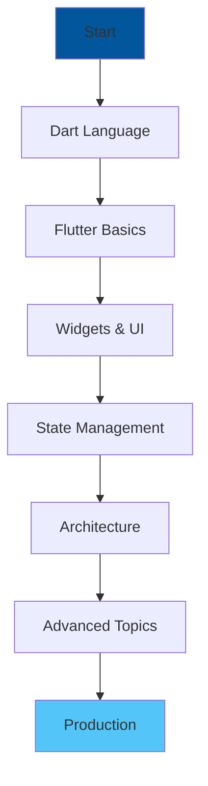
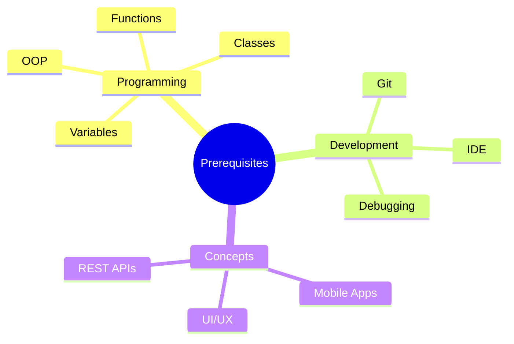
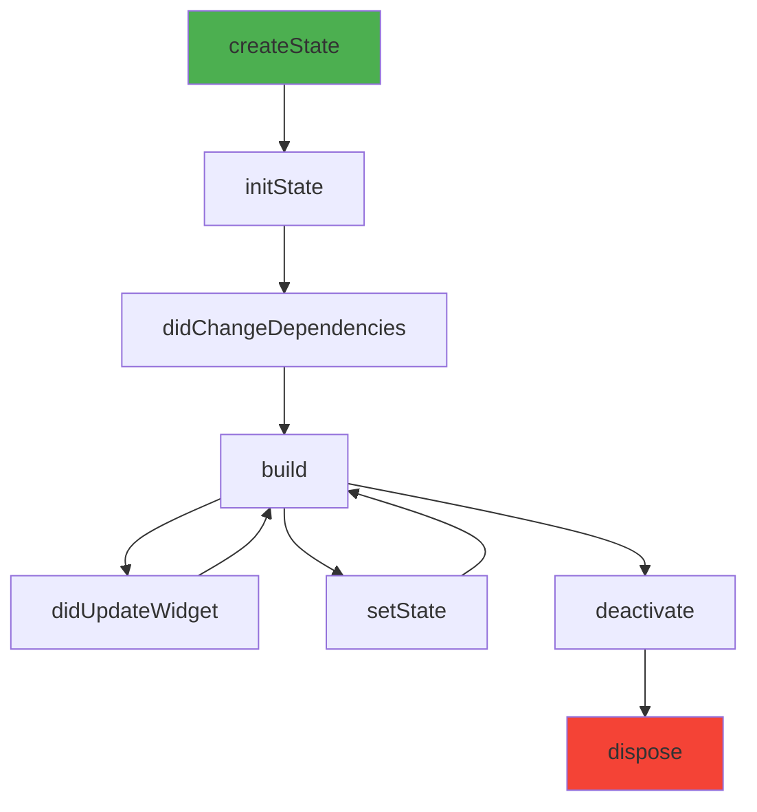
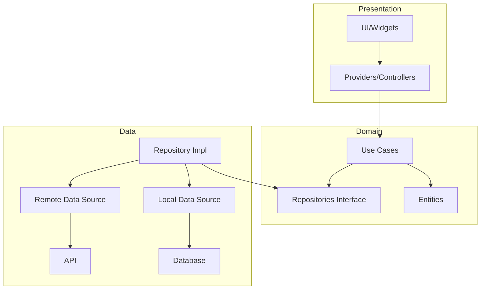
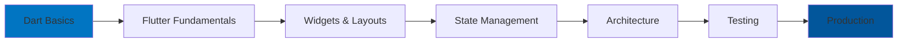

# Flutter Developer Roadmap

> A comprehensive guide to becoming a professional Flutter developer in 2024-2025



---

## Table of Contents

1. [Prerequisites](#prerequisites)
2. [Dart Programming Language](#dart-programming-language)
3. [Flutter Setup](#flutter-setup)
4. [Flutter Fundamentals](#flutter-fundamentals)
5. [Widget System](#widget-system)
6. [Layouts](#layouts)
7. [State Management](#state-management)
8. [Navigation](#navigation)
9. [Networking](#networking)
10. [Local Storage](#local-storage)
11. [Architecture Patterns](#architecture-patterns)
12. [Testing](#testing)
13. [Platform Channels](#platform-channels)
14. [Performance](#performance)
15. [Publishing](#publishing)
16. [Resources](#resources)

---

## Prerequisites

### Before Starting Flutter

Ensure you have basic knowledge of:

| Topic | Description |
|-------|-------------|
| Programming | Variables, functions, OOP |
| Git | Version control basics |
| Mobile Concepts | App lifecycle, UI patterns |
| CLI | Command line usage |



---

## Dart Programming Language

### Why Dart?

- **Optimized for UI** - Built for client-side development
- **Productive Development** - Hot reload, strong typing
- **Fast on All Platforms** - AOT compilation
- **Easy to Learn** - Familiar syntax

### Variables and Types

```dart
// Variables
var name = 'Flutter'; // Type inference
String language = 'Dart'; // Explicit type
final version = '3.0'; // Runtime constant
const pi = 3.14159; // Compile-time constant

// Null safety
String? nullable;
String nonNull = 'value';
String value = nullable ?? 'default'; // Null coalescing
String length = nullable?.length.toString() ?? '0'; // Null-aware

// Late initialization
late String description;
void init() {
  description = 'Initialized later';
}
```

### Collections

```dart
// List
var numbers = [1, 2, 3, 4, 5];
List<String> names = ['Alice', 'Bob', 'Charlie'];

// Spread operator
var combined = [...numbers, 6, 7, 8];

// Collection if/for
var nav = [
  'Home',
  'Settings',
  if (isAdmin) 'Admin',
  for (var item in items) item.name,
];

// Set
var uniqueNumbers = {1, 2, 3, 3, 2, 1}; // {1, 2, 3}

// Map
var scores = {
  'Alice': 95,
  'Bob': 87,
  'Charlie': 92,
};
Map<String, int> typed = {};
```

### Functions

```dart
// Basic function
String greet(String name) {
  return 'Hello, $name!';
}

// Arrow syntax
String greetArrow(String name) => 'Hello, $name!';

// Optional parameters
void connect(String host, [int port = 8080]) {}

// Named parameters
void createUser({
  required String name,
  String? email,
  int age = 0,
}) {}

// Higher-order functions
var doubled = numbers.map((n) => n * 2).toList();
var evens = numbers.where((n) => n % 2 == 0).toList();
var sum = numbers.reduce((a, b) => a + b);

// Typedef
typedef StringCallback = void Function(String);
void processString(String value, StringCallback callback) {
  callback(value.toUpperCase());
}
```

### Classes

```dart
// Basic class
class Person {
  final String name;
  final int age;
  
  Person(this.name, this.age);
  
  // Named constructor
  Person.guest() : name = 'Guest', age = 0;
  
  // Factory constructor
  factory Person.fromJson(Map<String, dynamic> json) {
    return Person(json['name'], json['age']);
  }
  
  @override
  String toString() => 'Person($name, $age)';
}

// Inheritance
class Employee extends Person {
  final String company;
  
  Employee(super.name, super.age, this.company);
  
  @override
  String toString() => 'Employee($name, $age, $company)';
}

// Abstract class
abstract class Animal {
  void makeSound();
  void move() => print('Moving');
}

class Dog extends Animal {
  @override
  void makeSound() => print('Bark!');
}

// Mixins
mixin Swimming {
  void swim() => print('Swimming');
}

mixin Flying {
  void fly() => print('Flying');
}

class Duck extends Animal with Swimming, Flying {
  @override
  void makeSound() => print('Quack!');
}
```

### Async Programming

```dart
// Future
Future<String> fetchData() async {
  await Future.delayed(Duration(seconds: 1));
  return 'Data loaded';
}

// Usage
void loadData() async {
  try {
    final data = await fetchData();
    print(data);
  } catch (e) {
    print('Error: $e');
  }
}

// Stream
Stream<int> countStream(int max) async* {
  for (int i = 1; i <= max; i++) {
    await Future.delayed(Duration(seconds: 1));
    yield i;
  }
}

// Listening to stream
void listenToStream() async {
  await for (var value in countStream(5)) {
    print(value);
  }
}

// StreamController
final controller = StreamController<String>.broadcast();
controller.stream.listen((data) => print(data));
controller.add('Hello');
controller.close();
```

### Generics

```dart
// Generic class
class Box<T> {
  final T value;
  Box(this.value);
}

// Generic function
T firstElement<T>(List<T> list) {
  return list.first;
}

// Bounded generics
class NumberBox<T extends num> {
  final T value;
  NumberBox(this.value);
  
  T add(T other) => (value + other) as T;
}

// Generic type alias
typedef Json = Map<String, dynamic>;
typedef JsonList = List<Json>;
```

### Extensions

```dart
extension StringExtension on String {
  String capitalize() {
    if (isEmpty) return this;
    return '${this[0].toUpperCase()}${substring(1)}';
  }
  
  bool get isEmail {
    return RegExp(r'^[\w-\.]+@([\w-]+\.)+[\w-]{2,4}$').hasMatch(this);
  }
}

// Usage
print('hello'.capitalize()); // Hello
print('test@email.com'.isEmail); // true

extension ListExtension<T> on List<T> {
  T? get firstOrNull => isEmpty ? null : first;
  T? get lastOrNull => isEmpty ? null : last;
}
```

---

## Flutter Setup

### Installation

1. Download Flutter SDK from flutter.dev
2. Add Flutter to PATH
3. Run `flutter doctor`
4. Install IDE plugins (VS Code or Android Studio)

### Project Structure

```
my_app/
├── android/                 # Android native code
├── ios/                     # iOS native code
├── lib/
│   ├── main.dart           # Entry point
│   ├── core/               # Core utilities
│   │   ├── constants/
│   │   ├── theme/
│   │   └── utils/
│   ├── data/               # Data layer
│   │   ├── models/
│   │   ├── repositories/
│   │   └── sources/
│   ├── presentation/       # UI layer
│   │   ├── screens/
│   │   ├── widgets/
│   │   └── providers/
│   └── services/           # Business logic
├── test/                   # Unit tests
├── integration_test/       # Integration tests
├── assets/                 # Images, fonts, etc.
├── pubspec.yaml            # Dependencies
└── README.md
```

### pubspec.yaml

```yaml
name: my_app
description: A Flutter application
publish_to: 'none'
version: 1.0.0+1

environment:
  sdk: '>=3.0.0 <4.0.0'

dependencies:
  flutter:
    sdk: flutter
  
  # State Management
  flutter_riverpod: ^2.4.9
  
  # Networking
  dio: ^5.4.0
  
  # Local Storage
  shared_preferences: ^2.2.2
  hive_flutter: ^1.1.0
  
  # Navigation
  go_router: ^13.0.0
  
  # UI
  flutter_svg: ^2.0.9
  cached_network_image: ^3.3.1
  
  # Utilities
  freezed_annotation: ^2.4.1
  json_annotation: ^4.8.1
  equatable: ^2.0.5

dev_dependencies:
  flutter_test:
    sdk: flutter
  flutter_lints: ^3.0.1
  build_runner: ^2.4.8
  freezed: ^2.4.6
  json_serializable: ^6.7.1
  mockito: ^5.4.4

flutter:
  uses-material-design: true
  
  assets:
    - assets/images/
    - assets/icons/
  
  fonts:
    - family: Poppins
      fonts:
        - asset: assets/fonts/Poppins-Regular.ttf
        - asset: assets/fonts/Poppins-Bold.ttf
          weight: 700
```

---

## Flutter Fundamentals

### Main Entry Point

```dart
import 'package:flutter/material.dart';

void main() {
  WidgetsFlutterBinding.ensureInitialized();
  runApp(const MyApp());
}

class MyApp extends StatelessWidget {
  const MyApp({super.key});

  @override
  Widget build(BuildContext context) {
    return MaterialApp(
      title: 'My App',
      debugShowCheckedModeBanner: false,
      theme: ThemeData(
        colorScheme: ColorScheme.fromSeed(seedColor: Colors.blue),
        useMaterial3: true,
      ),
      home: const HomeScreen(),
    );
  }
}
```

### Widget Lifecycle



```dart
class MyStatefulWidget extends StatefulWidget {
  const MyStatefulWidget({super.key});

  @override
  State<MyStatefulWidget> createState() => _MyStatefulWidgetState();
}

class _MyStatefulWidgetState extends State<MyStatefulWidget> {
  @override
  void initState() {
    super.initState();
    // Initialize state, subscriptions, controllers
  }

  @override
  void didChangeDependencies() {
    super.didChangeDependencies();
    // Called when dependencies change
  }

  @override
  void didUpdateWidget(MyStatefulWidget oldWidget) {
    super.didUpdateWidget(oldWidget);
    // Called when parent rebuilds with new config
  }

  @override
  void dispose() {
    // Cleanup controllers, subscriptions
    super.dispose();
  }

  @override
  Widget build(BuildContext context) {
    return Container();
  }
}
```

---

## Widget System

### StatelessWidget

```dart
class GreetingCard extends StatelessWidget {
  final String name;
  final VoidCallback? onTap;

  const GreetingCard({
    super.key,
    required this.name,
    this.onTap,
  });

  @override
  Widget build(BuildContext context) {
    return Card(
      child: InkWell(
        onTap: onTap,
        child: Padding(
          padding: const EdgeInsets.all(16),
          child: Text(
            'Hello, $name!',
            style: Theme.of(context).textTheme.headlineMedium,
          ),
        ),
      ),
    );
  }
}
```

### StatefulWidget

```dart
class Counter extends StatefulWidget {
  final int initialValue;
  
  const Counter({super.key, this.initialValue = 0});

  @override
  State<Counter> createState() => _CounterState();
}

class _CounterState extends State<Counter> {
  late int _count;

  @override
  void initState() {
    super.initState();
    _count = widget.initialValue;
  }

  void _increment() {
    setState(() {
      _count++;
    });
  }

  void _decrement() {
    setState(() {
      _count--;
    });
  }

  @override
  Widget build(BuildContext context) {
    return Column(
      mainAxisSize: MainAxisSize.min,
      children: [
        Text(
          '$_count',
          style: Theme.of(context).textTheme.displayLarge,
        ),
        const SizedBox(height: 16),
        Row(
          mainAxisAlignment: MainAxisAlignment.center,
          children: [
            IconButton(
              icon: const Icon(Icons.remove),
              onPressed: _decrement,
            ),
            const SizedBox(width: 16),
            IconButton(
              icon: const Icon(Icons.add),
              onPressed: _increment,
            ),
          ],
        ),
      ],
    );
  }
}
```

### Common Widgets

```dart
// Text
Text(
  'Hello World',
  style: TextStyle(
    fontSize: 24,
    fontWeight: FontWeight.bold,
    color: Colors.blue,
  ),
  textAlign: TextAlign.center,
  maxLines: 2,
  overflow: TextOverflow.ellipsis,
)

// Button variants
ElevatedButton(
  onPressed: () {},
  child: const Text('Elevated'),
)

TextButton(
  onPressed: () {},
  child: const Text('Text'),
)

OutlinedButton(
  onPressed: () {},
  child: const Text('Outlined'),
)

IconButton(
  icon: const Icon(Icons.favorite),
  onPressed: () {},
)

FloatingActionButton(
  onPressed: () {},
  child: const Icon(Icons.add),
)

// TextField
TextField(
  controller: _controller,
  decoration: InputDecoration(
    labelText: 'Email',
    hintText: 'Enter your email',
    prefixIcon: Icon(Icons.email),
    border: OutlineInputBorder(),
  ),
  keyboardType: TextInputType.emailAddress,
  onChanged: (value) {},
  onSubmitted: (value) {},
)

// Image
Image.network(
  'https://example.com/image.jpg',
  width: 200,
  height: 200,
  fit: BoxFit.cover,
  loadingBuilder: (context, child, progress) {
    if (progress == null) return child;
    return CircularProgressIndicator();
  },
  errorBuilder: (context, error, stackTrace) {
    return Icon(Icons.error);
  },
)

Image.asset('assets/images/logo.png')
```

---

## Layouts

### Container & Box Widgets

```dart
// Container
Container(
  width: 200,
  height: 100,
  padding: const EdgeInsets.all(16),
  margin: const EdgeInsets.symmetric(horizontal: 20),
  decoration: BoxDecoration(
    color: Colors.white,
    borderRadius: BorderRadius.circular(12),
    boxShadow: [
      BoxShadow(
        color: Colors.black.withOpacity(0.1),
        blurRadius: 10,
        offset: const Offset(0, 4),
      ),
    ],
  ),
  child: const Text('Container'),
)

// SizedBox
SizedBox(
  width: 100,
  height: 50,
  child: ElevatedButton(
    onPressed: () {},
    child: const Text('Fixed Size'),
  ),
)

// ConstrainedBox
ConstrainedBox(
  constraints: const BoxConstraints(
    minWidth: 100,
    maxWidth: 300,
    minHeight: 50,
    maxHeight: 200,
  ),
  child: Container(),
)
```

### Row & Column

```dart
// Row
Row(
  mainAxisAlignment: MainAxisAlignment.spaceBetween,
  crossAxisAlignment: CrossAxisAlignment.center,
  children: [
    Icon(Icons.star),
    Text('Rating'),
    Text('4.5'),
  ],
)

// Column
Column(
  mainAxisAlignment: MainAxisAlignment.start,
  crossAxisAlignment: CrossAxisAlignment.stretch,
  children: [
    Text('Title'),
    SizedBox(height: 8),
    Text('Subtitle'),
    Spacer(), // Takes remaining space
    ElevatedButton(onPressed: () {}, child: Text('Action')),
  ],
)

// Expanded & Flexible
Row(
  children: [
    Expanded(
      flex: 2,
      child: Container(color: Colors.red),
    ),
    Expanded(
      flex: 1,
      child: Container(color: Colors.blue),
    ),
  ],
)
```

### Stack

```dart
Stack(
  alignment: Alignment.center,
  children: [
    // Background
    Container(
      width: 300,
      height: 200,
      color: Colors.grey[200],
    ),
    // Positioned child
    Positioned(
      top: 10,
      right: 10,
      child: Icon(Icons.close),
    ),
    // Centered child
    Text('Overlay Text'),
    // Bottom positioned
    Positioned(
      bottom: 0,
      left: 0,
      right: 0,
      child: Container(
        color: Colors.black54,
        padding: EdgeInsets.all(8),
        child: Text(
          'Caption',
          style: TextStyle(color: Colors.white),
        ),
      ),
    ),
  ],
)
```

### ListView

```dart
// Basic ListView
ListView(
  padding: const EdgeInsets.all(16),
  children: [
    ListTile(title: Text('Item 1')),
    ListTile(title: Text('Item 2')),
    ListTile(title: Text('Item 3')),
  ],
)

// ListView.builder (efficient for large lists)
ListView.builder(
  itemCount: items.length,
  itemBuilder: (context, index) {
    final item = items[index];
    return ListTile(
      leading: CircleAvatar(child: Text('${index + 1}')),
      title: Text(item.title),
      subtitle: Text(item.subtitle),
      trailing: Icon(Icons.chevron_right),
      onTap: () => onItemTap(item),
    );
  },
)

// ListView.separated
ListView.separated(
  itemCount: items.length,
  separatorBuilder: (context, index) => Divider(),
  itemBuilder: (context, index) {
    return ListTile(title: Text(items[index]));
  },
)
```

### GridView

```dart
// GridView.count
GridView.count(
  crossAxisCount: 2,
  mainAxisSpacing: 10,
  crossAxisSpacing: 10,
  padding: const EdgeInsets.all(16),
  children: items.map((item) => ItemCard(item: item)).toList(),
)

// GridView.builder
GridView.builder(
  gridDelegate: SliverGridDelegateWithFixedCrossAxisCount(
    crossAxisCount: 3,
    mainAxisSpacing: 8,
    crossAxisSpacing: 8,
    childAspectRatio: 1,
  ),
  itemCount: photos.length,
  itemBuilder: (context, index) {
    return Image.network(
      photos[index].url,
      fit: BoxFit.cover,
    );
  },
)

// GridView.extent
GridView.builder(
  gridDelegate: SliverGridDelegateWithMaxCrossAxisExtent(
    maxCrossAxisExtent: 150,
    mainAxisSpacing: 8,
    crossAxisSpacing: 8,
  ),
  itemCount: items.length,
  itemBuilder: (context, index) => ItemTile(item: items[index]),
)
```

### CustomScrollView & Slivers

```dart
CustomScrollView(
  slivers: [
    // App bar that collapses
    SliverAppBar(
      expandedHeight: 200,
      pinned: true,
      flexibleSpace: FlexibleSpaceBar(
        title: Text('Profile'),
        background: Image.network(
          'https://example.com/cover.jpg',
          fit: BoxFit.cover,
        ),
      ),
    ),
    
    // Sliver list
    SliverList(
      delegate: SliverChildBuilderDelegate(
        (context, index) => ListTile(
          title: Text('Item $index'),
        ),
        childCount: 20,
      ),
    ),
    
    // Sliver grid
    SliverGrid(
      gridDelegate: SliverGridDelegateWithFixedCrossAxisCount(
        crossAxisCount: 2,
      ),
      delegate: SliverChildBuilderDelegate(
        (context, index) => Card(
          child: Center(child: Text('Grid $index')),
        ),
        childCount: 10,
      ),
    ),
    
    // Fixed extent list (more performant)
    SliverFixedExtentList(
      itemExtent: 50,
      delegate: SliverChildBuilderDelegate(
        (context, index) => ListTile(title: Text('Fixed $index')),
        childCount: 100,
      ),
    ),
  ],
)
```

---

## State Management

### setState (Local State)

```dart
class LocalStateExample extends StatefulWidget {
  @override
  State<LocalStateExample> createState() => _LocalStateExampleState();
}

class _LocalStateExampleState extends State<LocalStateExample> {
  int _counter = 0;
  bool _isLoading = false;
  List<String> _items = [];

  Future<void> _loadItems() async {
    setState(() => _isLoading = true);
    
    try {
      final items = await api.fetchItems();
      setState(() => _items = items);
    } finally {
      setState(() => _isLoading = false);
    }
  }

  @override
  Widget build(BuildContext context) {
    return Scaffold(
      body: _isLoading
          ? Center(child: CircularProgressIndicator())
          : ListView.builder(
              itemCount: _items.length,
              itemBuilder: (context, index) {
                return ListTile(title: Text(_items[index]));
              },
            ),
    );
  }
}
```

### InheritedWidget & Provider

```dart
// Provider package
class CounterProvider extends ChangeNotifier {
  int _count = 0;
  int get count => _count;

  void increment() {
    _count++;
    notifyListeners();
  }

  void decrement() {
    _count--;
    notifyListeners();
  }
}

// Setup
void main() {
  runApp(
    ChangeNotifierProvider(
      create: (_) => CounterProvider(),
      child: MyApp(),
    ),
  );
}

// Usage
class CounterScreen extends StatelessWidget {
  @override
  Widget build(BuildContext context) {
    return Consumer<CounterProvider>(
      builder: (context, counter, child) {
        return Column(
          children: [
            Text('Count: ${counter.count}'),
            ElevatedButton(
              onPressed: counter.increment,
              child: Text('Increment'),
            ),
          ],
        );
      },
    );
  }
}

// Or with context.watch/read
class AnotherScreen extends StatelessWidget {
  @override
  Widget build(BuildContext context) {
    final count = context.watch<CounterProvider>().count;
    
    return ElevatedButton(
      onPressed: () => context.read<CounterProvider>().increment(),
      child: Text('Count: $count'),
    );
  }
}
```

### Riverpod

```dart
// Providers
final counterProvider = StateNotifierProvider<CounterNotifier, int>((ref) {
  return CounterNotifier();
});

class CounterNotifier extends StateNotifier<int> {
  CounterNotifier() : super(0);

  void increment() => state++;
  void decrement() => state--;
}

// Async provider
final usersProvider = FutureProvider<List<User>>((ref) async {
  final api = ref.read(apiProvider);
  return api.fetchUsers();
});

// Family provider (with parameters)
final userProvider = FutureProvider.family<User, int>((ref, userId) async {
  final api = ref.read(apiProvider);
  return api.fetchUser(userId);
});

// Usage
class MyWidget extends ConsumerWidget {
  @override
  Widget build(BuildContext context, WidgetRef ref) {
    final count = ref.watch(counterProvider);
    final usersAsync = ref.watch(usersProvider);

    return Column(
      children: [
        Text('Count: $count'),
        ElevatedButton(
          onPressed: () => ref.read(counterProvider.notifier).increment(),
          child: Text('Increment'),
        ),
        usersAsync.when(
          data: (users) => UserList(users: users),
          loading: () => CircularProgressIndicator(),
          error: (err, stack) => Text('Error: $err'),
        ),
      ],
    );
  }
}
```

### BLoC Pattern

```dart
// Events
abstract class CounterEvent {}
class IncrementEvent extends CounterEvent {}
class DecrementEvent extends CounterEvent {}

// States
class CounterState {
  final int count;
  CounterState(this.count);
}

// BLoC
class CounterBloc extends Bloc<CounterEvent, CounterState> {
  CounterBloc() : super(CounterState(0)) {
    on<IncrementEvent>((event, emit) {
      emit(CounterState(state.count + 1));
    });
    
    on<DecrementEvent>((event, emit) {
      emit(CounterState(state.count - 1));
    });
  }
}

// Provider
BlocProvider(
  create: (_) => CounterBloc(),
  child: MyApp(),
)

// Usage
BlocBuilder<CounterBloc, CounterState>(
  builder: (context, state) {
    return Column(
      children: [
        Text('Count: ${state.count}'),
        ElevatedButton(
          onPressed: () => context.read<CounterBloc>().add(IncrementEvent()),
          child: Text('Increment'),
        ),
      ],
    );
  },
)
```

---

## Navigation

### Navigator 1.0

```dart
// Push
Navigator.push(
  context,
  MaterialPageRoute(builder: (context) => DetailScreen(id: itemId)),
);

// Push with result
final result = await Navigator.push<String>(
  context,
  MaterialPageRoute(builder: (context) => SelectionScreen()),
);

// Pop with result
Navigator.pop(context, 'Selected Value');

// Replace
Navigator.pushReplacement(
  context,
  MaterialPageRoute(builder: (context) => HomeScreen()),
);

// Clear stack and push
Navigator.pushAndRemoveUntil(
  context,
  MaterialPageRoute(builder: (context) => LoginScreen()),
  (route) => false,
);

// Named routes
Navigator.pushNamed(context, '/detail', arguments: {'id': 123});

// MaterialApp setup
MaterialApp(
  initialRoute: '/',
  routes: {
    '/': (context) => HomeScreen(),
    '/detail': (context) => DetailScreen(),
    '/settings': (context) => SettingsScreen(),
  },
  onGenerateRoute: (settings) {
    if (settings.name == '/user') {
      final args = settings.arguments as Map;
      return MaterialPageRoute(
        builder: (context) => UserScreen(userId: args['id']),
      );
    }
    return null;
  },
)
```

### GoRouter

```dart
// Router configuration
final router = GoRouter(
  initialLocation: '/',
  routes: [
    GoRoute(
      path: '/',
      builder: (context, state) => HomeScreen(),
      routes: [
        GoRoute(
          path: 'detail/:id',
          builder: (context, state) {
            final id = state.pathParameters['id']!;
            return DetailScreen(id: id);
          },
        ),
      ],
    ),
    GoRoute(
      path: '/settings',
      builder: (context, state) => SettingsScreen(),
    ),
    GoRoute(
      path: '/login',
      builder: (context, state) => LoginScreen(),
    ),
  ],
  redirect: (context, state) {
    final isLoggedIn = authService.isLoggedIn;
    final isLoggingIn = state.matchedLocation == '/login';

    if (!isLoggedIn && !isLoggingIn) return '/login';
    if (isLoggedIn && isLoggingIn) return '/';
    return null;
  },
  errorBuilder: (context, state) => ErrorScreen(error: state.error),
);

// Usage
MaterialApp.router(
  routerConfig: router,
)

// Navigation
context.go('/detail/123');
context.push('/detail/123');
context.pop();
context.goNamed('detail', pathParameters: {'id': '123'});
```

---

## Networking

### HTTP Package

```dart
import 'package:http/http.dart' as http;

class ApiService {
  final String baseUrl;
  
  ApiService(this.baseUrl);

  Future<List<User>> getUsers() async {
    final response = await http.get(Uri.parse('$baseUrl/users'));
    
    if (response.statusCode == 200) {
      final List<dynamic> data = jsonDecode(response.body);
      return data.map((json) => User.fromJson(json)).toList();
    } else {
      throw Exception('Failed to load users');
    }
  }

  Future<User> createUser(User user) async {
    final response = await http.post(
      Uri.parse('$baseUrl/users'),
      headers: {'Content-Type': 'application/json'},
      body: jsonEncode(user.toJson()),
    );
    
    if (response.statusCode == 201) {
      return User.fromJson(jsonDecode(response.body));
    } else {
      throw Exception('Failed to create user');
    }
  }
}
```

### Dio

```dart
class DioClient {
  final Dio _dio;

  DioClient()
      : _dio = Dio(
          BaseOptions(
            baseUrl: 'https://api.example.com',
            connectTimeout: Duration(seconds: 10),
            receiveTimeout: Duration(seconds: 10),
            headers: {'Content-Type': 'application/json'},
          ),
        ) {
    _dio.interceptors.add(
      InterceptorsWrapper(
        onRequest: (options, handler) {
          // Add auth token
          final token = authService.token;
          if (token != null) {
            options.headers['Authorization'] = 'Bearer $token';
          }
          handler.next(options);
        },
        onError: (error, handler) {
          // Handle errors globally
          if (error.response?.statusCode == 401) {
            // Refresh token or logout
          }
          handler.next(error);
        },
      ),
    );
    
    if (kDebugMode) {
      _dio.interceptors.add(LogInterceptor(
        requestBody: true,
        responseBody: true,
      ));
    }
  }

  Future<Response<T>> get<T>(
    String path, {
    Map<String, dynamic>? queryParameters,
  }) {
    return _dio.get(path, queryParameters: queryParameters);
  }

  Future<Response<T>> post<T>(
    String path, {
    dynamic data,
  }) {
    return _dio.post(path, data: data);
  }
}
```

### Data Models with Freezed

```dart
import 'package:freezed_annotation/freezed_annotation.dart';

part 'user.freezed.dart';
part 'user.g.dart';

@freezed
class User with _$User {
  const factory User({
    required int id,
    required String name,
    required String email,
    @JsonKey(name: 'avatar_url') String? avatarUrl,
    @Default(false) bool isActive,
  }) = _User;

  factory User.fromJson(Map<String, dynamic> json) => _$UserFromJson(json);
}

// Usage
final user = User(id: 1, name: 'John', email: 'john@email.com');
final updatedUser = user.copyWith(name: 'Jane');
final json = user.toJson();
```

---

## Local Storage

### SharedPreferences

```dart
class PreferencesService {
  static const _themeKey = 'theme_mode';
  static const _tokenKey = 'auth_token';
  static const _userKey = 'user_data';

  final SharedPreferences _prefs;

  PreferencesService(this._prefs);

  // Theme
  ThemeMode get themeMode {
    final value = _prefs.getString(_themeKey);
    return ThemeMode.values.firstWhere(
      (e) => e.name == value,
      orElse: () => ThemeMode.system,
    );
  }

  Future<void> setThemeMode(ThemeMode mode) async {
    await _prefs.setString(_themeKey, mode.name);
  }

  // Auth token
  String? get token => _prefs.getString(_tokenKey);

  Future<void> setToken(String? token) async {
    if (token == null) {
      await _prefs.remove(_tokenKey);
    } else {
      await _prefs.setString(_tokenKey, token);
    }
  }

  // User data (JSON)
  User? get user {
    final json = _prefs.getString(_userKey);
    if (json == null) return null;
    return User.fromJson(jsonDecode(json));
  }

  Future<void> setUser(User? user) async {
    if (user == null) {
      await _prefs.remove(_userKey);
    } else {
      await _prefs.setString(_userKey, jsonEncode(user.toJson()));
    }
  }

  Future<void> clear() async {
    await _prefs.clear();
  }
}
```

### Hive

```dart
// Model with adapter
@HiveType(typeId: 0)
class User extends HiveObject {
  @HiveField(0)
  final int id;

  @HiveField(1)
  final String name;

  @HiveField(2)
  final String email;

  User({required this.id, required this.name, required this.email});
}

// Initialize
void main() async {
  await Hive.initFlutter();
  Hive.registerAdapter(UserAdapter());
  await Hive.openBox<User>('users');
  runApp(MyApp());
}

// Repository
class UserRepository {
  final Box<User> _box;

  UserRepository() : _box = Hive.box('users');

  List<User> getAll() => _box.values.toList();

  User? getById(int id) => _box.get(id);

  Future<void> save(User user) => _box.put(user.id, user);

  Future<void> delete(int id) => _box.delete(id);

  Future<void> deleteAll() => _box.clear();

  Stream<BoxEvent> watch() => _box.watch();
}
```

### SQLite with Drift

```dart
// Tables
class Users extends Table {
  IntColumn get id => integer().autoIncrement()();
  TextColumn get name => text()();
  TextColumn get email => text().unique()();
  BoolColumn get isActive => boolean().withDefault(const Constant(true))();
  DateTimeColumn get createdAt => dateTime().withDefault(currentDateAndTime)();
}

// Database
@DriftDatabase(tables: [Users])
class AppDatabase extends _$AppDatabase {
  AppDatabase() : super(_openConnection());

  @override
  int get schemaVersion => 1;

  // Queries
  Future<List<User>> getAllUsers() => select(users).get();

  Stream<List<User>> watchAllUsers() => select(users).watch();

  Future<User> getUserById(int id) =>
      (select(users)..where((u) => u.id.equals(id))).getSingle();

  Future<int> insertUser(UsersCompanion user) =>
      into(users).insert(user);

  Future<bool> updateUser(User user) =>
      update(users).replace(user);

  Future<int> deleteUser(int id) =>
      (delete(users)..where((u) => u.id.equals(id))).go();
}
```

---

## Architecture Patterns

### Clean Architecture



```dart
// Domain - Entity
class User {
  final int id;
  final String name;
  final String email;

  User({required this.id, required this.name, required this.email});
}

// Domain - Repository interface
abstract class UserRepository {
  Future<List<User>> getUsers();
  Future<User> getUserById(int id);
  Future<void> saveUser(User user);
  Future<void> deleteUser(int id);
}

// Domain - Use case
class GetUsersUseCase {
  final UserRepository _repository;

  GetUsersUseCase(this._repository);

  Future<List<User>> call() => _repository.getUsers();
}

// Data - Model
class UserModel {
  final int id;
  final String name;
  final String email;

  UserModel({required this.id, required this.name, required this.email});

  factory UserModel.fromJson(Map<String, dynamic> json) {
    return UserModel(
      id: json['id'],
      name: json['name'],
      email: json['email'],
    );
  }

  Map<String, dynamic> toJson() => {
    'id': id,
    'name': name,
    'email': email,
  };

  User toEntity() => User(id: id, name: name, email: email);
  
  static UserModel fromEntity(User user) =>
      UserModel(id: user.id, name: user.name, email: user.email);
}

// Data - Repository implementation
class UserRepositoryImpl implements UserRepository {
  final RemoteDataSource _remote;
  final LocalDataSource _local;

  UserRepositoryImpl(this._remote, this._local);

  @override
  Future<List<User>> getUsers() async {
    try {
      final models = await _remote.getUsers();
      await _local.cacheUsers(models);
      return models.map((m) => m.toEntity()).toList();
    } catch (e) {
      final cached = await _local.getCachedUsers();
      return cached.map((m) => m.toEntity()).toList();
    }
  }

  @override
  Future<User> getUserById(int id) async {
    final model = await _remote.getUser(id);
    return model.toEntity();
  }

  @override
  Future<void> saveUser(User user) async {
    await _remote.createUser(UserModel.fromEntity(user));
  }

  @override
  Future<void> deleteUser(int id) async {
    await _remote.deleteUser(id);
  }
}

// Presentation - Controller/Provider
class UserController extends StateNotifier<UserState> {
  final GetUsersUseCase _getUsers;

  UserController(this._getUsers) : super(UserState.initial());

  Future<void> loadUsers() async {
    state = state.copyWith(isLoading: true, error: null);
    
    try {
      final users = await _getUsers();
      state = state.copyWith(users: users, isLoading: false);
    } catch (e) {
      state = state.copyWith(error: e.toString(), isLoading: false);
    }
  }
}

@freezed
class UserState with _$UserState {
  const factory UserState({
    @Default([]) List<User> users,
    @Default(false) bool isLoading,
    String? error,
  }) = _UserState;

  factory UserState.initial() => const UserState();
}
```

---

## Testing

### Unit Tests

```dart
// Model test
void main() {
  group('User', () {
    test('fromJson creates valid user', () {
      final json = {'id': 1, 'name': 'John', 'email': 'john@email.com'};
      final user = User.fromJson(json);
      
      expect(user.id, 1);
      expect(user.name, 'John');
      expect(user.email, 'john@email.com');
    });

    test('toJson returns correct map', () {
      final user = User(id: 1, name: 'John', email: 'john@email.com');
      final json = user.toJson();
      
      expect(json['id'], 1);
      expect(json['name'], 'John');
    });
  });
}

// Repository test with mock
class MockApiService extends Mock implements ApiService {}

void main() {
  late UserRepository repository;
  late MockApiService mockApi;

  setUp(() {
    mockApi = MockApiService();
    repository = UserRepositoryImpl(mockApi);
  });

  test('getUsers returns users from API', () async {
    final users = [User(id: 1, name: 'John', email: 'john@email.com')];
    when(() => mockApi.getUsers()).thenAnswer((_) async => users);

    final result = await repository.getUsers();

    expect(result, users);
    verify(() => mockApi.getUsers()).called(1);
  });
}

// Provider test
void main() {
  test('UserController loads users successfully', () async {
    final mockUseCase = MockGetUsersUseCase();
    final users = [User(id: 1, name: 'John', email: 'john@email.com')];
    
    when(() => mockUseCase()).thenAnswer((_) async => users);

    final container = ProviderContainer(
      overrides: [
        getUsersUseCaseProvider.overrideWithValue(mockUseCase),
      ],
    );

    final controller = container.read(userControllerProvider.notifier);
    await controller.loadUsers();

    final state = container.read(userControllerProvider);
    expect(state.users, users);
    expect(state.isLoading, false);
    expect(state.error, null);
  });
}
```

### Widget Tests

```dart
void main() {
  testWidgets('Counter increments when button pressed', (tester) async {
    await tester.pumpWidget(
      MaterialApp(home: Counter()),
    );

    expect(find.text('0'), findsOneWidget);

    await tester.tap(find.byIcon(Icons.add));
    await tester.pump();

    expect(find.text('1'), findsOneWidget);
  });

  testWidgets('UserList displays users', (tester) async {
    final users = [
      User(id: 1, name: 'John', email: 'john@email.com'),
      User(id: 2, name: 'Jane', email: 'jane@email.com'),
    ];

    await tester.pumpWidget(
      MaterialApp(
        home: UserList(users: users),
      ),
    );

    expect(find.text('John'), findsOneWidget);
    expect(find.text('Jane'), findsOneWidget);
  });

  testWidgets('Form validates email', (tester) async {
    await tester.pumpWidget(
      MaterialApp(home: LoginForm()),
    );

    await tester.enterText(find.byKey(Key('email_field')), 'invalid');
    await tester.tap(find.byType(ElevatedButton));
    await tester.pump();

    expect(find.text('Invalid email'), findsOneWidget);
  });
}
```

### Integration Tests

```dart
// integration_test/app_test.dart
void main() {
  IntegrationTestWidgetsFlutterBinding.ensureInitialized();

  testWidgets('Full app flow test', (tester) async {
    app.main();
    await tester.pumpAndSettle();

    // Login
    await tester.enterText(find.byKey(Key('email')), 'test@email.com');
    await tester.enterText(find.byKey(Key('password')), 'password');
    await tester.tap(find.text('Login'));
    await tester.pumpAndSettle();

    // Verify home screen
    expect(find.text('Welcome'), findsOneWidget);

    // Navigate to profile
    await tester.tap(find.byIcon(Icons.person));
    await tester.pumpAndSettle();

    expect(find.text('Profile'), findsOneWidget);
  });
}
```

---

## Platform Channels

### Method Channel

```dart
// Dart side
class NativeService {
  static const _channel = MethodChannel('com.example.app/native');

  Future<String> getPlatformVersion() async {
    final version = await _channel.invokeMethod<String>('getPlatformVersion');
    return version ?? 'Unknown';
  }

  Future<int> getBatteryLevel() async {
    final level = await _channel.invokeMethod<int>('getBatteryLevel');
    return level ?? -1;
  }

  Future<void> showNativeDialog(String title, String message) async {
    await _channel.invokeMethod('showDialog', {
      'title': title,
      'message': message,
    });
  }
}

// iOS (Swift)
@UIApplicationMain
@objc class AppDelegate: FlutterAppDelegate {
  override func application(
    _ application: UIApplication,
    didFinishLaunchingWithOptions launchOptions: [UIApplication.LaunchOptionsKey: Any]?
  ) -> Bool {
    let controller = window?.rootViewController as! FlutterViewController
    let channel = FlutterMethodChannel(
      name: "com.example.app/native",
      binaryMessenger: controller.binaryMessenger
    )
    
    channel.setMethodCallHandler { call, result in
      switch call.method {
      case "getPlatformVersion":
        result("iOS " + UIDevice.current.systemVersion)
      case "getBatteryLevel":
        result(self.getBatteryLevel())
      default:
        result(FlutterMethodNotImplemented)
      }
    }
    
    return super.application(application, didFinishLaunchingWithOptions: launchOptions)
  }
}

// Android (Kotlin)
class MainActivity: FlutterActivity() {
  private val CHANNEL = "com.example.app/native"

  override fun configureFlutterEngine(flutterEngine: FlutterEngine) {
    super.configureFlutterEngine(flutterEngine)
    
    MethodChannel(flutterEngine.dartExecutor.binaryMessenger, CHANNEL)
      .setMethodCallHandler { call, result ->
        when (call.method) {
          "getPlatformVersion" -> result.success("Android ${android.os.Build.VERSION.RELEASE}")
          "getBatteryLevel" -> result.success(getBatteryLevel())
          else -> result.notImplemented()
        }
      }
  }
}
```

---

## Performance

### Best Practices

```dart
// Use const constructors
const MyWidget(); // Better
MyWidget(); // Creates new instance each build

// Use const for static content
Container(
  child: const Text('Static Text'), // Widget tree reused
)

// Split widgets to minimize rebuilds
class ParentWidget extends StatelessWidget {
  @override
  Widget build(BuildContext context) {
    return Column(
      children: [
        const StaticHeader(), // Never rebuilds
        DynamicContent(), // Only this rebuilds
      ],
    );
  }
}

// Use ListView.builder for long lists
ListView.builder(
  itemCount: 10000,
  itemBuilder: (context, index) => ListTile(title: Text('Item $index')),
)

// Cache expensive computations
class MyWidget extends StatelessWidget {
  @override
  Widget build(BuildContext context) {
    // Avoid computing in build
    return Consumer<DataProvider>(
      builder: (context, provider, child) {
        final filteredData = provider.filteredData; // Computed in provider
        return ListView.builder(
          itemCount: filteredData.length,
          itemBuilder: (context, index) => ItemWidget(data: filteredData[index]),
        );
      },
    );
  }
}
```

### Image Optimization

```dart
// CachedNetworkImage
CachedNetworkImage(
  imageUrl: 'https://example.com/image.jpg',
  placeholder: (context, url) => CircularProgressIndicator(),
  errorWidget: (context, url, error) => Icon(Icons.error),
  memCacheWidth: 300, // Resize in memory
)

// Precache images
@override
void didChangeDependencies() {
  super.didChangeDependencies();
  precacheImage(AssetImage('assets/hero.png'), context);
}
```

---

## Publishing

### App Store (iOS)

1. **Apple Developer Account** ($99/year)
2. **App Store Connect** setup
3. **Certificates & Provisioning Profiles**
4. **Build Archive** - `flutter build ios --release`
5. **Upload via Xcode or Transporter**
6. **App Review** submission

### Play Store (Android)

```bash
# Generate keystore
keytool -genkey -v -keystore ~/upload-keystore.jks \
  -keyalg RSA -keysize 2048 -validity 10000 \
  -alias upload

# Build app bundle
flutter build appbundle --release

# Build APK
flutter build apk --release --split-per-abi
```

### CI/CD with GitHub Actions

```yaml
name: Flutter CI/CD

on:
  push:
    branches: [main]
  pull_request:
    branches: [main]

jobs:
  test:
    runs-on: ubuntu-latest
    steps:
      - uses: actions/checkout@v4
      - uses: subosito/flutter-action@v2
        with:
          flutter-version: '3.16.0'
      - run: flutter pub get
      - run: flutter analyze
      - run: flutter test

  build-android:
    needs: test
    runs-on: ubuntu-latest
    steps:
      - uses: actions/checkout@v4
      - uses: subosito/flutter-action@v2
      - run: flutter build appbundle --release
      - uses: actions/upload-artifact@v4
        with:
          name: android-release
          path: build/app/outputs/bundle/release/

  build-ios:
    needs: test
    runs-on: macos-latest
    steps:
      - uses: actions/checkout@v4
      - uses: subosito/flutter-action@v2
      - run: flutter build ios --release --no-codesign
```

---

## Resources

### Official Documentation
- [Flutter Docs](https://docs.flutter.dev)
- [Dart Docs](https://dart.dev/guides)
- [Flutter API](https://api.flutter.dev)
- [Pub.dev](https://pub.dev)

### Essential Packages

| Category | Package |
|----------|---------|
| State Management | riverpod, bloc, provider |
| Networking | dio, http |
| Storage | hive, shared_preferences |
| Navigation | go_router, auto_route |
| Serialization | freezed, json_serializable |
| Testing | mockito, mocktail |

### Learning Path



---

## Contributing

Contributions welcome! Please read the contribution guidelines first.

---

## License

MIT License

---

*Last updated: 2024*