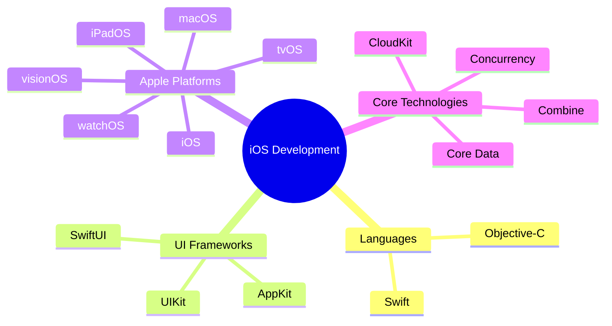
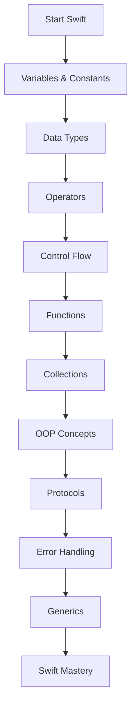
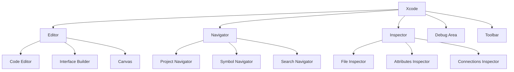
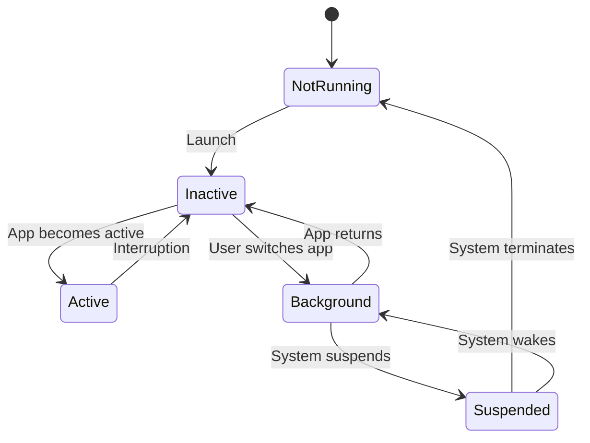
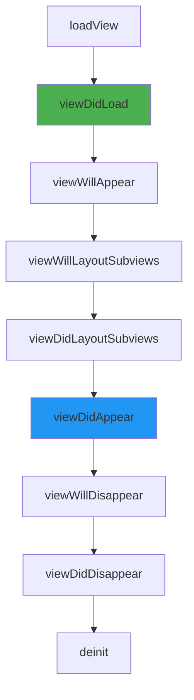
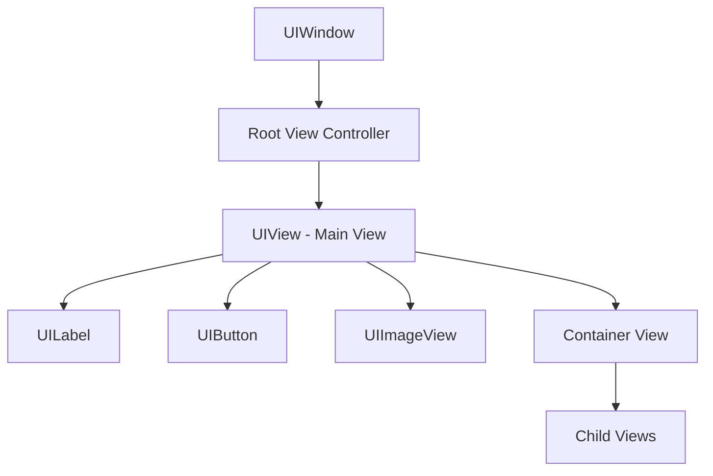

# 🍎 iOS Developer Roadmap

> A comprehensive guide to becoming a professional iOS developer in 2025 and beyond.

[](https://swift.org)
[](https://developer.apple.com/xcode/)
[](https://developer.apple.com/ios/)

---

## 📋 Table of Contents

- [Overview](#-overview)
- [Prerequisites](#-prerequisites)
- [Phase 1: Swift Fundamentals](#-phase-1-swift-fundamentals)
- [Phase 2: iOS Basics](#-phase-2-ios-basics)
- [Phase 3: UIKit Deep Dive](#-phase-3-uikit-deep-dive)
- [Phase 4: SwiftUI](#-phase-4-swiftui)
- [Phase 5: Data & Networking](#-phase-5-data--networking)
- [Phase 6: Advanced iOS](#-phase-6-advanced-ios)
- [Phase 7: Architecture & Testing](#-phase-7-architecture--testing)
- [Phase 8: App Store & Distribution](#-phase-8-app-store--distribution)
- [Learning Resources](#-learning-resources)
- [Project Ideas](#-project-ideas)
- [Career Tips](#-career-tips)

---

## 🎯 Overview

### The iOS Development Landscape



### Why iOS Development?

| Advantage | Description |
|-----------|-------------|
| **Revenue** | iOS users spend 2x more on apps |
| **Quality** | Consistent hardware, less fragmentation |
| **Tools** | World-class development tools (Xcode) |
| **Ecosystem** | Seamless integration across Apple devices |
| **Career** | High demand, competitive salaries |
| **Community** | Strong, supportive developer community |

### Learning Timeline

| Phase | Duration | Focus |
|-------|----------|-------|
| 1 | 4-6 weeks | Swift Fundamentals |
| 2 | 4-6 weeks | iOS Basics |
| 3 | 6-8 weeks | UIKit Deep Dive |
| 4 | 4-6 weeks | SwiftUI |
| 5 | 4-6 weeks | Data & Networking |
| 6 | 6-8 weeks | Advanced Topics |
| 7 | 4-6 weeks | Architecture & Testing |
| 8 | 2-4 weeks | App Store |

**Total: 8-12 months to job-ready**

---

## 📚 Prerequisites

### Required Knowledge

Before starting iOS development, ensure you understand:

```
├── Basic Programming Concepts
│   ├── Variables and data types
│   ├── Control flow (if/else, loops)
│   ├── Functions and methods
│   └── Basic OOP concepts
│
├── Computer Science Basics
│   ├── How computers work
│   ├── Memory management basics
│   └── Basic algorithms
│
└── Development Environment
    ├── Mac computer (required)
    ├── Apple Developer account (free tier)
    └── Xcode installed
```

### Hardware Requirements

| Requirement | Minimum | Recommended |
|-------------|---------|-------------|
| Mac | Apple Silicon or Intel | Apple Silicon (M1+) |
| RAM | 8GB | 16GB+ |
| Storage | 256GB | 512GB+ |
| macOS | Ventura 14.0 | Latest |
| Xcode | 15.0 | Latest |

---

## 🔤 Phase 1: Swift Fundamentals

### Swift Language Basics



### 1.1 Variables and Constants

```swift
// Constants (immutable)
let name = "John"
let age: Int = 25
let pi: Double = 3.14159

// Variables (mutable)
var score = 0
var message: String = "Hello"
var isActive: Bool = true
```

**Key Concepts:**
- Use `let` for constants (preferred when value won't change)
- Use `var` for variables (when value needs to change)
- Swift uses type inference
- Explicit type annotation with `: Type`

### 1.2 Data Types

| Type | Description | Example |
|------|-------------|---------|
| `Int` | Integer numbers | `42`, `-17` |
| `Double` | Decimal numbers | `3.14`, `-0.5` |
| `Float` | Less precise decimal | `3.14` |
| `Bool` | Boolean values | `true`, `false` |
| `String` | Text | `"Hello, World!"` |
| `Character` | Single character | `"A"` |

### 1.3 Optionals

```swift
// Optional declaration
var nickname: String? = nil
var age: Int? = 25

// Optional binding (safe unwrapping)
if let unwrappedNickname = nickname {
    print("Nickname: \(unwrappedNickname)")
} else {
    print("No nickname")
}

// Guard statement
func greet(_ name: String?) {
    guard let name = name else {
        print("No name provided")
        return
    }
    print("Hello, \(name)!")
}

// Nil coalescing
let displayName = nickname ?? "Anonymous"

// Optional chaining
let count = nickname?.count

// Force unwrapping (use carefully!)
let forcedName = nickname! // Crashes if nil
```

### 1.4 Collections

#### Arrays

```swift
// Array creation
var numbers: [Int] = [1, 2, 3, 4, 5]
var names = ["Alice", "Bob", "Charlie"]

// Array operations
numbers.append(6)
numbers.insert(0, at: 0)
numbers.remove(at: 0)
let first = numbers.first
let last = numbers.last

// Array iteration
for number in numbers {
    print(number)
}

// Higher-order functions
let doubled = numbers.map { $0 * 2 }
let evens = numbers.filter { $0 % 2 == 0 }
let sum = numbers.reduce(0, +)
```

#### Dictionaries

```swift
// Dictionary creation
var person: [String: Any] = [
    "name": "John",
    "age": 30,
    "isActive": true
]

// Dictionary operations
person["email"] = "john@example.com"
person.removeValue(forKey: "isActive")

// Safe access
if let name = person["name"] as? String {
    print("Name: \(name)")
}

// Iteration
for (key, value) in person {
    print("\(key): \(value)")
}
```

#### Sets

```swift
// Set creation
var uniqueNumbers: Set<Int> = [1, 2, 3, 3, 4, 4, 5]
// Result: {1, 2, 3, 4, 5}

// Set operations
let setA: Set = [1, 2, 3, 4]
let setB: Set = [3, 4, 5, 6]

let union = setA.union(setB)           // {1, 2, 3, 4, 5, 6}
let intersection = setA.intersection(setB)  // {3, 4}
let difference = setA.subtracting(setB)     // {1, 2}
```

### 1.5 Control Flow

```swift
// If/else
let temperature = 25
if temperature > 30 {
    print("Hot")
} else if temperature > 20 {
    print("Warm")
} else {
    print("Cold")
}

// Switch
let grade = "A"
switch grade {
case "A":
    print("Excellent")
case "B":
    print("Good")
case "C":
    print("Average")
default:
    print("Unknown")
}

// For loops
for i in 1...5 {
    print(i)  // 1, 2, 3, 4, 5
}

for i in 1..<5 {
    print(i)  // 1, 2, 3, 4
}

for i in stride(from: 0, to: 10, by: 2) {
    print(i)  // 0, 2, 4, 6, 8
}

// While loops
var count = 0
while count < 5 {
    print(count)
    count += 1
}

// Repeat-while (do-while)
repeat {
    print(count)
    count -= 1
} while count > 0
```

### 1.6 Functions

```swift
// Basic function
func greet() {
    print("Hello!")
}

// Function with parameters
func greet(name: String) {
    print("Hello, \(name)!")
}

// Function with return value
func add(_ a: Int, _ b: Int) -> Int {
    return a + b
}

// External and internal parameter names
func greet(person name: String, from city: String) {
    print("Hello, \(name) from \(city)!")
}
greet(person: "John", from: "New York")

// Default parameters
func greet(name: String = "World") {
    print("Hello, \(name)!")
}

// Variadic parameters
func sum(_ numbers: Int...) -> Int {
    return numbers.reduce(0, +)
}
sum(1, 2, 3, 4, 5)  // 15

// Inout parameters
func double(_ number: inout Int) {
    number *= 2
}
var myNumber = 5
double(&myNumber)  // myNumber is now 10

// Function types
let operation: (Int, Int) -> Int = add
let result = operation(5, 3)  // 8
```

### 1.7 Closures

```swift
// Basic closure
let greet = { (name: String) -> String in
    return "Hello, \(name)!"
}

// Closure as function parameter
func performOperation(_ a: Int, _ b: Int, operation: (Int, Int) -> Int) -> Int {
    return operation(a, b)
}

let result = performOperation(5, 3) { $0 + $1 }

// Trailing closure syntax
let numbers = [1, 2, 3, 4, 5]

let doubled = numbers.map { $0 * 2 }
let filtered = numbers.filter { $0 > 2 }
let sorted = numbers.sorted { $0 > $1 }

// Capturing values
func makeCounter() -> () -> Int {
    var count = 0
    return {
        count += 1
        return count
    }
}

let counter = makeCounter()
counter()  // 1
counter()  // 2
counter()  // 3

// Escaping closures
func fetchData(completion: @escaping (Data) -> Void) {
    DispatchQueue.global().async {
        // Fetch data...
        let data = Data()
        completion(data)
    }
}
```

### 1.8 Classes and Structures

```swift
// Structure (value type)
struct Point {
    var x: Double
    var y: Double
    
    // Computed property
    var magnitude: Double {
        return sqrt(x * x + y * y)
    }
    
    // Method
    func distance(to other: Point) -> Double {
        let dx = x - other.x
        let dy = y - other.y
        return sqrt(dx * dx + dy * dy)
    }
    
    // Mutating method (for structs)
    mutating func move(by delta: Point) {
        x += delta.x
        y += delta.y
    }
}

// Class (reference type)
class Person {
    var name: String
    var age: Int
    
    // Designated initializer
    init(name: String, age: Int) {
        self.name = name
        self.age = age
    }
    
    // Convenience initializer
    convenience init(name: String) {
        self.init(name: name, age: 0)
    }
    
    // Deinitializer
    deinit {
        print("\(name) is being deinitialized")
    }
    
    func introduce() {
        print("Hi, I'm \(name), \(age) years old.")
    }
}

// Inheritance
class Employee: Person {
    var company: String
    
    init(name: String, age: Int, company: String) {
        self.company = company
        super.init(name: name, age: age)
    }
    
    // Override method
    override func introduce() {
        super.introduce()
        print("I work at \(company).")
    }
}
```

### 1.9 Protocols

```swift
// Protocol definition
protocol Drawable {
    var color: String { get set }
    func draw()
}

// Protocol with default implementation
extension Drawable {
    func draw() {
        print("Drawing with \(color)")
    }
}

// Protocol adoption
struct Circle: Drawable {
    var color: String
    var radius: Double
    
    func draw() {
        print("Drawing a \(color) circle with radius \(radius)")
    }
}

// Protocol composition
protocol Named {
    var name: String { get }
}

protocol Aged {
    var age: Int { get }
}

func greet(_ person: Named & Aged) {
    print("Hello, \(person.name), you are \(person.age) years old.")
}

// Protocol-oriented programming
protocol Vehicle {
    var numberOfWheels: Int { get }
    func start()
    func stop()
}

extension Vehicle {
    func start() {
        print("Starting...")
    }
    
    func stop() {
        print("Stopping...")
    }
}

struct Car: Vehicle {
    var numberOfWheels: Int { 4 }
}

struct Motorcycle: Vehicle {
    var numberOfWheels: Int { 2 }
}
```

### 1.10 Error Handling

```swift
// Define errors
enum NetworkError: Error {
    case invalidURL
    case noData
    case decodingError
    case serverError(code: Int)
}

// Throwing function
func fetchUser(id: Int) throws -> User {
    guard id > 0 else {
        throw NetworkError.invalidURL
    }
    // Fetch user...
    return User(id: id, name: "John")
}

// Handling errors
do {
    let user = try fetchUser(id: 1)
    print(user.name)
} catch NetworkError.invalidURL {
    print("Invalid URL")
} catch NetworkError.serverError(let code) {
    print("Server error: \(code)")
} catch {
    print("Unknown error: \(error)")
}

// try? - returns optional
let user = try? fetchUser(id: 1)

// try! - force try (crashes on error)
let user = try! fetchUser(id: 1)

// Rethrowing functions
func perform<T>(operation: () throws -> T) rethrows -> T {
    return try operation()
}
```

### 1.11 Generics

```swift
// Generic function
func swap<T>(_ a: inout T, _ b: inout T) {
    let temp = a
    a = b
    b = temp
}

// Generic type
struct Stack<Element> {
    private var items: [Element] = []
    
    mutating func push(_ item: Element) {
        items.append(item)
    }
    
    mutating func pop() -> Element? {
        return items.popLast()
    }
    
    var top: Element? {
        return items.last
    }
    
    var isEmpty: Bool {
        return items.isEmpty
    }
}

// Generic constraints
func findIndex<T: Equatable>(of value: T, in array: [T]) -> Int? {
    for (index, item) in array.enumerated() {
        if item == value {
            return index
        }
    }
    return nil
}

// Associated types
protocol Container {
    associatedtype Item
    mutating func append(_ item: Item)
    var count: Int { get }
    subscript(i: Int) -> Item { get }
}

// Where clauses
func allItemsMatch<C1: Container, C2: Container>(_ c1: C1, _ c2: C2) -> Bool
    where C1.Item == C2.Item, C1.Item: Equatable {
    guard c1.count == c2.count else { return false }
    for i in 0..<c1.count {
        if c1[i] != c2[i] { return false }
    }
    return true
}
```

### 1.12 Memory Management (ARC)

```swift
// Strong reference (default)
class Person {
    var name: String
    var apartment: Apartment?
    
    init(name: String) {
        self.name = name
    }
    
    deinit {
        print("\(name) is being deinitialized")
    }
}

// Weak reference (breaks retain cycles)
class Apartment {
    var number: Int
    weak var tenant: Person?  // weak to avoid retain cycle
    
    init(number: Int) {
        self.number = number
    }
    
    deinit {
        print("Apartment \(number) is being deinitialized")
    }
}

// Unowned reference (non-optional, must always have value)
class Customer {
    var name: String
    var card: CreditCard?
    
    init(name: String) {
        self.name = name
    }
}

class CreditCard {
    var number: Int
    unowned let customer: Customer  // always exists
    
    init(number: Int, customer: Customer) {
        self.number = number
        self.customer = customer
    }
}

// Capture lists in closures
class HTMLElement {
    let name: String
    let text: String?
    
    lazy var asHTML: () -> String = { [unowned self] in
        if let text = self.text {
            return "<\(self.name)>\(text)</\(self.name)>"
        } else {
            return "<\(self.name) />"
        }
    }
    
    init(name: String, text: String? = nil) {
        self.name = name
        self.text = text
    }
}
```

---

## 📱 Phase 2: iOS Basics

### Xcode Overview



### 2.1 Xcode Keyboard Shortcuts

| Shortcut | Action |
|----------|--------|
| `⌘B` | Build |
| `⌘R` | Run |
| `⌘.` | Stop |
| `⌘⇧K` | Clean Build Folder |
| `⌘0` | Toggle Navigator |
| `⌘⌥0` | Toggle Inspector |
| `⌘⇧Y` | Toggle Debug Area |
| `⌘/` | Comment/Uncomment |
| `⌃⌘↑` | Switch .h/.m or counterpart |
| `⌘⇧O` | Open Quickly |
| `⌘⇧J` | Reveal in Navigator |
| `⌘L` | Go to Line |
| `⌃6` | Jump to Method |

### 2.2 iOS App Lifecycle



#### App Delegate Methods

```swift
@main
class AppDelegate: UIResponder, UIApplicationDelegate {

    func application(_ application: UIApplication, 
                     didFinishLaunchingWithOptions launchOptions: [UIApplication.LaunchOptionsKey: Any]?) -> Bool {
        // App finished launching
        return true
    }

    func applicationWillResignActive(_ application: UIApplication) {
        // App about to become inactive
    }

    func applicationDidEnterBackground(_ application: UIApplication) {
        // App entered background
    }

    func applicationWillEnterForeground(_ application: UIApplication) {
        // App about to enter foreground
    }

    func applicationDidBecomeActive(_ application: UIApplication) {
        // App became active
    }

    func applicationWillTerminate(_ application: UIApplication) {
        // App about to terminate
    }
}
```

#### Scene Delegate (iOS 13+)

```swift
class SceneDelegate: UIResponder, UIWindowSceneDelegate {

    var window: UIWindow?

    func scene(_ scene: UIScene, 
               willConnectTo session: UISceneSession, 
               options connectionOptions: UIScene.ConnectionOptions) {
        guard let windowScene = (scene as? UIWindowScene) else { return }
        
        window = UIWindow(windowScene: windowScene)
        window?.rootViewController = ViewController()
        window?.makeKeyAndVisible()
    }

    func sceneDidDisconnect(_ scene: UIScene) { }
    func sceneDidBecomeActive(_ scene: UIScene) { }
    func sceneWillResignActive(_ scene: UIScene) { }
    func sceneWillEnterForeground(_ scene: UIScene) { }
    func sceneDidEnterBackground(_ scene: UIScene) { }
}
```

### 2.3 View Controller Lifecycle



```swift
class ViewController: UIViewController {
    
    // Called when view is created programmatically
    override func loadView() {
        super.loadView()
        // Create custom view hierarchy
    }
    
    // Called once after view is loaded
    override func viewDidLoad() {
        super.viewDidLoad()
        // Setup UI, configure views
        // One-time setup
    }
    
    // Called every time view is about to appear
    override func viewWillAppear(_ animated: Bool) {
        super.viewWillAppear(animated)
        // Update UI with latest data
        // Start animations
    }
    
    // Called when view's bounds change
    override func viewWillLayoutSubviews() {
        super.viewWillLayoutSubviews()
        // Adjust layout before autolayout
    }
    
    // Called after layout is complete
    override func viewDidLayoutSubviews() {
        super.viewDidLayoutSubviews()
        // Make adjustments after autolayout
    }
    
    // Called after view appeared
    override func viewDidAppear(_ animated: Bool) {
        super.viewDidAppear(animated)
        // Start expensive operations
        // Analytics tracking
    }
    
    // Called when view is about to disappear
    override func viewWillDisappear(_ animated: Bool) {
        super.viewWillDisappear(animated)
        // Save data
        // Stop animations/timers
    }
    
    // Called after view disappeared
    override func viewDidDisappear(_ animated: Bool) {
        super.viewDidDisappear(animated)
        // Cleanup
    }
    
    // Memory warning received
    override func didReceiveMemoryWarning() {
        super.didReceiveMemoryWarning()
        // Release cached data
    }
    
    deinit {
        // Final cleanup
        // Remove observers
    }
}
```

### 2.4 Auto Layout

#### Auto Layout Concepts

```
├── Constraints
│   ├── Leading/Trailing
│   ├── Top/Bottom
│   ├── Width/Height
│   ├── CenterX/CenterY
│   └── Aspect Ratio
│
├── Priorities
│   ├── Required (1000)
│   ├── High (750)
│   ├── Low (250)
│   └── Custom values
│
├── Content Hugging
│   └── Resistance to growing
│
└── Compression Resistance
    └── Resistance to shrinking
```

#### Programmatic Auto Layout

```swift
// NSLayoutConstraint way
let button = UIButton()
button.translatesAutoresizingMaskIntoConstraints = false
view.addSubview(button)

NSLayoutConstraint.activate([
    button.centerXAnchor.constraint(equalTo: view.centerXAnchor),
    button.centerYAnchor.constraint(equalTo: view.centerYAnchor),
    button.widthAnchor.constraint(equalToConstant: 200),
    button.heightAnchor.constraint(equalToConstant: 50)
])

// Visual Format Language
let views = ["button": button]
let metrics = ["padding": 20]

let horizontal = NSLayoutConstraint.constraints(
    withVisualFormat: "H:|-padding-[button]-padding-|",
    options: [],
    metrics: metrics,
    views: views
)

let vertical = NSLayoutConstraint.constraints(
    withVisualFormat: "V:|-padding-[button(50)]",
    options: [],
    metrics: metrics,
    views: views
)

NSLayoutConstraint.activate(horizontal + vertical)
```

#### Stack Views

```swift
// Vertical stack
let vStack = UIStackView(arrangedSubviews: [label, textField, button])
vStack.axis = .vertical
vStack.spacing = 16
vStack.alignment = .fill
vStack.distribution = .fill

// Horizontal stack
let hStack = UIStackView(arrangedSubviews: [icon, label])
hStack.axis = .horizontal
hStack.spacing = 8
hStack.alignment = .center

// Add to view
view.addSubview(vStack)
vStack.translatesAutoresizingMaskIntoConstraints = false
NSLayoutConstraint.activate([
    vStack.leadingAnchor.constraint(equalTo: view.leadingAnchor, constant: 20),
    vStack.trailingAnchor.constraint(equalTo: view.trailingAnchor, constant: -20),
    vStack.centerYAnchor.constraint(equalTo: view.centerYAnchor)
])
```

### 2.5 Interface Builder vs Programmatic UI

| Aspect | Interface Builder | Programmatic |
|--------|-------------------|--------------|
| **Speed** | Faster for simple UIs | Faster for complex/dynamic |
| **Merge Conflicts** | Difficult | Easy |
| **Reusability** | Limited | Excellent |
| **Learning Curve** | Lower | Higher |
| **Debugging** | Harder | Easier |
| **Team Size** | Small teams | Large teams |
| **Dynamic UI** | Limited | Full control |

---

## 🎨 Phase 3: UIKit Deep Dive

### 3.1 View Hierarchy



### 3.2 Common UIKit Components

#### UILabel

```swift
let label = UILabel()
label.text = "Hello, World!"
label.font = .systemFont(ofSize: 17, weight: .regular)
label.textColor = .label
label.textAlignment = .center
label.numberOfLines = 0  // Unlimited lines
label.lineBreakMode = .byWordWrapping

// Attributed text
let attributedString = NSMutableAttributedString(string: "Hello World")
attributedString.addAttribute(.foregroundColor, value: UIColor.red, range: NSRange(location: 0, length: 5))
label.attributedText = attributedString
```

#### UIButton

```swift
let button = UIButton(type: .system)
button.setTitle("Tap Me", for: .normal)
button.setTitleColor(.white, for: .normal)
button.backgroundColor = .systemBlue
button.layer.cornerRadius = 8
button.addTarget(self, action: #selector(buttonTapped), for: .touchUpInside)

// Button configuration (iOS 15+)
var config = UIButton.Configuration.filled()
config.title = "Tap Me"
config.image = UIImage(systemName: "hand.tap")
config.imagePlacement = .leading
config.imagePadding = 8
let modernButton = UIButton(configuration: config)
```

#### UITextField

```swift
let textField = UITextField()
textField.placeholder = "Enter text"
textField.borderStyle = .roundedRect
textField.keyboardType = .emailAddress
textField.returnKeyType = .done
textField.autocapitalizationType = .none
textField.autocorrectionType = .no
textField.delegate = self

// Text field delegate
extension ViewController: UITextFieldDelegate {
    func textFieldShouldReturn(_ textField: UITextField) -> Bool {
        textField.resignFirstResponder()
        return true
    }
    
    func textField(_ textField: UITextField, 
                   shouldChangeCharactersIn range: NSRange, 
                   replacementString string: String) -> Bool {
        // Validate input
        return true
    }
}
```

#### UITextView

```swift
let textView = UITextView()
textView.text = "Long text content..."
textView.font = .systemFont(ofSize: 16)
textView.isEditable = true
textView.isScrollEnabled = true
textView.delegate = self

extension ViewController: UITextViewDelegate {
    func textViewDidChange(_ textView: UITextView) {
        // Handle text change
    }
    
    func textViewDidBeginEditing(_ textView: UITextView) {
        // Handle begin editing
    }
}
```

#### UIImageView

```swift
let imageView = UIImageView()
imageView.image = UIImage(named: "photo")
imageView.contentMode = .scaleAspectFit
imageView.clipsToBounds = true
imageView.layer.cornerRadius = 10

// SF Symbols (iOS 13+)
imageView.image = UIImage(systemName: "star.fill")
imageView.tintColor = .systemYellow

// Async image loading
Task {
    let (data, _) = try await URLSession.shared.data(from: imageURL)
    imageView.image = UIImage(data: data)
}
```

### 3.3 UITableView

```swift
class TableViewController: UIViewController {
    
    private let tableView = UITableView(frame: .zero, style: .plain)
    private var items: [String] = []
    
    override func viewDidLoad() {
        super.viewDidLoad()
        setupTableView()
    }
    
    private func setupTableView() {
        tableView.delegate = self
        tableView.dataSource = self
        tableView.register(UITableViewCell.self, forCellReuseIdentifier: "Cell")
        
        view.addSubview(tableView)
        tableView.frame = view.bounds
        tableView.autoresizingMask = [.flexibleWidth, .flexibleHeight]
    }
}

extension TableViewController: UITableViewDataSource {
    func tableView(_ tableView: UITableView, numberOfRowsInSection section: Int) -> Int {
        return items.count
    }
    
    func tableView(_ tableView: UITableView, cellForRowAt indexPath: IndexPath) -> UITableViewCell {
        let cell = tableView.dequeueReusableCell(withIdentifier: "Cell", for: indexPath)
        cell.textLabel?.text = items[indexPath.row]
        return cell
    }
}

extension TableViewController: UITableViewDelegate {
    func tableView(_ tableView: UITableView, didSelectRowAt indexPath: IndexPath) {
        tableView.deselectRow(at: indexPath, animated: true)
        // Handle selection
    }
    
    func tableView(_ tableView: UITableView, heightForRowAt indexPath: IndexPath) -> CGFloat {
        return 60
    }
    
    func tableView(_ tableView: UITableView, 
                   commit editingStyle: UITableViewCell.EditingStyle, 
                   forRowAt indexPath: IndexPath) {
        if editingStyle == .delete {
            items.remove(at: indexPath.row)
            tableView.deleteRows(at: [indexPath], with: .automatic)
        }
    }
}
```

### 3.4 UICollectionView

```swift
class CollectionViewController: UIViewController {
    
    private var collectionView: UICollectionView!
    private var items: [Item] = []
    
    override func viewDidLoad() {
        super.viewDidLoad()
        setupCollectionView()
    }
    
    private func setupCollectionView() {
        // Create layout
        let layout = UICollectionViewFlowLayout()
        layout.scrollDirection = .vertical
        layout.minimumLineSpacing = 10
        layout.minimumInteritemSpacing = 10
        layout.sectionInset = UIEdgeInsets(top: 10, left: 10, bottom: 10, right: 10)
        
        // Create collection view
        collectionView = UICollectionView(frame: .zero, collectionViewLayout: layout)
        collectionView.delegate = self
        collectionView.dataSource = self
        collectionView.register(CustomCell.self, forCellWithReuseIdentifier: "CustomCell")
        
        view.addSubview(collectionView)
        collectionView.frame = view.bounds
    }
}

// Custom Cell
class CustomCell: UICollectionViewCell {
    let imageView = UIImageView()
    let label = UILabel()
    
    override init(frame: CGRect) {
        super.init(frame: frame)
        setupViews()
    }
    
    required init?(coder: NSCoder) {
        fatalError("init(coder:) has not been implemented")
    }
    
    private func setupViews() {
        // Configure cell UI
    }
    
    func configure(with item: Item) {
        // Configure with data
    }
}

// Compositional Layout (iOS 13+)
func createCompositionalLayout() -> UICollectionViewLayout {
    let itemSize = NSCollectionLayoutSize(
        widthDimension: .fractionalWidth(0.5),
        heightDimension: .fractionalHeight(1.0)
    )
    let item = NSCollectionLayoutItem(layoutSize: itemSize)
    item.contentInsets = NSDirectionalEdgeInsets(top: 5, leading: 5, bottom: 5, trailing: 5)
    
    let groupSize = NSCollectionLayoutSize(
        widthDimension: .fractionalWidth(1.0),
        heightDimension: .fractionalWidth(0.5)
    )
    let group = NSCollectionLayoutGroup.horizontal(layoutSize: groupSize, subitems: [item])
    
    let section = NSCollectionLayoutSection(group: group)
    return UICollectionViewCompositionalLayout(section: section)
}
```

### 3.5 Navigation

#### UINavigationController

```swift
// Setup navigation controller
let rootVC = HomeViewController()
let navController = UINavigationController(rootViewController: rootVC)

// Push view controller
let detailVC = DetailViewController()
navigationController?.pushViewController(detailVC, animated: true)

// Pop view controller
navigationController?.popViewController(animated: true)

// Pop to root
navigationController?.popToRootViewController(animated: true)

// Configure navigation bar
navigationItem.title = "Home"
navigationItem.largeTitleDisplayMode = .always
navigationController?.navigationBar.prefersLargeTitles = true

// Navigation bar buttons
navigationItem.rightBarButtonItem = UIBarButtonItem(
    barButtonSystemItem: .add,
    target: self,
    action: #selector(addTapped)
)
```

#### UITabBarController

```swift
let tabBarController = UITabBarController()

let homeVC = UINavigationController(rootViewController: HomeViewController())
homeVC.tabBarItem = UITabBarItem(
    title: "Home",
    image: UIImage(systemName: "house"),
    selectedImage: UIImage(systemName: "house.fill")
)

let profileVC = UINavigationController(rootViewController: ProfileViewController())
profileVC.tabBarItem = UITabBarItem(
    title: "Profile",
    image: UIImage(systemName: "person"),
    selectedImage: UIImage(systemName: "person.fill")
)

tabBarController.viewControllers = [homeVC, profileVC]
```

#### Modal Presentation

```swift
// Present modally
let modalVC = ModalViewController()
modalVC.modalPresentationStyle = .pageSheet  // .fullScreen, .formSheet, etc.
modalVC.modalTransitionStyle = .coverVertical
present(modalVC, animated: true)

// Dismiss
dismiss(animated: true)

// Sheet presentation (iOS 15+)
if let sheet = modalVC.sheetPresentationController {
    sheet.detents = [.medium(), .large()]
    sheet.prefersGrabberVisible = true
    sheet.prefersScrollingExpandsWhenScrolledToEdge = false
}
```

### 3.6 Animations

```swift
// Basic animation
UIView.animate(withDuration: 0.3) {
    self.view.alpha = 0
}

// With options
UIView.animate(
    withDuration: 0.5,
    delay: 0.1,
    options: [.curveEaseInOut],
    animations: {
        self.button.transform = CGAffineTransform(scaleX: 1.2, y: 1.2)
    },
    completion: { finished in
        // Animation completed
    }
)

// Spring animation
UIView.animate(
    withDuration: 0.6,
    delay: 0,
    usingSpringWithDamping: 0.7,
    initialSpringVelocity: 0.5,
    options: [],
    animations: {
        self.card.center = newCenter
    }
)

// Keyframe animations
UIView.animateKeyframes(withDuration: 1.0, delay: 0) {
    UIView.addKeyframe(withRelativeStartTime: 0, relativeDuration: 0.25) {
        self.view.transform = CGAffineTransform(rotationAngle: .pi / 4)
    }
    UIView.addKeyframe(withRelativeStartTime: 0.25, relativeDuration: 0.25) {
        self.view.transform = CGAffineTransform(rotationAngle: .pi / 2)
    }
    UIView.addKeyframe(withRelativeStartTime: 0.5, relativeDuration: 0.5) {
        self.view.transform = .identity
    }
}

// Property animator (iOS 10+)
let animator = UIViewPropertyAnimator(duration: 0.3, curve: .easeInOut) {
    self.view.backgroundColor = .systemBlue
}
animator.startAnimation()

// Interactive animation
animator.pauseAnimation()
animator.fractionComplete = 0.5
animator.continueAnimation(withTimingParameters: nil, durationFactor: 0)
```

---

## 🎯 Phase 4: SwiftUI

### SwiftUI Overview

```mermaid
flowchart TD
    A[SwiftUI] --> B[Views]
    A --> C[State Management]
    A --> D[Data Flow]
    A --> E[Navigation]
    
    B --> B1[Built-in Views]
    B --> B2[Custom Views]
    B --> B3[View Modifiers]
    
    C --> C1[@State]
    C --> C2[@Binding]
    C --> C3[@ObservedObject]
    C --> C4[@StateObject]
    C --> C5[@EnvironmentObject]
    
    D --> D1[Combine]
    D --> D2[Async/Await]
```

### 4.1 Basic Views

```swift
import SwiftUI

// Text
Text("Hello, World!")
    .font(.title)
    .fontWeight(.bold)
    .foregroundColor(.blue)

// Image
Image(systemName: "star.fill")
    .resizable()
    .frame(width: 50, height: 50)
    .foregroundColor(.yellow)

Image("photo")
    .resizable()
    .aspectRatio(contentMode: .fit)
    .clipShape(Circle())

// Button
Button("Tap Me") {
    print("Button tapped")
}
.buttonStyle(.borderedProminent)

Button {
    // Action
} label: {
    HStack {
        Image(systemName: "plus")
        Text("Add Item")
    }
}

// TextField
@State private var text = ""

TextField("Enter text", text: $text)
    .textFieldStyle(.roundedBorder)

SecureField("Password", text: $password)

// Toggle
@State private var isOn = false

Toggle("Enable Feature", isOn: $isOn)
    .toggleStyle(.switch)

// Picker
@State private var selection = 0

Picker("Options", selection: $selection) {
    Text("Option 1").tag(0)
    Text("Option 2").tag(1)
    Text("Option 3").tag(2)
}
.pickerStyle(.segmented)

// Slider
@State private var value = 0.5

Slider(value: $value, in: 0...1) {
    Text("Value")
}
```

### 4.2 Layout

```swift
// VStack - Vertical
VStack(alignment: .leading, spacing: 10) {
    Text("Title")
    Text("Subtitle")
    Text("Description")
}

// HStack - Horizontal
HStack(alignment: .center, spacing: 10) {
    Image(systemName: "star")
    Text("Rating")
    Spacer()
    Text("5.0")
}

// ZStack - Overlay
ZStack(alignment: .bottomTrailing) {
    Image("background")
    Text("Overlay")
        .padding()
        .background(Color.black.opacity(0.5))
}

// LazyVStack/LazyHStack (Lazy loading)
ScrollView {
    LazyVStack {
        ForEach(items) { item in
            ItemRow(item: item)
        }
    }
}

// Grid (iOS 16+)
Grid {
    GridRow {
        Text("Row 1, Col 1")
        Text("Row 1, Col 2")
    }
    GridRow {
        Text("Row 2, Col 1")
        Text("Row 2, Col 2")
    }
}

// LazyVGrid
let columns = [
    GridItem(.flexible()),
    GridItem(.flexible()),
    GridItem(.flexible())
]

LazyVGrid(columns: columns, spacing: 10) {
    ForEach(items) { item in
        ItemCard(item: item)
    }
}
```

### 4.3 State Management

```swift
// @State - Local state
struct CounterView: View {
    @State private var count = 0
    
    var body: some View {
        VStack {
            Text("Count: \(count)")
            Button("Increment") {
                count += 1
            }
        }
    }
}

// @Binding - Two-way binding
struct ChildView: View {
    @Binding var isOn: Bool
    
    var body: some View {
        Toggle("Toggle", isOn: $isOn)
    }
}

struct ParentView: View {
    @State private var isOn = false
    
    var body: some View {
        ChildView(isOn: $isOn)
    }
}

// @StateObject - Owns observable object
class ViewModel: ObservableObject {
    @Published var items: [Item] = []
    
    func loadItems() async {
        // Load items
    }
}

struct ContentView: View {
    @StateObject private var viewModel = ViewModel()
    
    var body: some View {
        List(viewModel.items) { item in
            Text(item.name)
        }
        .task {
            await viewModel.loadItems()
        }
    }
}

// @ObservedObject - Doesn't own, receives from parent
struct ChildView: View {
    @ObservedObject var viewModel: ViewModel
    
    var body: some View {
        // Use viewModel
    }
}

// @EnvironmentObject - Shared across view hierarchy
struct ContentView: View {
    @EnvironmentObject var settings: AppSettings
    
    var body: some View {
        Text("Theme: \(settings.theme)")
    }
}

// App entry point
@main
struct MyApp: App {
    @StateObject private var settings = AppSettings()
    
    var body: some Scene {
        WindowGroup {
            ContentView()
                .environmentObject(settings)
        }
    }
}

// @Environment - System values
struct ContentView: View {
    @Environment(\.colorScheme) var colorScheme
    @Environment(\.dismiss) var dismiss
    
    var body: some View {
        VStack {
            if colorScheme == .dark {
                Text("Dark Mode")
            }
            Button("Close") {
                dismiss()
            }
        }
    }
}
```

### 4.4 Navigation

```swift
// NavigationStack (iOS 16+)
struct ContentView: View {
    @State private var path = NavigationPath()
    
    var body: some View {
        NavigationStack(path: $path) {
            List(items) { item in
                NavigationLink(value: item) {
                    Text(item.name)
                }
            }
            .navigationTitle("Items")
            .navigationDestination(for: Item.self) { item in
                DetailView(item: item)
            }
        }
    }
}

// Programmatic navigation
Button("Go to Detail") {
    path.append(item)
}

// TabView
struct MainView: View {
    var body: some View {
        TabView {
            HomeView()
                .tabItem {
                    Label("Home", systemImage: "house")
                }
            
            ProfileView()
                .tabItem {
                    Label("Profile", systemImage: "person")
                }
        }
    }
}

// Sheet presentation
struct ContentView: View {
    @State private var showSheet = false
    
    var body: some View {
        Button("Show Sheet") {
            showSheet = true
        }
        .sheet(isPresented: $showSheet) {
            SheetView()
        }
    }
}

// Full screen cover
.fullScreenCover(isPresented: $showFullScreen) {
    FullScreenView()
}
```

### 4.5 Lists

```swift
// Basic List
List {
    Text("Item 1")
    Text("Item 2")
    Text("Item 3")
}

// Dynamic List
List(items) { item in
    ItemRow(item: item)
}

// Sections
List {
    Section("Section 1") {
        Text("Item 1")
        Text("Item 2")
    }
    
    Section("Section 2") {
        Text("Item 3")
        Text("Item 4")
    }
}

// Swipe actions
List {
    ForEach(items) { item in
        Text(item.name)
            .swipeActions(edge: .trailing) {
                Button(role: .destructive) {
                    delete(item)
                } label: {
                    Label("Delete", systemImage: "trash")
                }
            }
            .swipeActions(edge: .leading) {
                Button {
                    favorite(item)
                } label: {
                    Label("Favorite", systemImage: "star")
                }
                .tint(.yellow)
            }
    }
}

// Pull to refresh
List {
    // Content
}
.refreshable {
    await loadData()
}

// Search
@State private var searchText = ""

List {
    // Content
}
.searchable(text: $searchText)
```

### 4.6 Custom Views & Modifiers

```swift
// Custom View
struct CardView: View {
    let title: String
    let subtitle: String
    
    var body: some View {
        VStack(alignment: .leading, spacing: 8) {
            Text(title)
                .font(.headline)
            Text(subtitle)
                .font(.subheadline)
                .foregroundColor(.secondary)
        }
        .padding()
        .background(Color(.systemBackground))
        .cornerRadius(10)
        .shadow(radius: 5)
    }
}

// View Modifier
struct CardModifier: ViewModifier {
    func body(content: Content) -> some View {
        content
            .padding()
            .background(Color(.systemBackground))
            .cornerRadius(10)
            .shadow(radius: 5)
    }
}

extension View {
    func cardStyle() -> some View {
        modifier(CardModifier())
    }
}

// Usage
Text("Hello")
    .cardStyle()

// Button Style
struct PrimaryButtonStyle: ButtonStyle {
    func makeBody(configuration: Configuration) -> some View {
        configuration.label
            .padding()
            .background(configuration.isPressed ? Color.blue.opacity(0.8) : Color.blue)
            .foregroundColor(.white)
            .cornerRadius(10)
            .scaleEffect(configuration.isPressed ? 0.95 : 1)
    }
}

Button("Tap Me") { }
    .buttonStyle(PrimaryButtonStyle())
```

---

## 📊 Phase 5: Data & Networking

### 5.1 UserDefaults

```swift
// Simple storage
UserDefaults.standard.set("John", forKey: "username")
UserDefaults.standard.set(25, forKey: "age")
UserDefaults.standard.set(true, forKey: "isLoggedIn")

// Retrieve
let username = UserDefaults.standard.string(forKey: "username")
let age = UserDefaults.standard.integer(forKey: "age")
let isLoggedIn = UserDefaults.standard.bool(forKey: "isLoggedIn")

// Property wrapper approach
@propertyWrapper
struct UserDefault<T> {
    let key: String
    let defaultValue: T
    
    var wrappedValue: T {
        get { UserDefaults.standard.object(forKey: key) as? T ?? defaultValue }
        set { UserDefaults.standard.set(newValue, forKey: key) }
    }
}

class Settings {
    @UserDefault(key: "username", defaultValue: "")
    static var username: String
    
    @UserDefault(key: "notificationsEnabled", defaultValue: true)
    static var notificationsEnabled: Bool
}
```

### 5.2 Keychain

```swift
import Security

class KeychainManager {
    static func save(_ data: Data, service: String, account: String) throws {
        let query: [String: Any] = [
            kSecClass as String: kSecClassGenericPassword,
            kSecAttrService as String: service,
            kSecAttrAccount as String: account,
            kSecValueData as String: data
        ]
        
        SecItemDelete(query as CFDictionary)
        
        let status = SecItemAdd(query as CFDictionary, nil)
        guard status == errSecSuccess else {
            throw KeychainError.saveFailed
        }
    }
    
    static func load(service: String, account: String) throws -> Data {
        let query: [String: Any] = [
            kSecClass as String: kSecClassGenericPassword,
            kSecAttrService as String: service,
            kSecAttrAccount as String: account,
            kSecReturnData as String: true
        ]
        
        var result: AnyObject?
        let status = SecItemCopyMatching(query as CFDictionary, &result)
        
        guard status == errSecSuccess, let data = result as? Data else {
            throw KeychainError.loadFailed
        }
        
        return data
    }
    
    static func delete(service: String, account: String) throws {
        let query: [String: Any] = [
            kSecClass as String: kSecClassGenericPassword,
            kSecAttrService as String: service,
            kSecAttrAccount as String: account
        ]
        
        let status = SecItemDelete(query as CFDictionary)
        guard status == errSecSuccess || status == errSecItemNotFound else {
            throw KeychainError.deleteFailed
        }
    }
}
```

### 5.3 Core Data

```swift
// Data Model
import CoreData

@objc(Task)
public class Task: NSManagedObject {
    @NSManaged public var id: UUID
    @NSManaged public var title: String
    @NSManaged public var isCompleted: Bool
    @NSManaged public var createdAt: Date
}

// Core Data Stack
class CoreDataManager {
    static let shared = CoreDataManager()
    
    lazy var persistentContainer: NSPersistentContainer = {
        let container = NSPersistentContainer(name: "Model")
        container.loadPersistentStores { _, error in
            if let error = error {
                fatalError("Failed to load Core Data: \(error)")
            }
        }
        return container
    }()
    
    var context: NSManagedObjectContext {
        persistentContainer.viewContext
    }
    
    func save() {
        if context.hasChanges {
            do {
                try context.save()
            } catch {
                print("Failed to save: \(error)")
            }
        }
    }
    
    // CRUD Operations
    func createTask(title: String) -> Task {
        let task = Task(context: context)
        task.id = UUID()
        task.title = title
        task.isCompleted = false
        task.createdAt = Date()
        save()
        return task
    }
    
    func fetchTasks() -> [Task] {
        let request: NSFetchRequest<Task> = Task.fetchRequest()
        request.sortDescriptors = [NSSortDescriptor(key: "createdAt", ascending: false)]
        
        do {
            return try context.fetch(request)
        } catch {
            print("Failed to fetch: \(error)")
            return []
        }
    }
    
    func deleteTask(_ task: Task) {
        context.delete(task)
        save()
    }
}
```

### 5.4 SwiftData (iOS 17+)

```swift
import SwiftData

@Model
class Task {
    var id: UUID
    var title: String
    var isCompleted: Bool
    var createdAt: Date
    
    init(title: String) {
        self.id = UUID()
        self.title = title
        self.isCompleted = false
        self.createdAt = Date()
    }
}

// App setup
@main
struct MyApp: App {
    var body: some Scene {
        WindowGroup {
            ContentView()
        }
        .modelContainer(for: Task.self)
    }
}

// View with SwiftData
struct ContentView: View {
    @Environment(\.modelContext) private var modelContext
    @Query(sort: \Task.createdAt, order: .reverse) private var tasks: [Task]
    
    var body: some View {
        List {
            ForEach(tasks) { task in
                Text(task.title)
            }
            .onDelete(perform: deleteTasks)
        }
    }
    
    func addTask(title: String) {
        let task = Task(title: title)
        modelContext.insert(task)
    }
    
    func deleteTasks(at offsets: IndexSet) {
        for index in offsets {
            modelContext.delete(tasks[index])
        }
    }
}
```

### 5.5 Networking

```swift
// URLSession basics
func fetchData() async throws -> Data {
    let url = URL(string: "https://api.example.com/data")!
    let (data, response) = try await URLSession.shared.data(from: url)
    
    guard let httpResponse = response as? HTTPURLResponse,
          (200...299).contains(httpResponse.statusCode) else {
        throw NetworkError.invalidResponse
    }
    
    return data
}

// JSON Decoding
struct User: Codable {
    let id: Int
    let name: String
    let email: String
}

func fetchUsers() async throws -> [User] {
    let url = URL(string: "https://api.example.com/users")!
    let (data, _) = try await URLSession.shared.data(from: url)
    
    let decoder = JSONDecoder()
    decoder.keyDecodingStrategy = .convertFromSnakeCase
    
    return try decoder.decode([User].self, from: data)
}

// POST Request
func createUser(_ user: User) async throws -> User {
    let url = URL(string: "https://api.example.com/users")!
    var request = URLRequest(url: url)
    request.httpMethod = "POST"
    request.setValue("application/json", forHTTPHeaderField: "Content-Type")
    
    let encoder = JSONEncoder()
    request.httpBody = try encoder.encode(user)
    
    let (data, _) = try await URLSession.shared.data(for: request)
    return try JSONDecoder().decode(User.self, from: data)
}

// Network Manager
class NetworkManager {
    static let shared = NetworkManager()
    
    private let baseURL = "https://api.example.com"
    private let session: URLSession
    
    private init() {
        let config = URLSessionConfiguration.default
        config.timeoutIntervalForRequest = 30
        config.waitsForConnectivity = true
        session = URLSession(configuration: config)
    }
    
    func request<T: Decodable>(_ endpoint: String, method: String = "GET") async throws -> T {
        guard let url = URL(string: baseURL + endpoint) else {
            throw NetworkError.invalidURL
        }
        
        var request = URLRequest(url: url)
        request.httpMethod = method
        
        let (data, response) = try await session.data(for: request)
        
        guard let httpResponse = response as? HTTPURLResponse else {
            throw NetworkError.invalidResponse
        }
        
        switch httpResponse.statusCode {
        case 200...299:
            return try JSONDecoder().decode(T.self, from: data)
        case 401:
            throw NetworkError.unauthorized
        case 404:
            throw NetworkError.notFound
        default:
            throw NetworkError.serverError(httpResponse.statusCode)
        }
    }
}
```

---

## 🚀 Phase 6: Advanced iOS

### 6.1 Swift Concurrency

```swift
// Async/Await
func fetchUser(id: Int) async throws -> User {
    let url = URL(string: "https://api.example.com/users/\(id)")!
    let (data, _) = try await URLSession.shared.data(from: url)
    return try JSONDecoder().decode(User.self, from: data)
}

// Task
Task {
    do {
        let user = try await fetchUser(id: 1)
        print(user.name)
    } catch {
        print("Error: \(error)")
    }
}

// Task Group
func fetchAllUsers(ids: [Int]) async throws -> [User] {
    try await withThrowingTaskGroup(of: User.self) { group in
        for id in ids {
            group.addTask {
                try await fetchUser(id: id)
            }
        }
        
        var users: [User] = []
        for try await user in group {
            users.append(user)
        }
        return users
    }
}

// Actors
actor UserCache {
    private var cache: [Int: User] = [:]
    
    func user(for id: Int) -> User? {
        cache[id]
    }
    
    func setUser(_ user: User, for id: Int) {
        cache[id] = user
    }
}

// MainActor
@MainActor
class ViewModel: ObservableObject {
    @Published var users: [User] = []
    
    func loadUsers() async {
        do {
            users = try await fetchAllUsers(ids: [1, 2, 3])
        } catch {
            // Handle error
        }
    }
}

// Continuations (bridging callback APIs)
func legacyFetch(completion: @escaping (Result<Data, Error>) -> Void) {
    // Legacy callback-based API
}

func modernFetch() async throws -> Data {
    try await withCheckedThrowingContinuation { continuation in
        legacyFetch { result in
            switch result {
            case .success(let data):
                continuation.resume(returning: data)
            case .failure(let error):
                continuation.resume(throwing: error)
            }
        }
    }
}
```

### 6.2 Combine Framework

```swift
import Combine

// Publisher basics
let publisher = [1, 2, 3, 4, 5].publisher

let subscription = publisher
    .map { $0 * 2 }
    .filter { $0 > 4 }
    .sink { value in
        print(value)  // 6, 8, 10
    }

// Subject
let subject = PassthroughSubject<String, Never>()

subject
    .sink { value in
        print(value)
    }

subject.send("Hello")
subject.send("World")

// CurrentValueSubject
let currentValue = CurrentValueSubject<Int, Never>(0)
print(currentValue.value)  // 0
currentValue.send(1)
print(currentValue.value)  // 1

// Networking with Combine
func fetchUser(id: Int) -> AnyPublisher<User, Error> {
    let url = URL(string: "https://api.example.com/users/\(id)")!
    
    return URLSession.shared.dataTaskPublisher(for: url)
        .map(\.data)
        .decode(type: User.self, decoder: JSONDecoder())
        .receive(on: DispatchQueue.main)
        .eraseToAnyPublisher()
}

// ViewModel with Combine
class SearchViewModel: ObservableObject {
    @Published var searchText = ""
    @Published var results: [Item] = []
    
    private var cancellables = Set<AnyCancellable>()
    
    init() {
        $searchText
            .debounce(for: .milliseconds(300), scheduler: RunLoop.main)
            .removeDuplicates()
            .filter { !$0.isEmpty }
            .flatMap { query in
                self.search(query: query)
            }
            .receive(on: DispatchQueue.main)
            .sink { [weak self] results in
                self?.results = results
            }
            .store(in: &cancellables)
    }
    
    private func search(query: String) -> AnyPublisher<[Item], Never> {
        // Search implementation
    }
}
```

### 6.3 Push Notifications

```swift
import UserNotifications

// Request permission
func requestNotificationPermission() {
    UNUserNotificationCenter.current().requestAuthorization(options: [.alert, .badge, .sound]) { granted, error in
        if granted {
            DispatchQueue.main.async {
                UIApplication.shared.registerForRemoteNotifications()
            }
        }
    }
}

// AppDelegate methods
func application(_ application: UIApplication, 
                 didRegisterForRemoteNotificationsWithDeviceToken deviceToken: Data) {
    let token = deviceToken.map { String(format: "%02.2hhx", $0) }.joined()
    print("Device Token: \(token)")
    // Send token to server
}

func application(_ application: UIApplication, 
                 didFailToRegisterForRemoteNotificationsWithError error: Error) {
    print("Failed to register: \(error)")
}

// Local notifications
func scheduleLocalNotification() {
    let content = UNMutableNotificationContent()
    content.title = "Reminder"
    content.body = "Don't forget to check the app!"
    content.sound = .default
    
    let trigger = UNTimeIntervalNotificationTrigger(timeInterval: 60, repeats: false)
    
    let request = UNNotificationRequest(identifier: UUID().uuidString, content: content, trigger: trigger)
    
    UNUserNotificationCenter.current().add(request)
}

// Handle notification
class NotificationDelegate: NSObject, UNUserNotificationCenterDelegate {
    func userNotificationCenter(_ center: UNUserNotificationCenter, 
                                willPresent notification: UNNotification,
                                withCompletionHandler completionHandler: @escaping (UNNotificationPresentationOptions) -> Void) {
        completionHandler([.banner, .sound, .badge])
    }
    
    func userNotificationCenter(_ center: UNUserNotificationCenter, 
                                didReceive response: UNNotificationResponse,
                                withCompletionHandler completionHandler: @escaping () -> Void) {
        let userInfo = response.notification.request.content.userInfo
        // Handle notification tap
        completionHandler()
    }
}
```

### 6.4 Core Location

```swift
import CoreLocation

class LocationManager: NSObject, ObservableObject, CLLocationManagerDelegate {
    private let manager = CLLocationManager()
    
    @Published var location: CLLocation?
    @Published var authorizationStatus: CLAuthorizationStatus = .notDetermined
    
    override init() {
        super.init()
        manager.delegate = self
        manager.desiredAccuracy = kCLLocationAccuracyBest
    }
    
    func requestPermission() {
        manager.requestWhenInUseAuthorization()
    }
    
    func startUpdating() {
        manager.startUpdatingLocation()
    }
    
    func stopUpdating() {
        manager.stopUpdatingLocation()
    }
    
    // Delegate methods
    func locationManager(_ manager: CLLocationManager, didUpdateLocations locations: [CLLocation]) {
        location = locations.last
    }
    
    func locationManager(_ manager: CLLocationManager, didFailWithError error: Error) {
        print("Location error: \(error)")
    }
    
    func locationManagerDidChangeAuthorization(_ manager: CLLocationManager) {
        authorizationStatus = manager.authorizationStatus
    }
}

// Geocoding
func geocode(address: String) async throws -> CLLocation? {
    let geocoder = CLGeocoder()
    let placemarks = try await geocoder.geocodeAddressString(address)
    return placemarks.first?.location
}

func reverseGeocode(location: CLLocation) async throws -> String? {
    let geocoder = CLGeocoder()
    let placemarks = try await geocoder.reverseGeocodeLocation(location)
    return placemarks.first?.locality
}
```

### 6.5 MapKit

```swift
import MapKit
import SwiftUI

// SwiftUI Map
struct MapView: View {
    @State private var region = MKCoordinateRegion(
        center: CLLocationCoordinate2D(latitude: 37.7749, longitude: -122.4194),
        span: MKCoordinateSpan(latitudeDelta: 0.1, longitudeDelta: 0.1)
    )
    
    var body: some View {
        Map(coordinateRegion: $region, annotationItems: locations) { location in
            MapMarker(coordinate: location.coordinate, tint: .red)
        }
    }
}

// Custom annotation
struct Location: Identifiable {
    let id = UUID()
    let name: String
    let coordinate: CLLocationCoordinate2D
}

// Map with custom annotations
Map(coordinateRegion: $region, annotationItems: locations) { location in
    MapAnnotation(coordinate: location.coordinate) {
        VStack {
            Image(systemName: "mappin.circle.fill")
                .foregroundColor(.red)
                .font(.title)
            Text(location.name)
                .font(.caption)
        }
    }
}
```

### 6.6 App Extensions

```
├── Widget Extension
│   ├── Timeline Provider
│   ├── Widget Entry
│   └── Widget View
│
├── Share Extension
│   └── Handle shared content
│
├── Today Extension
│   └── Widget (deprecated)
│
├── Notification Content
│   └── Custom notification UI
│
└── Intents Extension
    └── Siri integration
```

---

## 🏗️ Phase 7: Architecture & Testing

### 7.1 MVVM Pattern

```swift
// Model
struct User: Codable, Identifiable {
    let id: Int
    let name: String
    let email: String
}

// ViewModel
@MainActor
class UserListViewModel: ObservableObject {
    @Published private(set) var users: [User] = []
    @Published private(set) var isLoading = false
    @Published private(set) var errorMessage: String?
    
    private let userService: UserServiceProtocol
    
    init(userService: UserServiceProtocol = UserService()) {
        self.userService = userService
    }
    
    func loadUsers() async {
        isLoading = true
        errorMessage = nil
        
        do {
            users = try await userService.fetchUsers()
        } catch {
            errorMessage = error.localizedDescription
        }
        
        isLoading = false
    }
}

// View
struct UserListView: View {
    @StateObject private var viewModel = UserListViewModel()
    
    var body: some View {
        NavigationStack {
            Group {
                if viewModel.isLoading {
                    ProgressView()
                } else if let error = viewModel.errorMessage {
                    Text(error)
                } else {
                    List(viewModel.users) { user in
                        Text(user.name)
                    }
                }
            }
            .navigationTitle("Users")
        }
        .task {
            await viewModel.loadUsers()
        }
    }
}
```

### 7.2 Dependency Injection

```swift
// Protocol for abstraction
protocol UserServiceProtocol {
    func fetchUsers() async throws -> [User]
}

// Production implementation
class UserService: UserServiceProtocol {
    func fetchUsers() async throws -> [User] {
        // Real network call
    }
}

// Mock for testing
class MockUserService: UserServiceProtocol {
    var mockUsers: [User] = []
    var shouldThrowError = false
    
    func fetchUsers() async throws -> [User] {
        if shouldThrowError {
            throw NetworkError.serverError(500)
        }
        return mockUsers
    }
}

// Container
class DIContainer {
    static let shared = DIContainer()
    
    lazy var userService: UserServiceProtocol = UserService()
    
    #if DEBUG
    func reset() {
        // Reset for testing
    }
    #endif
}
```

### 7.3 Unit Testing

```swift
import XCTest
@testable import MyApp

final class UserListViewModelTests: XCTestCase {
    var sut: UserListViewModel!
    var mockService: MockUserService!
    
    override func setUp() {
        super.setUp()
        mockService = MockUserService()
        sut = UserListViewModel(userService: mockService)
    }
    
    override func tearDown() {
        sut = nil
        mockService = nil
        super.tearDown()
    }
    
    func testLoadUsers_Success() async {
        // Given
        let expectedUsers = [
            User(id: 1, name: "John", email: "john@example.com"),
            User(id: 2, name: "Jane", email: "jane@example.com")
        ]
        mockService.mockUsers = expectedUsers
        
        // When
        await sut.loadUsers()
        
        // Then
        XCTAssertEqual(sut.users.count, 2)
        XCTAssertFalse(sut.isLoading)
        XCTAssertNil(sut.errorMessage)
    }
    
    func testLoadUsers_Failure() async {
        // Given
        mockService.shouldThrowError = true
        
        // When
        await sut.loadUsers()
        
        // Then
        XCTAssertTrue(sut.users.isEmpty)
        XCTAssertFalse(sut.isLoading)
        XCTAssertNotNil(sut.errorMessage)
    }
}
```

### 7.4 UI Testing

```swift
import XCTest

final class UserListUITests: XCTestCase {
    var app: XCUIApplication!
    
    override func setUp() {
        super.setUp()
        continueAfterFailure = false
        app = XCUIApplication()
        app.launchArguments = ["UI_TESTING"]
        app.launch()
    }
    
    func testUserListDisplaysUsers() {
        // Given
        let userList = app.collectionViews["userList"]
        
        // Then
        XCTAssertTrue(userList.waitForExistence(timeout: 5))
        XCTAssertTrue(userList.cells.count > 0)
    }
    
    func testTapUserNavigatesToDetail() {
        // Given
        let userList = app.collectionViews["userList"]
        _ = userList.waitForExistence(timeout: 5)
        
        // When
        userList.cells.firstMatch.tap()
        
        // Then
        let detailView = app.staticTexts["userDetailTitle"]
        XCTAssertTrue(detailView.waitForExistence(timeout: 2))
    }
}
```

---

## 📦 Phase 8: App Store & Distribution

### 8.1 App Store Guidelines

```
├── Content Guidelines
│   ├── No objectionable content
│   ├── No hidden features
│   └── Accurate metadata
│
├── Design Guidelines
│   ├── Human Interface Guidelines
│   ├── App completeness
│   └── User experience
│
├── Technical Guidelines
│   ├── No private APIs
│   ├── No crashes
│   └── Performance requirements
│
└── Business Guidelines
    ├── In-app purchases
    ├── Subscriptions
    └── Privacy requirements
```

### 8.2 App Store Submission Checklist

- [ ] App icon (1024x1024)
- [ ] Screenshots for all device sizes
- [ ] App description
- [ ] Keywords
- [ ] Privacy policy URL
- [ ] Support URL
- [ ] App Store Connect setup
- [ ] TestFlight testing
- [ ] App Review guidelines compliance
- [ ] Version number and build number
- [ ] Certificates and provisioning profiles

### 8.3 TestFlight

```
├── Internal Testing
│   ├── Up to 100 testers
│   ├── Instant distribution
│   └── No review required
│
└── External Testing
    ├── Up to 10,000 testers
    ├── Public link option
    └── Beta App Review required
```

### 8.4 App Monetization

| Model | Description | Best For |
|-------|-------------|----------|
| **Paid** | One-time purchase | Premium apps |
| **Freemium** | Free with IAP | Games, productivity |
| **Subscription** | Recurring payment | Content, services |
| **Ads** | Free with ads | Mass market apps |
| **Hybrid** | Multiple models | Flexible approach |

---

## 📖 Learning Resources

### Official Resources

- [Apple Developer Documentation](https://developer.apple.com/documentation/)
- [Swift Language Guide](https://docs.swift.org/swift-book/)
- [Human Interface Guidelines](https://developer.apple.com/design/human-interface-guidelines/)
- [WWDC Videos](https://developer.apple.com/videos/)

### Books

| Book | Author | Level |
|------|--------|-------|
| Swift Programming | Big Nerd Ranch | Beginner |
| iOS Programming | Big Nerd Ranch | Beginner |
| Hacking with Swift | Paul Hudson | Beginner-Advanced |
| Advanced Swift | objc.io | Advanced |
| Combine: Asynchronous Programming | Ray Wenderlich | Intermediate |

### Online Courses

- [100 Days of SwiftUI](https://www.hackingwithswift.com/100/swiftui) (Free)
- [Stanford CS193p](https://cs193p.sites.stanford.edu/) (Free)
- [Kodeco (Ray Wenderlich)](https://www.kodeco.com/) (Paid)
- [Udemy iOS Courses](https://www.udemy.com/topic/ios-development/) (Paid)

### Communities

- [Swift Forums](https://forums.swift.org/)
- [r/iOSProgramming](https://www.reddit.com/r/iOSProgramming/)
- [iOS Dev Weekly](https://iosdevweekly.com/)
- [Hacking with Swift Forums](https://www.hackingwithswift.com/forums)

---

## 💡 Project Ideas

### Beginner Projects

1. **Calculator** - Basic arithmetic operations
2. **Todo List** - CRUD with UserDefaults
3. **Weather App** - API integration
4. **Timer App** - Background tasks
5. **Flashcard App** - Simple animations

### Intermediate Projects

1. **Notes App** - Core Data/SwiftData
2. **Recipe App** - Complex UI, networking
3. **Fitness Tracker** - HealthKit integration
4. **News Reader** - REST API, caching
5. **Chat App** - Firebase, real-time

### Advanced Projects

1. **Social Media Client** - Complex architecture
2. **Photo Editor** - Core Image
3. **Music Player** - AVFoundation
4. **AR Experience** - ARKit
5. **Full E-commerce** - Complete app

---

## 💼 Career Tips

### Building Your Portfolio

1. **GitHub Profile** - Showcase your code
2. **Personal Projects** - Build 3-5 complete apps
3. **Open Source** - Contribute to iOS projects
4. **Blog/Twitter** - Share your learning
5. **App Store** - Publish at least one app

### Interview Preparation

- Review Swift fundamentals
- Practice coding challenges
- Know iOS architecture patterns
- Prepare system design answers
- Have project stories ready

### Salary Negotiation

- Research market rates
- Know your worth
- Consider total compensation
- Be willing to walk away
- Get offers in writing

---

## 🎯 Conclusion

Becoming a professional iOS developer is a journey that requires dedication, practice, and continuous learning. This roadmap provides a structured path, but remember:

1. **Practice daily** - Consistency beats intensity
2. **Build projects** - Theory is nothing without practice
3. **Stay curious** - Technology evolves rapidly
4. **Join communities** - Learn from others
5. **Never stop learning** - This is a lifelong journey

Good luck on your iOS development journey! 🚀

---

<p align="center">
  <a href="../README.md">← Back to Main Roadmap</a>
</p>
