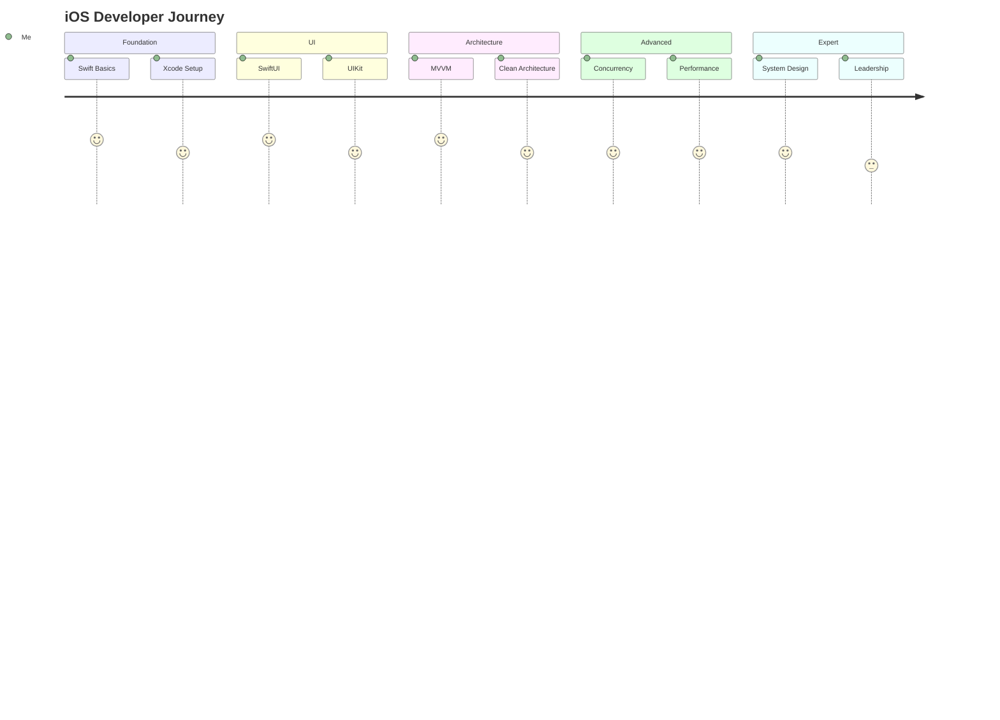
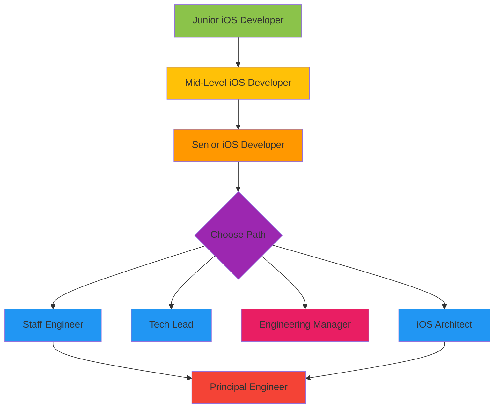

# 🍎 iOS Developer Roadmap - Complete Guide

> The definitive guide to becoming a world-class iOS developer

## Table of Contents

- [Overview](#overview)
- [Phase 1: Swift Foundations](#phase-1-swift-foundations-weeks-1-8)
- [Phase 2: SwiftUI Mastery](#phase-2-swiftui-mastery-weeks-9-16)
- [Phase 3: UIKit Essentials](#phase-3-uikit-essentials-weeks-17-20)
- [Phase 4: Data & Networking](#phase-4-data--networking-weeks-21-28)
- [Phase 5: Architecture & Testing](#phase-5-architecture--testing-weeks-29-36)
- [Phase 6: Advanced Topics](#phase-6-advanced-topics-weeks-37-48)
- [Phase 7: Expert Level](#phase-7-expert-level-months-13-24)
- [Resources](#resources)
- [Career Path](#career-path)

---

## Overview



### Time Investment

| Phase | Duration | Hours/Week | Total Hours |
|-------|----------|------------|-------------|
| Swift Foundations | 8 weeks | 15-20 | 120-160 |
| SwiftUI Mastery | 8 weeks | 15-20 | 120-160 |
| UIKit Essentials | 4 weeks | 10-15 | 40-60 |
| Data & Networking | 8 weeks | 15-20 | 120-160 |
| Architecture | 8 weeks | 15-20 | 120-160 |
| Advanced Topics | 12 weeks | 15-20 | 180-240 |
| **Total** | **48 weeks** | | **700-940 hrs** |

---

## Phase 1: Swift Foundations (Weeks 1-8)

### Week 1-2: Language Basics

#### Variables & Types

```swift
// Constants and Variables
let constant = "Cannot change"
var variable = "Can change"

// Type Annotations
let explicitString: String = "Hello"
let explicitInt: Int = 42
let explicitDouble: Double = 3.14
let explicitBool: Bool = true

// Type Inference
let inferredString = "Swift infers this is String"
let inferredInt = 42 // Int
let inferredDouble = 3.14 // Double

// Multi-line Strings
let multiline = """
    This is a
    multi-line string
    """

// String Interpolation
let name = "Swift"
let greeting = "Hello, \(name)!"
```

#### Collections

```swift
// Arrays
var numbers: [Int] = [1, 2, 3, 4, 5]
numbers.append(6)
numbers.remove(at: 0)
let first = numbers.first // Optional<Int>
let count = numbers.count

// Sets
var uniqueNumbers: Set<Int> = [1, 2, 3, 3, 3]
uniqueNumbers.insert(4)
let contains = uniqueNumbers.contains(2)

// Dictionaries
var scores: [String: Int] = ["Alice": 95, "Bob": 87]
scores["Charlie"] = 92
let aliceScore = scores["Alice"] // Optional<Int>

// Higher-order Functions
let doubled = numbers.map { $0 * 2 }
let evens = numbers.filter { $0 % 2 == 0 }
let sum = numbers.reduce(0, +)
let sorted = numbers.sorted { $0 > $1 }
```

#### Control Flow

```swift
// If-Else
let score = 85
if score >= 90 {
    print("A")
} else if score >= 80 {
    print("B")
} else {
    print("C")
}

// Switch
let character: Character = "a"
switch character {
case "a", "e", "i", "o", "u":
    print("Vowel")
case "b"..."z":
    print("Consonant")
default:
    print("Unknown")
}

// Guard
func process(value: Int?) {
    guard let unwrapped = value else {
        print("Value is nil")
        return
    }
    print("Value is \(unwrapped)")
}

// For-In
for number in 1...5 {
    print(number)
}

for (index, value) in numbers.enumerated() {
    print("\(index): \(value)")
}

// While
var counter = 0
while counter < 5 {
    counter += 1
}
```

### Week 3-4: Functions & Closures

#### Functions

```swift
// Basic Function
func greet(name: String) -> String {
    return "Hello, \(name)!"
}

// Multiple Parameters
func greet(name: String, from hometown: String) -> String {
    return "Hello \(name)! I hear you're from \(hometown)."
}

// Default Parameters
func greet(name: String, formal: Bool = false) -> String {
    return formal ? "Good day, \(name)." : "Hey, \(name)!"
}

// Variadic Parameters
func sum(_ numbers: Int...) -> Int {
    numbers.reduce(0, +)
}

// Inout Parameters
func doubleInPlace(_ number: inout Int) {
    number *= 2
}

// Returning Multiple Values
func minMax(array: [Int]) -> (min: Int, max: Int)? {
    guard let min = array.min(), let max = array.max() else {
        return nil
    }
    return (min, max)
}

// Throwing Functions
enum ValidationError: Error {
    case tooShort
    case tooLong
}

func validate(password: String) throws -> Bool {
    guard password.count >= 8 else { throw ValidationError.tooShort }
    guard password.count <= 32 else { throw ValidationError.tooLong }
    return true
}
```

#### Closures

```swift
// Basic Closure
let multiply: (Int, Int) -> Int = { a, b in
    return a * b
}

// Shorthand Syntax
let add: (Int, Int) -> Int = { $0 + $1 }

// Trailing Closure
let names = ["Chris", "Alex", "Barry"]
let sorted = names.sorted { $0 < $1 }

// Capturing Values
func makeCounter() -> () -> Int {
    var count = 0
    return {
        count += 1
        return count
    }
}

// Escaping Closures
func fetchData(completion: @escaping (Data) -> Void) {
    DispatchQueue.global().async {
        // fetch data
        let data = Data()
        completion(data)
    }
}

// Autoclosures
func logIfTrue(_ condition: @autoclosure () -> Bool) {
    if condition() {
        print("Condition was true")
    }
}
logIfTrue(2 > 1) // No need for { 2 > 1 }
```

### Week 5-6: OOP & Protocols

#### Structs vs Classes

```swift
// Struct (Value Type)
struct Point {
    var x: Double
    var y: Double
    
    mutating func moveBy(dx: Double, dy: Double) {
        x += dx
        y += dy
    }
}

// Class (Reference Type)
class Person {
    let name: String
    var age: Int
    
    init(name: String, age: Int) {
        self.name = name
        self.age = age
    }
    
    deinit {
        print("\(name) is being deallocated")
    }
}

// When to use Struct vs Class
// Struct: Value semantics, immutable by default, no inheritance
// Class: Reference semantics, identity important, inheritance needed
```

#### Protocols

```swift
// Protocol Definition
protocol Drawable {
    var color: String { get set }
    func draw()
}

// Protocol Extension (Default Implementation)
extension Drawable {
    func draw() {
        print("Drawing with color: \(color)")
    }
}

// Conforming to Protocol
struct Circle: Drawable {
    var color: String
    var radius: Double
    
    func draw() {
        print("Drawing circle with radius \(radius)")
    }
}

// Protocol Composition
protocol Named { var name: String { get } }
protocol Aged { var age: Int { get } }

func greet(person: Named & Aged) {
    print("Hello \(person.name), you are \(person.age)")
}

// Associated Types
protocol Container {
    associatedtype Item
    var count: Int { get }
    mutating func append(_ item: Item)
    subscript(i: Int) -> Item { get }
}

// Protocol-Oriented Programming
protocol Vehicle {
    var numberOfWheels: Int { get }
}

extension Vehicle {
    var description: String {
        return "A vehicle with \(numberOfWheels) wheels"
    }
}
```

### Week 7-8: Error Handling & Generics

#### Error Handling

```swift
// Define Errors
enum NetworkError: Error {
    case noConnection
    case timeout
    case invalidResponse(code: Int)
}

// Throwing Function
func fetchUser(id: Int) throws -> User {
    guard hasConnection else { throw NetworkError.noConnection }
    // fetch user
    return User(id: id)
}

// Do-Catch
do {
    let user = try fetchUser(id: 1)
    print(user)
} catch NetworkError.noConnection {
    print("No internet connection")
} catch NetworkError.timeout {
    print("Request timed out")
} catch NetworkError.invalidResponse(let code) {
    print("Server returned error: \(code)")
} catch {
    print("Unknown error: \(error)")
}

// Try? and Try!
let user1 = try? fetchUser(id: 1) // Optional<User>
let user2 = try! fetchUser(id: 1) // Force (dangerous!)

// Defer
func processFile(filename: String) throws {
    let file = openFile(filename)
    defer {
        closeFile(file) // Always executed
    }
    // Process file...
}

// Rethrows
func perform<T>(_ operation: () throws -> T) rethrows -> T {
    return try operation()
}
```

#### Generics

```swift
// Generic Function
func swapValues<T>(_ a: inout T, _ b: inout T) {
    let temp = a
    a = b
    b = temp
}

// Generic Type
struct Stack<Element> {
    private var items: [Element] = []
    
    mutating func push(_ item: Element) {
        items.append(item)
    }
    
    mutating func pop() -> Element? {
        return items.popLast()
    }
}

// Type Constraints
func findIndex<T: Equatable>(of value: T, in array: [T]) -> Int? {
    for (index, item) in array.enumerated() {
        if item == value {
            return index
        }
    }
    return nil
}

// Where Clauses
func allItemsMatch<C1: Container, C2: Container>(_ c1: C1, _ c2: C2) -> Bool
    where C1.Item == C2.Item, C1.Item: Equatable {
    guard c1.count == c2.count else { return false }
    for i in 0..<c1.count {
        if c1[i] != c2[i] { return false }
    }
    return true
}

// Opaque Types
func makeOpaqueContainer() -> some Container {
    return [1, 2, 3]
}
```

**🎯 Phase 1 Project:** Build a command-line task manager
- Create, read, update, delete tasks
- Save to JSON file
- Use structs, protocols, and error handling
- Write unit tests

---

## Phase 2: SwiftUI Mastery (Weeks 9-16)

### Week 9-10: SwiftUI Fundamentals

#### Basic Views

```swift
import SwiftUI

struct ContentView: View {
    var body: some View {
        VStack(spacing: 16) {
            // Text
            Text("Hello, World!")
                .font(.largeTitle)
                .fontWeight(.bold)
                .foregroundStyle(.blue)
            
            // Image
            Image(systemName: "star.fill")
                .font(.system(size: 50))
                .foregroundStyle(.yellow)
            
            // Button
            Button("Tap Me") {
                print("Button tapped!")
            }
            .buttonStyle(.borderedProminent)
            
            // TextField
            TextField("Enter name", text: .constant(""))
                .textFieldStyle(.roundedBorder)
                .padding()
        }
    }
}
```

#### Layout System

```swift
struct LayoutExamples: View {
    var body: some View {
        // VStack - Vertical
        VStack(alignment: .leading, spacing: 10) {
            Text("First")
            Text("Second")
            Text("Third")
        }
        
        // HStack - Horizontal
        HStack(alignment: .center, spacing: 20) {
            Image(systemName: "star")
            Text("Rating")
            Spacer()
            Text("4.5")
        }
        
        // ZStack - Overlay
        ZStack {
            Color.blue
            Text("On top")
                .foregroundStyle(.white)
        }
        
        // Grid (iOS 16+)
        Grid {
            GridRow {
                Text("Row 1, Col 1")
                Text("Row 1, Col 2")
            }
            GridRow {
                Text("Row 2, Col 1")
                Text("Row 2, Col 2")
            }
        }
    }
}
```

### Week 11-12: State Management

```swift
// @State - Local state
struct CounterView: View {
    @State private var count = 0
    
    var body: some View {
        Button("Count: \(count)") {
            count += 1
        }
    }
}

// @Binding - Pass state to child
struct ToggleRow: View {
    @Binding var isOn: Bool
    let title: String
    
    var body: some View {
        Toggle(title, isOn: $isOn)
    }
}

// @Observable (iOS 17+)
@Observable
class UserSettings {
    var username = ""
    var notificationsEnabled = true
    var theme: Theme = .system
}

struct SettingsView: View {
    @State private var settings = UserSettings()
    
    var body: some View {
        Form {
            TextField("Username", text: $settings.username)
            Toggle("Notifications", isOn: $settings.notificationsEnabled)
        }
    }
}

// @Environment
struct ThemedView: View {
    @Environment(\.colorScheme) var colorScheme
    
    var body: some View {
        Text(colorScheme == .dark ? "Dark Mode" : "Light Mode")
    }
}

// Custom Environment Values
struct ThemeKey: EnvironmentKey {
    static let defaultValue: Theme = .system
}

extension EnvironmentValues {
    var appTheme: Theme {
        get { self[ThemeKey.self] }
        set { self[ThemeKey.self] = newValue }
    }
}
```

### Week 13-14: Navigation & Lists

```swift
// NavigationStack (iOS 16+)
struct NavigationExample: View {
    @State private var path = NavigationPath()
    
    var body: some View {
        NavigationStack(path: $path) {
            List {
                NavigationLink("Go to Detail", value: "detail")
                NavigationLink("Go to Settings", value: 42)
            }
            .navigationDestination(for: String.self) { value in
                Text("String destination: \(value)")
            }
            .navigationDestination(for: Int.self) { value in
                Text("Int destination: \(value)")
            }
            .navigationTitle("Home")
        }
    }
}

// Lists with Dynamic Content
struct TaskListView: View {
    @State private var tasks = [
        Task(title: "Learn SwiftUI", isComplete: false),
        Task(title: "Build an app", isComplete: false)
    ]
    
    var body: some View {
        List {
            ForEach($tasks) { $task in
                TaskRow(task: $task)
            }
            .onDelete(perform: deleteTasks)
            .onMove(perform: moveTasks)
        }
        .listStyle(.insetGrouped)
        .toolbar {
            EditButton()
        }
    }
    
    private func deleteTasks(at offsets: IndexSet) {
        tasks.remove(atOffsets: offsets)
    }
    
    private func moveTasks(from source: IndexSet, to destination: Int) {
        tasks.move(fromOffsets: source, toOffset: destination)
    }
}
```

### Week 15-16: Animations & Gestures

```swift
// Basic Animations
struct AnimationExample: View {
    @State private var isExpanded = false
    
    var body: some View {
        VStack {
            RoundedRectangle(cornerRadius: 20)
                .fill(.blue)
                .frame(
                    width: isExpanded ? 200 : 100,
                    height: isExpanded ? 200 : 100
                )
                .animation(.spring(response: 0.5, dampingFraction: 0.6), value: isExpanded)
            
            Button("Toggle") {
                isExpanded.toggle()
            }
        }
    }
}

// Explicit Animation
struct ExplicitAnimationExample: View {
    @State private var rotation = 0.0
    
    var body: some View {
        Button("Rotate") {
            withAnimation(.easeInOut(duration: 1)) {
                rotation += 360
            }
        }
        .rotationEffect(.degrees(rotation))
    }
}

// Matched Geometry Effect
struct HeroAnimation: View {
    @Namespace private var namespace
    @State private var isExpanded = false
    
    var body: some View {
        if isExpanded {
            RoundedRectangle(cornerRadius: 20)
                .fill(.blue)
                .matchedGeometryEffect(id: "shape", in: namespace)
                .frame(maxWidth: .infinity, maxHeight: 300)
                .onTapGesture { isExpanded.toggle() }
        } else {
            RoundedRectangle(cornerRadius: 10)
                .fill(.blue)
                .matchedGeometryEffect(id: "shape", in: namespace)
                .frame(width: 100, height: 100)
                .onTapGesture { isExpanded.toggle() }
        }
    }
}

// Gestures
struct GestureExample: View {
    @State private var offset = CGSize.zero
    @State private var scale = 1.0
    
    var body: some View {
        Circle()
            .fill(.blue)
            .frame(width: 100, height: 100)
            .scaleEffect(scale)
            .offset(offset)
            .gesture(
                DragGesture()
                    .onChanged { value in
                        offset = value.translation
                    }
                    .onEnded { _ in
                        withAnimation(.spring()) {
                            offset = .zero
                        }
                    }
            )
            .gesture(
                MagnificationGesture()
                    .onChanged { value in
                        scale = value
                    }
                    .onEnded { _ in
                        withAnimation {
                            scale = 1.0
                        }
                    }
            )
    }
}
```

**🎯 Phase 2 Project:** Build a Recipe Book app
- Browse recipes with images
- Search and filter
- Favorite recipes
- Smooth animations
- Dark mode support

---

## Phase 3: UIKit Essentials (Weeks 17-20)

> While SwiftUI is the future, UIKit knowledge is still valuable for legacy code and complex scenarios.

### UIViewController Lifecycle

```swift
class MyViewController: UIViewController {
    
    override func viewDidLoad() {
        super.viewDidLoad()
        // Called once when view is loaded into memory
        // Setup UI, add subviews
    }
    
    override func viewWillAppear(_ animated: Bool) {
        super.viewWillAppear(animated)
        // Called every time view is about to appear
        // Start animations, refresh data
    }
    
    override func viewDidAppear(_ animated: Bool) {
        super.viewDidAppear(animated)
        // Called after view appears
        // Start timers, analytics
    }
    
    override func viewWillDisappear(_ animated: Bool) {
        super.viewWillDisappear(animated)
        // Called when view is about to disappear
        // Save state, pause media
    }
    
    override func viewDidDisappear(_ animated: Bool) {
        super.viewDidDisappear(animated)
        // Called after view disappears
        // Stop timers, cleanup
    }
}
```

### Auto Layout Programmatically

```swift
class LayoutViewController: UIViewController {
    
    private let titleLabel: UILabel = {
        let label = UILabel()
        label.text = "Hello"
        label.font = .systemFont(ofSize: 24, weight: .bold)
        label.translatesAutoresizingMaskIntoConstraints = false
        return label
    }()
    
    private let actionButton: UIButton = {
        let button = UIButton(type: .system)
        button.setTitle("Tap Me", for: .normal)
        button.translatesAutoresizingMaskIntoConstraints = false
        return button
    }()
    
    override func viewDidLoad() {
        super.viewDidLoad()
        setupViews()
        setupConstraints()
    }
    
    private func setupViews() {
        view.addSubview(titleLabel)
        view.addSubview(actionButton)
    }
    
    private func setupConstraints() {
        NSLayoutConstraint.activate([
            titleLabel.centerXAnchor.constraint(equalTo: view.centerXAnchor),
            titleLabel.topAnchor.constraint(equalTo: view.safeAreaLayoutGuide.topAnchor, constant: 20),
            
            actionButton.centerXAnchor.constraint(equalTo: view.centerXAnchor),
            actionButton.topAnchor.constraint(equalTo: titleLabel.bottomAnchor, constant: 20),
            actionButton.widthAnchor.constraint(greaterThanOrEqualToConstant: 100),
            actionButton.heightAnchor.constraint(equalToConstant: 44)
        ])
    }
}
```

### UICollectionView Compositional Layout

```swift
class ModernCollectionViewController: UIViewController {
    
    private var collectionView: UICollectionView!
    private var dataSource: UICollectionViewDiffableDataSource<Section, Item>!
    
    enum Section: Int {
        case featured, regular
    }
    
    struct Item: Hashable {
        let id: UUID
        let title: String
    }
    
    override func viewDidLoad() {
        super.viewDidLoad()
        setupCollectionView()
        setupDataSource()
        applySnapshot()
    }
    
    private func setupCollectionView() {
        let layout = createLayout()
        collectionView = UICollectionView(frame: view.bounds, collectionViewLayout: layout)
        collectionView.autoresizingMask = [.flexibleWidth, .flexibleHeight]
        view.addSubview(collectionView)
    }
    
    private func createLayout() -> UICollectionViewLayout {
        UICollectionViewCompositionalLayout { sectionIndex, environment in
            let section = Section(rawValue: sectionIndex)!
            
            switch section {
            case .featured:
                let itemSize = NSCollectionLayoutSize(
                    widthDimension: .fractionalWidth(1.0),
                    heightDimension: .fractionalHeight(1.0)
                )
                let item = NSCollectionLayoutItem(layoutSize: itemSize)
                
                let groupSize = NSCollectionLayoutSize(
                    widthDimension: .fractionalWidth(0.8),
                    heightDimension: .absolute(200)
                )
                let group = NSCollectionLayoutGroup.horizontal(layoutSize: groupSize, subitems: [item])
                
                let section = NSCollectionLayoutSection(group: group)
                section.orthogonalScrollingBehavior = .groupPagingCentered
                return section
                
            case .regular:
                let itemSize = NSCollectionLayoutSize(
                    widthDimension: .fractionalWidth(0.5),
                    heightDimension: .fractionalHeight(1.0)
                )
                let item = NSCollectionLayoutItem(layoutSize: itemSize)
                item.contentInsets = NSDirectionalEdgeInsets(top: 8, leading: 8, bottom: 8, trailing: 8)
                
                let groupSize = NSCollectionLayoutSize(
                    widthDimension: .fractionalWidth(1.0),
                    heightDimension: .absolute(150)
                )
                let group = NSCollectionLayoutGroup.horizontal(layoutSize: groupSize, subitems: [item])
                
                return NSCollectionLayoutSection(group: group)
            }
        }
    }
}
```

---

## Phase 4: Data & Networking (Weeks 21-28)

### URLSession & Async/Await

```swift
// Modern Networking with async/await
actor NetworkService {
    private let session = URLSession.shared
    private let decoder = JSONDecoder()
    
    func fetch<T: Decodable>(_ type: T.Type, from url: URL) async throws -> T {
        let (data, response) = try await session.data(from: url)
        
        guard let httpResponse = response as? HTTPURLResponse else {
            throw NetworkError.invalidResponse
        }
        
        guard (200...299).contains(httpResponse.statusCode) else {
            throw NetworkError.statusCode(httpResponse.statusCode)
        }
        
        return try decoder.decode(T.self, from: data)
    }
    
    func post<T: Encodable, R: Decodable>(
        _ body: T,
        to url: URL
    ) async throws -> R {
        var request = URLRequest(url: url)
        request.httpMethod = "POST"
        request.setValue("application/json", forHTTPHeaderField: "Content-Type")
        request.httpBody = try JSONEncoder().encode(body)
        
        let (data, response) = try await session.data(for: request)
        
        guard let httpResponse = response as? HTTPURLResponse,
              (200...299).contains(httpResponse.statusCode) else {
            throw NetworkError.invalidResponse
        }
        
        return try decoder.decode(R.self, from: data)
    }
}

// Usage
struct User: Codable {
    let id: Int
    let name: String
    let email: String
}

class UserRepository {
    private let network = NetworkService()
    
    func getUser(id: Int) async throws -> User {
        let url = URL(string: "https://api.example.com/users/\(id)")!
        return try await network.fetch(User.self, from: url)
    }
}
```

### SwiftData (iOS 17+)

```swift
import SwiftData

// Define Model
@Model
class Task {
    var title: String
    var isComplete: Bool
    var createdAt: Date
    var category: Category?
    
    init(title: String, isComplete: Bool = false) {
        self.title = title
        self.isComplete = isComplete
        self.createdAt = Date()
    }
}

@Model
class Category {
    var name: String
    @Relationship(deleteRule: .cascade, inverse: \Task.category)
    var tasks: [Task]
    
    init(name: String) {
        self.name = name
        self.tasks = []
    }
}

// App Setup
@main
struct MyApp: App {
    var body: some Scene {
        WindowGroup {
            ContentView()
        }
        .modelContainer(for: [Task.self, Category.self])
    }
}

// Using in View
struct TaskListView: View {
    @Environment(\.modelContext) private var context
    @Query(sort: \Task.createdAt, order: .reverse) private var tasks: [Task]
    
    var body: some View {
        List {
            ForEach(tasks) { task in
                TaskRow(task: task)
            }
            .onDelete(perform: deleteTasks)
        }
    }
    
    private func addTask(title: String) {
        let task = Task(title: title)
        context.insert(task)
    }
    
    private func deleteTasks(at offsets: IndexSet) {
        for index in offsets {
            context.delete(tasks[index])
        }
    }
}

// Custom Queries
struct FilteredTasksView: View {
    @Query private var incompleteTasks: [Task]
    
    init() {
        let predicate = #Predicate<Task> { !$0.isComplete }
        _incompleteTasks = Query(filter: predicate, sort: \.createdAt)
    }
    
    var body: some View {
        List(incompleteTasks) { task in
            Text(task.title)
        }
    }
}
```

---

## Phase 5: Architecture & Testing (Weeks 29-36)

### MVVM with SwiftUI

```swift
// Model
struct User: Identifiable, Codable {
    let id: UUID
    var name: String
    var email: String
}

// ViewModel
@Observable
class UserListViewModel {
    private(set) var users: [User] = []
    private(set) var isLoading = false
    private(set) var errorMessage: String?
    
    private let repository: UserRepositoryProtocol
    
    init(repository: UserRepositoryProtocol = UserRepository()) {
        self.repository = repository
    }
    
    func loadUsers() async {
        isLoading = true
        errorMessage = nil
        
        do {
            users = try await repository.fetchUsers()
        } catch {
            errorMessage = error.localizedDescription
        }
        
        isLoading = false
    }
    
    func deleteUser(_ user: User) async {
        do {
            try await repository.delete(user)
            users.removeAll { $0.id == user.id }
        } catch {
            errorMessage = error.localizedDescription
        }
    }
}

// View
struct UserListView: View {
    @State private var viewModel = UserListViewModel()
    
    var body: some View {
        Group {
            if viewModel.isLoading {
                ProgressView()
            } else if let error = viewModel.errorMessage {
                ErrorView(message: error) {
                    Task { await viewModel.loadUsers() }
                }
            } else {
                List(viewModel.users) { user in
                    UserRow(user: user)
                }
            }
        }
        .task {
            await viewModel.loadUsers()
        }
    }
}
```

### Unit Testing

```swift
import XCTest
@testable import MyApp

final class UserListViewModelTests: XCTestCase {
    
    var sut: UserListViewModel!
    var mockRepository: MockUserRepository!
    
    override func setUp() {
        super.setUp()
        mockRepository = MockUserRepository()
        sut = UserListViewModel(repository: mockRepository)
    }
    
    override func tearDown() {
        sut = nil
        mockRepository = nil
        super.tearDown()
    }
    
    func test_loadUsers_success() async {
        // Given
        let expectedUsers = [
            User(id: UUID(), name: "Alice", email: "alice@test.com"),
            User(id: UUID(), name: "Bob", email: "bob@test.com")
        ]
        mockRepository.usersToReturn = expectedUsers
        
        // When
        await sut.loadUsers()
        
        // Then
        XCTAssertEqual(sut.users.count, 2)
        XCTAssertNil(sut.errorMessage)
        XCTAssertFalse(sut.isLoading)
    }
    
    func test_loadUsers_failure() async {
        // Given
        mockRepository.errorToThrow = NetworkError.noConnection
        
        // When
        await sut.loadUsers()
        
        // Then
        XCTAssertTrue(sut.users.isEmpty)
        XCTAssertNotNil(sut.errorMessage)
    }
}

// Mock
class MockUserRepository: UserRepositoryProtocol {
    var usersToReturn: [User] = []
    var errorToThrow: Error?
    
    func fetchUsers() async throws -> [User] {
        if let error = errorToThrow {
            throw error
        }
        return usersToReturn
    }
    
    func delete(_ user: User) async throws {
        if let error = errorToThrow {
            throw error
        }
    }
}
```

---

## Phase 6: Advanced Topics (Weeks 37-48)

### Swift Concurrency Deep Dive

```swift
// Actors
actor BankAccount {
    private var balance: Double = 0
    
    func deposit(_ amount: Double) {
        balance += amount
    }
    
    func withdraw(_ amount: Double) throws -> Double {
        guard balance >= amount else {
            throw BankError.insufficientFunds
        }
        balance -= amount
        return amount
    }
    
    func getBalance() -> Double {
        balance
    }
}

// MainActor
@MainActor
class ViewModel: ObservableObject {
    @Published var data: [String] = []
    
    func loadData() async {
        // This runs on main thread
        let fetched = await fetchFromNetwork()
        data = fetched // Safe UI update
    }
    
    nonisolated func fetchFromNetwork() async -> [String] {
        // This can run on any thread
        return []
    }
}

// Task Groups
func fetchAllUsers(ids: [Int]) async throws -> [User] {
    try await withThrowingTaskGroup(of: User.self) { group in
        for id in ids {
            group.addTask {
                try await self.fetchUser(id: id)
            }
        }
        
        var users: [User] = []
        for try await user in group {
            users.append(user)
        }
        return users
    }
}

// AsyncStream
func notifications() -> AsyncStream<Notification> {
    AsyncStream { continuation in
        let observer = NotificationCenter.default.addObserver(
            forName: .someNotification,
            object: nil,
            queue: nil
        ) { notification in
            continuation.yield(notification)
        }
        
        continuation.onTermination = { _ in
            NotificationCenter.default.removeObserver(observer)
        }
    }
}
```

### Performance Optimization

```swift
// Lazy Loading
struct LazyImageView: View {
    let url: URL
    
    var body: some View {
        AsyncImage(url: url) { phase in
            switch phase {
            case .empty:
                ProgressView()
            case .success(let image):
                image.resizable().aspectRatio(contentMode: .fit)
            case .failure:
                Image(systemName: "photo")
            @unknown default:
                EmptyView()
            }
        }
    }
}

// Efficient List Rendering
struct EfficientList: View {
    let items: [Item]
    
    var body: some View {
        List {
            ForEach(items) { item in
                ItemRow(item: item)
                    .id(item.id) // Stable identity
            }
        }
        .listStyle(.plain)
    }
}

// Memory Management
class ImageCache {
    static let shared = ImageCache()
    
    private let cache = NSCache<NSString, UIImage>()
    
    init() {
        cache.countLimit = 100
        cache.totalCostLimit = 50 * 1024 * 1024 // 50MB
    }
    
    func image(for key: String) -> UIImage? {
        cache.object(forKey: key as NSString)
    }
    
    func setImage(_ image: UIImage, for key: String) {
        let cost = image.jpegData(compressionQuality: 1)?.count ?? 0
        cache.setObject(image, forKey: key as NSString, cost: cost)
    }
}
```

---

## Phase 7: Expert Level (Months 13-24)

### Topics to Master

| Topic | Time | Resources |
|-------|------|-----------|
| System Design | 40 hrs | [Mobile System Design](https://github.com/weeeBox/mobile-system-design) |
| visionOS | 30 hrs | [Apple visionOS](https://developer.apple.com/visionos/) |
| Metal/Shaders | 20 hrs | [Metal Best Practices](https://developer.apple.com/metal/) |
| Compiler/Runtime | 20 hrs | Swift source code |
| Open Source | Ongoing | GitHub contributions |
| Conference Speaking | Ongoing | Local meetups → conferences |

---

## Resources

### Official

- [Apple Developer Documentation](https://developer.apple.com/documentation/)
- [Swift.org](https://swift.org/)
- [WWDC Videos](https://developer.apple.com/videos/)

### Courses

- [100 Days of SwiftUI](https://www.hackingwithswift.com/100/swiftui) - Free
- [Stanford CS193p](https://cs193p.sites.stanford.edu/) - Free
- [Point-Free](https://www.pointfree.co/) - Paid
- [Design+Code](https://designcode.io/) - Paid

### Books

- "Swift Programming: The Big Nerd Ranch Guide"
- "iOS Programming: The Big Nerd Ranch Guide"
- "Advanced Swift" by objc.io

### Community

- [Swift Forums](https://forums.swift.org/)
- [r/iOSProgramming](https://www.reddit.com/r/iOSProgramming/)
- [iOS Dev Weekly](https://iosdevweekly.com/)

---

## Career Path



---

<p align="center">
  <strong>Keep learning, keep building! 🚀</strong>
</p>
