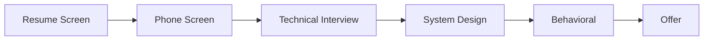

# 🎯 Mobile Developer Interview Preparation Guide

> Comprehensive guide to ace your mobile developer interviews

---

## Table of Contents

- [Interview Process Overview](#interview-process-overview)
- [Technical Questions](#technical-questions)
- [System Design](#system-design)
- [Coding Challenges](#coding-challenges)
- [Behavioral Questions](#behavioral-questions)
- [Company-Specific Prep](#company-specific-prep)
- [Resources](#resources)

---

## Interview Process Overview

### Typical Interview Stages



| Stage | Duration | Focus |
|-------|----------|-------|
| Phone Screen | 30-45 min | Background, basic technical |
| Technical 1 | 45-60 min | Coding, data structures |
| Technical 2 | 45-60 min | Platform-specific |
| System Design | 45-60 min | Architecture |
| Behavioral | 45-60 min | Culture fit |

---

## Technical Questions

### iOS Interview Questions

#### Swift Fundamentals

**Q: What's the difference between `let` and `var`?**
```swift
let constant = "Cannot change" // Immutable
var variable = "Can change"    // Mutable

// Best practice: Always prefer `let` unless mutation is needed
```

**Q: Explain optionals in Swift.**
```swift
// Optional represents a value that might be nil
var name: String? = nil

// Unwrapping methods:
// 1. Optional binding
if let unwrapped = name {
    print(unwrapped)
}

// 2. Guard
guard let unwrapped = name else { return }

// 3. Nil coalescing
let result = name ?? "Default"

// 4. Optional chaining
let count = name?.count

// 5. Force unwrap (avoid!)
let forced = name! // Crashes if nil
```

**Q: Explain value types vs reference types.**
```swift
// Value Types (Structs, Enums)
struct Point {
    var x: Int
    var y: Int
}
var p1 = Point(x: 0, y: 0)
var p2 = p1  // Copy
p2.x = 10    // p1.x is still 0

// Reference Types (Classes)
class Person {
    var name: String
    init(name: String) { self.name = name }
}
var person1 = Person(name: "Alice")
var person2 = person1  // Same reference
person2.name = "Bob"   // person1.name is also "Bob"

// When to use which:
// Struct: Simple data, immutability preferred, no inheritance
// Class: Identity matters, shared state, inheritance needed
```

**Q: What is ARC (Automatic Reference Counting)?**
```swift
// ARC automatically manages memory for reference types

// Strong reference (default)
class Parent {
    var child: Child?
}

// Weak reference (breaks retain cycles)
class Child {
    weak var parent: Parent?
}

// Unowned reference (when reference is never nil during lifetime)
class Customer {
    var card: CreditCard?
}
class CreditCard {
    unowned let customer: Customer
    init(customer: Customer) {
        self.customer = customer
    }
}

// Common retain cycle: Closures
class ViewController {
    var closure: (() -> Void)?
    
    func setup() {
        // BAD: Strong reference to self
        closure = {
            self.doSomething()
        }
        
        // GOOD: Weak capture
        closure = { [weak self] in
            self?.doSomething()
        }
    }
}
```

**Q: Explain Swift Concurrency (async/await).**
```swift
// Async function
func fetchUser() async throws -> User {
    let (data, _) = try await URLSession.shared.data(from: url)
    return try JSONDecoder().decode(User.self, from: data)
}

// Calling async function
Task {
    do {
        let user = try await fetchUser()
        // Update UI
    } catch {
        // Handle error
    }
}

// Parallel execution
async let user = fetchUser()
async let posts = fetchPosts()
let (userResult, postsResult) = try await (user, posts)

// Actor for thread safety
actor BankAccount {
    private var balance: Double = 0
    
    func deposit(_ amount: Double) {
        balance += amount
    }
}
```

#### SwiftUI vs UIKit

**Q: When would you choose UIKit over SwiftUI?**

| Use SwiftUI When | Use UIKit When |
|------------------|----------------|
| New iOS 15+ only apps | Supporting iOS 13/14 |
| Simple to medium UI | Complex custom UI |
| Rapid prototyping | Fine-grained control |
| Standard components | Complex collection views |
| Team knows SwiftUI | Large existing codebase |

**Q: Explain the SwiftUI view lifecycle.**
```swift
struct ContentView: View {
    @State private var count = 0
    
    var body: some View {
        Text("Count: \(count)")
            .onAppear {
                // Called when view appears
            }
            .onDisappear {
                // Called when view disappears
            }
            .onChange(of: count) { oldValue, newValue in
                // Called when count changes
            }
            .task {
                // Async work when view appears
                // Automatically cancelled on disappear
            }
    }
}
```

#### Architecture

**Q: Explain MVVM architecture.**
```swift
// Model
struct User: Codable {
    let id: Int
    let name: String
}

// ViewModel
@Observable
class UserViewModel {
    private(set) var users: [User] = []
    private(set) var isLoading = false
    
    private let repository: UserRepository
    
    func loadUsers() async {
        isLoading = true
        users = await repository.fetchUsers()
        isLoading = false
    }
}

// View
struct UserListView: View {
    @State private var viewModel = UserViewModel()
    
    var body: some View {
        List(viewModel.users) { user in
            Text(user.name)
        }
        .task {
            await viewModel.loadUsers()
        }
    }
}
```

---

### Android Interview Questions

#### Kotlin Fundamentals

**Q: Explain null safety in Kotlin.**
```kotlin
// Non-nullable (cannot be null)
val name: String = "Kotlin"

// Nullable (can be null)
val nullable: String? = null

// Safe call
val length = nullable?.length // Returns null if nullable is null

// Elvis operator
val len = nullable?.length ?: 0 // Default if null

// Not-null assertion (avoid!)
val len2 = nullable!!.length // Throws if null

// Safe cast
val str: String? = value as? String

// Let scope function
nullable?.let { nonNull ->
    println(nonNull.length)
}
```

**Q: What are coroutines?**
```kotlin
// Coroutines are lightweight threads for async programming

// Suspend function
suspend fun fetchUser(id: Int): User {
    return withContext(Dispatchers.IO) {
        api.getUser(id)
    }
}

// Launching coroutine
viewModelScope.launch {
    val user = fetchUser(1)
    _state.value = user
}

// Parallel execution
coroutineScope {
    val user = async { fetchUser(1) }
    val posts = async { fetchPosts(1) }
    UserWithPosts(user.await(), posts.await())
}

// Flow for streams
fun getUsers(): Flow<List<User>> = flow {
    while (true) {
        emit(api.getUsers())
        delay(5000)
    }
}
```

**Q: Explain sealed classes.**
```kotlin
sealed class Result<out T> {
    data class Success<T>(val data: T) : Result<T>()
    data class Error(val message: String) : Result<Nothing>()
    data object Loading : Result<Nothing>()
}

// Exhaustive when
fun handleResult(result: Result<String>) = when (result) {
    is Result.Success -> "Data: ${result.data}"
    is Result.Error -> "Error: ${result.message}"
    Result.Loading -> "Loading..."
    // No else needed - compiler knows all cases
}
```

#### Jetpack Compose

**Q: Explain recomposition.**
```kotlin
// Recomposition = Compose re-executing composables when state changes

@Composable
fun Counter() {
    // This state triggers recomposition when changed
    var count by remember { mutableStateOf(0) }
    
    // Only this Text recomposes, not the whole function
    Text("Count: $count")
    
    Button(onClick = { count++ }) {
        Text("Increment")
    }
}

// Key for stable identity
LazyColumn {
    items(
        items = users,
        key = { it.id } // Helps Compose track items
    ) { user ->
        UserRow(user)
    }
}

// derivedStateOf for expensive computations
val sortedList by remember {
    derivedStateOf { list.sortedBy { it.name } }
}
```

**Q: Explain state hoisting.**
```kotlin
// State hoisting = moving state up to make composables stateless

// Stateful (owns state)
@Composable
fun StatefulCounter() {
    var count by remember { mutableStateOf(0) }
    StatelessCounter(
        count = count,
        onIncrement = { count++ }
    )
}

// Stateless (receives state)
@Composable
fun StatelessCounter(
    count: Int,
    onIncrement: () -> Unit
) {
    Column {
        Text("Count: $count")
        Button(onClick = onIncrement) {
            Text("Increment")
        }
    }
}

// Benefits:
// - Reusable
// - Testable
// - Previewable
```

#### Android Lifecycle

**Q: Explain Activity lifecycle.**
```kotlin
class MainActivity : AppCompatActivity() {
    override fun onCreate(savedInstanceState: Bundle?) {
        super.onCreate(savedInstanceState)
        // Called when activity is first created
        // Initialize UI, restore state
    }
    
    override fun onStart() {
        super.onStart()
        // Activity becomes visible
    }
    
    override fun onResume() {
        super.onResume()
        // Activity in foreground, user can interact
        // Start animations, acquire resources
    }
    
    override fun onPause() {
        super.onPause()
        // Activity partially visible (dialog on top)
        // Pause animations, save data
    }
    
    override fun onStop() {
        super.onStop()
        // Activity no longer visible
        // Release resources
    }
    
    override fun onDestroy() {
        super.onDestroy()
        // Activity being destroyed
        // Final cleanup
    }
}
```

---

## System Design

### Mobile System Design Framework

#### 1. Requirements Clarification (5 min)

- **Functional:** What features?
- **Non-functional:** Performance, scale, offline?
- **Platform:** iOS, Android, both?
- **Scale:** Users, data volume?

#### 2. High-Level Design (10 min)

```
┌─────────────────────────────────────────────┐
│                Mobile Client                 │
├─────────────┬─────────────┬─────────────────┤
│     UI      │   Domain    │      Data       │
│   Layer     │   Layer     │     Layer       │
└─────────────┴──────┬──────┴─────────────────┘
                     │
              ┌──────▼──────┐
              │   Network   │
              └──────┬──────┘
                     │
              ┌──────▼──────┐
              │   Backend   │
              └─────────────┘
```

#### 3. Detailed Component Design (15 min)

**Data Layer:**
- Local DB (Room/Core Data)
- Network client (Retrofit/URLSession)
- Caching strategy
- Sync mechanism

**Domain Layer:**
- Use cases
- Business logic
- Models

**UI Layer:**
- ViewModels
- UI State
- Navigation

#### 4. Deep Dives (15 min)

Pick 2-3 areas:
- Offline support
- Pagination
- Image caching
- Real-time updates
- Security

### Example: Design Instagram Feed

#### Requirements
- Display posts with images/videos
- Infinite scroll
- Like/comment
- Offline viewing of cached posts

#### High-Level Architecture

```
┌─────────────────────────────────────────────────┐
│                   UI Layer                       │
├─────────────────────────────────────────────────┤
│  FeedScreen  │  FeedViewModel  │  FeedUIState   │
└───────────────────────┬─────────────────────────┘
                        │
┌───────────────────────▼─────────────────────────┐
│                 Domain Layer                     │
├─────────────────────────────────────────────────┤
│  GetFeedUseCase  │  LikePostUseCase  │  Post    │
└───────────────────────┬─────────────────────────┘
                        │
┌───────────────────────▼─────────────────────────┐
│                  Data Layer                      │
├─────────────────────────────────────────────────┤
│  FeedRepository  │  PostLocalDS  │  PostRemoteDS│
└─────────────────────────────────────────────────┘
```

#### Key Decisions

1. **Pagination:** Cursor-based with RemoteMediator
2. **Caching:** LRU cache for images, DB for posts
3. **Offline:** Show cached posts, queue actions
4. **Updates:** WebSocket for real-time likes

---

## Coding Challenges

### Common Patterns

#### 1. Two Pointers

```swift
// Find pair with target sum in sorted array
func twoSum(_ nums: [Int], _ target: Int) -> [Int]? {
    var left = 0
    var right = nums.count - 1
    
    while left < right {
        let sum = nums[left] + nums[right]
        if sum == target {
            return [left, right]
        } else if sum < target {
            left += 1
        } else {
            right -= 1
        }
    }
    return nil
}
```

#### 2. Sliding Window

```swift
// Maximum sum subarray of size k
func maxSubarraySum(_ nums: [Int], _ k: Int) -> Int {
    guard nums.count >= k else { return 0 }
    
    var windowSum = nums[0..<k].reduce(0, +)
    var maxSum = windowSum
    
    for i in k..<nums.count {
        windowSum += nums[i] - nums[i - k]
        maxSum = max(maxSum, windowSum)
    }
    
    return maxSum
}
```

#### 3. Binary Search

```swift
// Search in rotated sorted array
func search(_ nums: [Int], _ target: Int) -> Int {
    var left = 0
    var right = nums.count - 1
    
    while left <= right {
        let mid = left + (right - left) / 2
        
        if nums[mid] == target {
            return mid
        }
        
        // Left half is sorted
        if nums[left] <= nums[mid] {
            if target >= nums[left] && target < nums[mid] {
                right = mid - 1
            } else {
                left = mid + 1
            }
        } else {
            // Right half is sorted
            if target > nums[mid] && target <= nums[right] {
                left = mid + 1
            } else {
                right = mid - 1
            }
        }
    }
    
    return -1
}
```

#### 4. BFS/DFS

```swift
// Level order traversal
func levelOrder(_ root: TreeNode?) -> [[Int]] {
    guard let root = root else { return [] }
    
    var result: [[Int]] = []
    var queue: [TreeNode] = [root]
    
    while !queue.isEmpty {
        var level: [Int] = []
        let size = queue.count
        
        for _ in 0..<size {
            let node = queue.removeFirst()
            level.append(node.val)
            
            if let left = node.left { queue.append(left) }
            if let right = node.right { queue.append(right) }
        }
        
        result.append(level)
    }
    
    return result
}
```

#### 5. Dynamic Programming

```swift
// Longest increasing subsequence
func lengthOfLIS(_ nums: [Int]) -> Int {
    guard !nums.isEmpty else { return 0 }
    
    var dp = [Int](repeating: 1, count: nums.count)
    var maxLength = 1
    
    for i in 1..<nums.count {
        for j in 0..<i {
            if nums[i] > nums[j] {
                dp[i] = max(dp[i], dp[j] + 1)
            }
        }
        maxLength = max(maxLength, dp[i])
    }
    
    return maxLength
}
```

---

## Behavioral Questions

### STAR Method

- **S**ituation: Set the context
- **T**ask: What was your responsibility
- **A**ction: What you did
- **R**esult: What happened

### Common Questions

#### "Tell me about a challenging bug you fixed."

**Structure:**
1. Describe the bug and its impact
2. Explain your debugging process
3. What was the root cause
4. How you fixed it
5. What you learned

#### "Describe a project you're proud of."

**Structure:**
1. Project overview and your role
2. Technical challenges
3. Your contributions
4. Impact/results
5. What you'd do differently

#### "Tell me about a time you disagreed with a teammate."

**Structure:**
1. Context of the disagreement
2. Your perspective
3. How you handled it
4. Resolution
5. What you learned

### Questions to Ask Interviewers

**About the Role:**
- What does a typical day look like?
- What are the biggest challenges?
- How is success measured?

**About the Team:**
- Team size and structure?
- Code review process?
- How are technical decisions made?

**About Growth:**
- Learning opportunities?
- Career progression path?
- Mentorship programs?

---

## Company-Specific Prep

### FAANG Focus Areas

| Company | Focus Areas |
|---------|-------------|
| **Apple** | Deep iOS knowledge, attention to detail, user experience |
| **Google** | Algorithms, scalability, Android internals |
| **Meta** | Move fast, system design, product sense |
| **Amazon** | Leadership principles, scalability, customer obsession |
| **Netflix** | Culture fit, senior-level expectations |

### Startup Focus Areas

- Breadth of knowledge
- Adaptability
- Product thinking
- Ship quickly
- Work with ambiguity

---

## Resources

### Books

- "Cracking the Coding Interview" - Gayle McDowell
- "System Design Interview" - Alex Xu
- "Mobile System Design" - weeeBox

### Practice Platforms

- [LeetCode](https://leetcode.com/) - Coding problems
- [Pramp](https://www.pramp.com/) - Mock interviews
- [Interviewing.io](https://interviewing.io/) - Practice with engineers

### iOS-Specific

- [Sean Allen Interview Questions](https://seanallen.co/ios-interview)
- [Hacking with Swift Interview](https://www.hackingwithswift.com/interview-questions)

### Android-Specific

- [Android Interview Questions](https://github.com/amitshekhariitbhu/android-interview-questions)
- [Philipp Lackner YouTube](https://www.youtube.com/@PhilippLackner)

---

## Interview Day Checklist

### Before

- [ ] Research the company
- [ ] Review your resume
- [ ] Prepare questions
- [ ] Test your setup (video, audio, IDE)
- [ ] Get good sleep

### During

- [ ] Clarify requirements
- [ ] Think out loud
- [ ] Start with brute force
- [ ] Optimize
- [ ] Test your code
- [ ] Ask clarifying questions

### After

- [ ] Send thank you note
- [ ] Reflect on what went well
- [ ] Note areas to improve

---

<p align="center">
  <strong>Good luck with your interviews! 🍀</strong>
</p>
