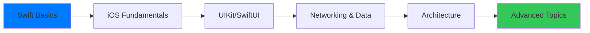
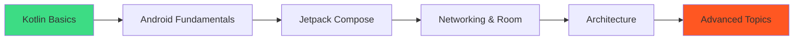
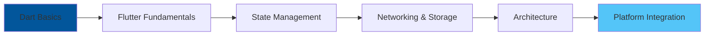

# Recommended Courses for Mobile Developers

> A comprehensive guide to online courses for iOS, Android, and Flutter development

---

## Table of Contents

1. [iOS Development Courses](#ios-development-courses)
2. [Android Development Courses](#android-development-courses)
3. [Flutter Development Courses](#flutter-development-courses)
4. [Cross-Platform Development](#cross-platform-development)
5. [Swift Programming](#swift-programming)
6. [Kotlin Programming](#kotlin-programming)
7. [Mobile Architecture](#mobile-architecture)
8. [UI/UX Design](#uiux-design)
9. [Testing & Quality](#testing--quality)
10. [DevOps & CI/CD](#devops--cicd)
11. [Computer Science Fundamentals](#computer-science-fundamentals)
12. [Free Resources](#free-resources)
13. [Learning Paths](#learning-paths)

---

## iOS Development Courses

### Beginner Level

#### 100 Days of SwiftUI
- **Platform**: Hacking with Swift
- **Instructor**: Paul Hudson
- **Duration**: 100 days
- **Cost**: Free
- **Topics**: SwiftUI fundamentals, projects
- **Projects**: 19+ complete apps
- **Link**: hackingwithswift.com/100/swiftui

#### iOS & Swift - The Complete iOS App Development Bootcamp
- **Platform**: Udemy
- **Instructor**: Dr. Angela Yu
- **Duration**: 60+ hours
- **Cost**: Paid
- **Topics**: Swift, UIKit, SwiftUI, Core Data
- **Projects**: 25+ apps
- **Rating**: 4.8/5 (100k+ reviews)

#### Stanford CS193p - Developing Apps for iOS
- **Platform**: Stanford (YouTube)
- **Instructor**: Paul Hegarty
- **Duration**: Full semester
- **Cost**: Free
- **Topics**: SwiftUI, MVVM, Core Data
- **Level**: University-level

#### iOS Development for Beginners
- **Platform**: Coursera
- **Provider**: Meta (Facebook)
- **Duration**: 6 months
- **Cost**: Paid (Free audit)
- **Certificate**: Professional Certificate
- **Topics**: Swift, Xcode, UIKit basics

### Intermediate Level

#### Mastering SwiftUI
- **Platform**: Hacking with Swift+
- **Instructor**: Paul Hudson
- **Duration**: Self-paced
- **Cost**: Subscription
- **Topics**: Advanced SwiftUI, Animations
- **Projects**: Real-world apps

#### SwiftUI Masterclass
- **Platform**: Udemy
- **Instructor**: Robert Petras
- **Duration**: 40+ hours
- **Cost**: Paid
- **Topics**: SwiftUI 4, iOS 17 features
- **Rating**: 4.7/5

#### Core Data Fundamentals
- **Platform**: raywenderlich.com
- **Duration**: 8+ hours
- **Cost**: Subscription
- **Topics**: Core Data stack, migrations
- **Projects**: Practical applications

#### Combine Framework
- **Platform**: raywenderlich.com
- **Duration**: 6+ hours
- **Cost**: Subscription
- **Topics**: Publishers, Subscribers, Operators
- **Level**: Intermediate

### Advanced Level

#### Advanced iOS App Architecture
- **Platform**: raywenderlich.com
- **Duration**: 10+ hours
- **Cost**: Subscription
- **Topics**: MVVM, VIPER, Clean Architecture
- **Projects**: Production apps

#### iOS Architect Bootcamp
- **Platform**: Essential Developer
- **Duration**: Self-paced
- **Cost**: Paid
- **Topics**: TDD, Clean Architecture, Modular Design
- **Focus**: Professional development

#### Metal by Tutorials
- **Platform**: raywenderlich.com
- **Duration**: Self-paced
- **Cost**: Subscription
- **Topics**: GPU programming, shaders
- **Level**: Advanced

#### Concurrency in iOS
- **Platform**: Hacking with Swift+
- **Duration**: Self-paced
- **Cost**: Subscription
- **Topics**: async/await, actors, tasks
- **Level**: Advanced

---

## Android Development Courses

### Beginner Level

#### Android Basics with Compose
- **Platform**: Google (Android Developers)
- **Duration**: Self-paced
- **Cost**: Free
- **Topics**: Kotlin, Compose, Android basics
- **Certificate**: Yes
- **Link**: developer.android.com/courses

#### The Complete Android 14 Developer Course
- **Platform**: Udemy
- **Instructor**: Denis Panjuta
- **Duration**: 50+ hours
- **Cost**: Paid
- **Topics**: Kotlin, Jetpack Compose, Firebase
- **Rating**: 4.6/5

#### Android Development for Beginners
- **Platform**: Coursera
- **Provider**: Meta (Facebook)
- **Duration**: 6 months
- **Cost**: Paid (Free audit)
- **Certificate**: Professional Certificate

#### Developing Android Apps with Kotlin
- **Platform**: Udacity
- **Provider**: Google
- **Duration**: 2 months
- **Cost**: Free
- **Topics**: Android fundamentals, Kotlin
- **Level**: Beginner

### Intermediate Level

#### Android Jetpack Compose Masterclass
- **Platform**: Udemy
- **Instructor**: Catalin Ghita
- **Duration**: 30+ hours
- **Cost**: Paid
- **Topics**: Modern Compose, Material 3
- **Rating**: 4.8/5

#### Kotlin Coroutines Deep Dive
- **Platform**: Kt.Academy
- **Instructor**: Marcin Moskala
- **Duration**: Self-paced
- **Cost**: Paid
- **Topics**: Coroutines, Flow, Channels
- **Level**: Intermediate-Advanced

#### Room Database Masterclass
- **Platform**: Pluralsight
- **Duration**: 4+ hours
- **Cost**: Subscription
- **Topics**: Room, migrations, relationships
- **Projects**: Data-heavy apps

#### Android Architecture Components
- **Platform**: raywenderlich.com
- **Duration**: 8+ hours
- **Cost**: Subscription
- **Topics**: ViewModel, LiveData, Navigation
- **Level**: Intermediate

### Advanced Level

#### Advanced Android App Architecture
- **Platform**: raywenderlich.com
- **Duration**: 10+ hours
- **Cost**: Subscription
- **Topics**: MVVM, MVI, Clean Architecture
- **Focus**: Production patterns

#### Android Performance Optimization
- **Platform**: Udacity
- **Provider**: Google
- **Duration**: 1 month
- **Cost**: Free
- **Topics**: Memory, battery, rendering
- **Level**: Advanced

#### Dagger Hilt Complete Guide
- **Platform**: Philipp Lackner (YouTube)
- **Duration**: 3+ hours
- **Cost**: Free
- **Topics**: Dependency Injection
- **Quality**: Professional

---

## Flutter Development Courses

### Beginner Level

#### The Complete Flutter Development Bootcamp
- **Platform**: Udemy
- **Instructor**: Dr. Angela Yu
- **Duration**: 28+ hours
- **Cost**: Paid
- **Topics**: Dart, Flutter, Firebase
- **Projects**: 15+ apps
- **Rating**: 4.7/5 (90k+ reviews)

#### Flutter & Dart - The Complete Guide
- **Platform**: Udemy
- **Instructor**: Maximilian Schwarzmüller
- **Duration**: 42+ hours
- **Cost**: Paid
- **Topics**: Comprehensive Flutter
- **Rating**: 4.6/5 (70k+ reviews)

#### Flutter Crash Course for Beginners
- **Platform**: YouTube (Traversy Media)
- **Duration**: 4+ hours
- **Cost**: Free
- **Topics**: Flutter basics, projects
- **Quality**: High production

#### Get Started with Flutter
- **Platform**: Google Codelabs
- **Duration**: Self-paced
- **Cost**: Free
- **Topics**: Official Flutter tutorials
- **Link**: codelabs.developers.google.com

### Intermediate Level

#### Flutter Intermediate Projects
- **Platform**: Udemy
- **Instructor**: Paulo Dichone
- **Duration**: 25+ hours
- **Cost**: Paid
- **Topics**: REST APIs, State Management
- **Projects**: Real-world apps

#### Riverpod 2.0 - Ultimate Guide
- **Platform**: Code with Andrea
- **Instructor**: Andrea Bizzotto
- **Duration**: Self-paced
- **Cost**: Paid
- **Topics**: State management mastery
- **Level**: Intermediate-Advanced

#### Flutter BLoC Course
- **Platform**: YouTube (Flutterly)
- **Duration**: 5+ hours
- **Cost**: Free
- **Topics**: BLoC pattern, Cubit
- **Quality**: Comprehensive

#### Flutter Firebase Complete Course
- **Platform**: Udemy
- **Duration**: 15+ hours
- **Cost**: Paid
- **Topics**: Auth, Firestore, Storage
- **Projects**: Full-stack apps

### Advanced Level

#### Flutter Clean Architecture
- **Platform**: Reso Coder (YouTube)
- **Instructor**: Matt Rešetár
- **Duration**: 10+ hours
- **Cost**: Free
- **Topics**: TDD, Clean Architecture
- **Quality**: Production-grade

#### Flutter Animation Masterclass
- **Platform**: Udemy
- **Duration**: 10+ hours
- **Cost**: Paid
- **Topics**: Implicit, Explicit, Custom animations
- **Level**: Advanced

#### Flutter Testing Masterclass
- **Platform**: Code with Andrea
- **Duration**: Self-paced
- **Cost**: Paid
- **Topics**: Unit, Widget, Integration tests
- **Focus**: Quality assurance

---

## Cross-Platform Development

### React Native

#### React Native - The Practical Guide
- **Platform**: Udemy
- **Instructor**: Maximilian Schwarzmüller
- **Duration**: 33+ hours
- **Cost**: Paid
- **Rating**: 4.6/5

#### CS50's Mobile App Development with React Native
- **Platform**: Harvard (edX)
- **Duration**: 13 weeks
- **Cost**: Free (Paid certificate)
- **Level**: Intermediate

### Kotlin Multiplatform

#### Kotlin Multiplatform Mobile
- **Platform**: JetBrains Academy
- **Duration**: Self-paced
- **Cost**: Free
- **Topics**: KMM basics, shared code
- **Provider**: Official

#### KMM Complete Guide
- **Platform**: Philipp Lackner (YouTube)
- **Duration**: 5+ hours
- **Cost**: Free
- **Topics**: Practical KMM development
- **Quality**: Professional

---

## Swift Programming

### Language Fundamentals

#### Swift 5 Essential Training
- **Platform**: LinkedIn Learning
- **Duration**: 5+ hours
- **Cost**: Subscription
- **Topics**: Swift syntax, OOP
- **Level**: Beginner

#### Develop in Swift Fundamentals
- **Platform**: Apple
- **Duration**: Self-paced
- **Cost**: Free
- **Topics**: Official Swift curriculum
- **Certificate**: Yes

#### Swift Playgrounds
- **Platform**: Apple (iPad/Mac)
- **Cost**: Free
- **Topics**: Interactive Swift learning
- **Best For**: Visual learners

### Advanced Swift

#### Advanced Swift
- **Platform**: objc.io
- **Duration**: Self-paced
- **Cost**: Paid
- **Topics**: Memory, Generics, Interop
- **Level**: Expert

#### Functional Programming in Swift
- **Platform**: objc.io
- **Duration**: Self-paced
- **Cost**: Paid
- **Topics**: FP concepts in Swift
- **Level**: Advanced

---

## Kotlin Programming

### Language Fundamentals

#### Kotlin for Java Developers
- **Platform**: Coursera
- **Provider**: JetBrains
- **Duration**: 5 weeks
- **Cost**: Paid (Free audit)
- **Certificate**: Yes
- **Quality**: Official

#### Kotlin Bootcamp for Programmers
- **Platform**: Udacity
- **Provider**: Google
- **Duration**: 2 weeks
- **Cost**: Free
- **Topics**: Kotlin basics
- **Level**: Beginner

#### Kotlin Essential Training
- **Platform**: LinkedIn Learning
- **Duration**: 4+ hours
- **Cost**: Subscription
- **Topics**: Kotlin fundamentals
- **Level**: Beginner

### Advanced Kotlin

#### Kotlin Coroutines Deep Dive
- **Platform**: Kt.Academy
- **Instructor**: Marcin Moskala
- **Duration**: Self-paced
- **Cost**: Paid
- **Topics**: Complete coroutines
- **Level**: Advanced

#### Effective Kotlin
- **Platform**: Kt.Academy
- **Duration**: Self-paced
- **Cost**: Paid
- **Topics**: Best practices
- **Level**: Intermediate-Advanced

---

## Mobile Architecture

### Clean Architecture

#### Clean Architecture for Android
- **Platform**: Udemy
- **Duration**: 10+ hours
- **Cost**: Paid
- **Topics**: SOLID, Clean Architecture
- **Platform Focus**: Android

#### iOS Architecture Patterns
- **Platform**: raywenderlich.com
- **Duration**: 6+ hours
- **Cost**: Subscription
- **Topics**: MVC, MVVM, VIPER
- **Platform Focus**: iOS

### Design Patterns

#### Design Patterns in Swift
- **Platform**: raywenderlich.com
- **Duration**: 5+ hours
- **Cost**: Subscription
- **Topics**: GoF patterns in Swift
- **Level**: Intermediate

#### Design Patterns in Kotlin
- **Platform**: Udemy
- **Duration**: 8+ hours
- **Cost**: Paid
- **Topics**: Patterns for Android
- **Level**: Intermediate

---

## UI/UX Design

### Mobile Design Fundamentals

#### Google UX Design Professional Certificate
- **Platform**: Coursera
- **Provider**: Google
- **Duration**: 6 months
- **Cost**: Paid (Free audit)
- **Topics**: Complete UX curriculum
- **Certificate**: Professional

#### Mobile App Design from Scratch
- **Platform**: Udemy
- **Duration**: 15+ hours
- **Cost**: Paid
- **Topics**: Figma, prototyping
- **Tool Focus**: Figma

#### UI Design Bootcamp
- **Platform**: Designcode
- **Duration**: Self-paced
- **Cost**: Subscription
- **Topics**: Modern app design
- **Quality**: High production

### Platform Guidelines

#### Human Interface Guidelines Study
- **Platform**: Apple Developer
- **Cost**: Free
- **Topics**: iOS design principles
- **Source**: Official

#### Material Design Course
- **Platform**: Google
- **Cost**: Free
- **Topics**: Android design system
- **Source**: Official

---

## Testing & Quality

### Mobile Testing

#### iOS Testing by Tutorials
- **Platform**: raywenderlich.com
- **Duration**: 8+ hours
- **Cost**: Subscription
- **Topics**: XCTest, TDD
- **Level**: Intermediate

#### Android Testing
- **Platform**: Udacity
- **Provider**: Google
- **Duration**: 2 weeks
- **Cost**: Free
- **Topics**: JUnit, Espresso
- **Level**: Intermediate

#### Test-Driven Development in Swift
- **Platform**: Essential Developer
- **Duration**: Self-paced
- **Cost**: Paid
- **Topics**: TDD methodology
- **Level**: Advanced

### Flutter Testing

#### Flutter Testing Masterclass
- **Platform**: Code with Andrea
- **Duration**: Self-paced
- **Cost**: Paid
- **Topics**: Unit, Widget, Integration
- **Level**: Intermediate-Advanced

---

## DevOps & CI/CD

### Mobile CI/CD

#### Fastlane for iOS
- **Platform**: raywenderlich.com
- **Duration**: 4+ hours
- **Cost**: Subscription
- **Topics**: Automation, deployment
- **Tool Focus**: Fastlane

#### GitHub Actions for Mobile
- **Platform**: YouTube
- **Duration**: Various
- **Cost**: Free
- **Topics**: CI/CD workflows
- **Tool Focus**: GitHub Actions

#### Firebase App Distribution
- **Platform**: Google Codelabs
- **Cost**: Free
- **Topics**: Beta testing distribution
- **Source**: Official

### App Store Optimization

#### App Store Optimization Masterclass
- **Platform**: Udemy
- **Duration**: 5+ hours
- **Cost**: Paid
- **Topics**: ASO strategies
- **Level**: All levels

---

## Computer Science Fundamentals

### Algorithms & Data Structures

#### Algorithms Specialization
- **Platform**: Coursera
- **Provider**: Stanford
- **Duration**: 4 courses
- **Cost**: Paid (Free audit)
- **Topics**: Comprehensive algorithms
- **Quality**: World-class

#### Data Structures & Algorithms in Swift
- **Platform**: raywenderlich.com
- **Duration**: 10+ hours
- **Cost**: Subscription
- **Topics**: Swift implementations
- **Level**: All levels

#### LeetCode Patterns
- **Platform**: LeetCode
- **Cost**: Free/Premium
- **Topics**: Problem-solving
- **Focus**: Interview prep

### System Design

#### Grokking the System Design Interview
- **Platform**: Educative
- **Duration**: Self-paced
- **Cost**: Paid
- **Topics**: Scalable systems
- **Focus**: Senior roles

#### Mobile System Design
- **Platform**: Various (YouTube)
- **Cost**: Free
- **Topics**: Mobile-specific design
- **Level**: Senior

---

## Free Resources

### YouTube Channels

| Channel | Focus | Subscribers |
|---------|-------|-------------|
| **Sean Allen** | iOS/Swift | 500k+ |
| **Philipp Lackner** | Android/Kotlin | 400k+ |
| **The Flutter Way** | Flutter | 200k+ |
| **Traversy Media** | General | 2M+ |
| **Fireship** | Quick tutorials | 2M+ |
| **CodeWithChris** | iOS beginners | 800k+ |
| **Stevdza-San** | Android | 200k+ |
| **Reso Coder** | Flutter | 150k+ |

### Official Free Resources

| Resource | Platform | Link |
|----------|----------|------|
| **Swift Playgrounds** | iOS | Apple |
| **Android Codelabs** | Android | Google |
| **Flutter Codelabs** | Flutter | Google |
| **Kotlin Koans** | Kotlin | JetBrains |
| **CS193p** | iOS | Stanford |

### Community Resources

| Resource | Type | Link |
|----------|------|------|
| **Hacking with Swift** | Tutorials | hackingwithswift.com |
| **Android Weekly** | Newsletter | androidweekly.net |
| **Flutter Weekly** | Newsletter | flutterweekly.net |
| **iOS Dev Weekly** | Newsletter | iosdevweekly.com |

---

## Learning Paths

### iOS Developer Path (6-12 months)

| Month | Focus | Recommended Course |
|-------|-------|-------------------|
| 1-2 | Swift & Xcode | 100 Days of Swift |
| 3-4 | SwiftUI | Stanford CS193p |
| 5-6 | Networking, Core Data | raywenderlich |
| 7-8 | Architecture | Advanced iOS Architecture |
| 9-10 | Testing, CI/CD | iOS Testing by Tutorials |
| 11-12 | Portfolio Projects | Personal Apps |

### Android Developer Path (6-12 months)

| Month | Focus | Recommended Course |
|-------|-------|-------------------|
| 1-2 | Kotlin | Kotlin for Java Developers |
| 3-4 | Android Basics | Android Basics with Compose |
| 5-6 | Jetpack Compose | Compose Masterclass |
| 7-8 | Architecture | Clean Architecture |
| 9-10 | Testing, Coroutines | Advanced courses |
| 11-12 | Portfolio Projects | Personal Apps |

### Flutter Developer Path (4-8 months)

| Month | Focus | Recommended Course |
|-------|-------|-------------------|
| 1 | Dart Language | Dart basics |
| 2-3 | Flutter UI | Angela Yu's Bootcamp |
| 4 | State Management | Riverpod Guide |
| 5 | Backend & Storage | Firebase Course |
| 6-7 | Architecture | Clean Architecture |
| 8 | Advanced & Portfolio | Platform Channels |

---

## Course Comparison

### Udemy vs Subscription Platforms

| Factor | Udemy | Subscription (rw, etc.) |
|--------|-------|------------------------|
| **Cost** | One-time ($10-200) | Monthly ($15-20) |
| **Updates** | Varies | Regular |
| **Quality** | Varies | Consistent |
| **Certificate** | Yes | Yes |
| **Offline** | Yes | Some |
| **Best For** | Specific topics | Ongoing learning |

### Free vs Paid

| Factor | Free | Paid |
|--------|------|------|
| **Structure** | Variable | Organized |
| **Support** | Community | Instructor |
| **Certificate** | Rarely | Usually |
| **Depth** | Variable | Usually deep |
| **Best For** | Getting started | Career investment |

---

## Tips for Effective Learning

### Study Strategy

1. **Active Coding** - Don't just watch, code along
2. **Take Notes** - Document key concepts
3. **Build Projects** - Apply learning immediately
4. **Review Regularly** - Spaced repetition
5. **Teach Others** - Solidify understanding

### Time Management

| Schedule Type | Daily Time | Weekly Progress |
|--------------|------------|-----------------|
| Casual | 30 min | 1 section |
| Moderate | 1-2 hours | 3-4 sections |
| Intensive | 3-4 hours | Full module |
| Full-time | 6-8 hours | Course/week |

### Building Portfolio

1. Complete course projects
2. Modify with personal features
3. Build original apps
4. Publish to stores
5. Open source contributions

---

## Certification Guide

### Valuable Certifications

| Certification | Provider | Value |
|--------------|----------|-------|
| **Associate Android Developer** | Google | High |
| **iOS Developer Certificate** | Apple | Medium |
| **Meta Mobile Developer** | Meta/Coursera | Medium |
| **AWS Mobile** | Amazon | Specialized |

### Certification Tips

- Complete before applying
- Include on LinkedIn
- Mention in resume
- Keep updated

---

## Community & Support

### Discord Servers

- Swift (iOS Developers)
- Kotlin (Android Developers)
- Flutter Dev
- Mobile Dev

### Forums & Q&A

- Stack Overflow
- Reddit (r/iOSProgramming, r/AndroidDev, r/FlutterDev)
- Apple Developer Forums
- Android Developers Community

---

## Conclusion

### Getting Started Checklist

- [ ] Choose your platform (iOS/Android/Flutter)
- [ ] Complete a beginner course
- [ ] Build 3 practice projects
- [ ] Learn architecture patterns
- [ ] Master testing
- [ ] Build portfolio apps
- [ ] Contribute to open source
- [ ] Apply for jobs

### Investment Recommendation

| Budget | Recommendation |
|--------|---------------|
| Free | YouTube + Official docs + Codelabs |
| $50 | Udemy course on sale |
| $200/year | raywenderlich subscription |
| $500+ | Bootcamp or advanced course |

---

## Contributing

Found a great course? Submit a PR with:
- Course name and platform
- Instructor
- Topics covered
- Your rating
- Why you recommend it

---

## License

MIT License

---

*Last updated: 2024*
